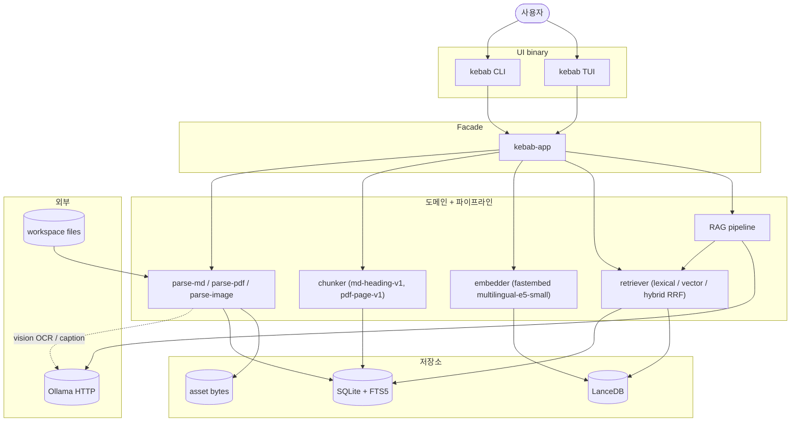

# kebab — Local-first Knowledge Base

`kebab` 는 개인용 로컬 knowledge base + RAG 도구다. Markdown / PDF / 이미지를 한 곳에 색인하고, 의미 검색 + page-단위 citation 포함 LLM 답변을 단일 binary 로 제공한다. 모든 추론은 로컬 (Ollama / fastembed) 에서 돌아간다. 대상 하드웨어: M4 48GB MacBook 1대, 사용자 1명.

## Quick start

```bash
# build
cargo build --release

# 첫 실행 — XDG 경로에 config.toml 생성
./target/release/kebab init

# config 손보고 — `[workspace] include` 에 *.md / *.png / *.pdf 등 추가, 모델 endpoint 등
${EDITOR:-vi} ~/.config/kebab/config.toml

# 색인 (Markdown / 이미지 / PDF 모두 한 번에)
./target/release/kebab ingest

# 검색 (citation 의 source_span 이 매체별로 line / region / page)
./target/release/kebab search "Markdown chunking 규칙" --mode hybrid

# 질문 (Ollama 필요, PDF 인용 시 page 번호 surface)
./target/release/kebab ask "내 KB 설계에서 저장소 전략은?"

# Ratatui 셸 (Library 패널 — j/k 이동, f 필터, q 종료)
./target/release/kebab tui
```

격리된 임시 워크스페이스로 돌려보는 절차는 [docs/SMOKE.md](docs/SMOKE.md) — `--config <path>` 로 분리. 이미지 / PDF fixture 가 필요하면 두 example 바이너리 (`cargo run --release --example gen_smoke_pdf -p kebab-parse-pdf` / `gen_smoke_png -p kebab-parse-image`) 로 시스템 dep 없이 in-tree 생성 가능.

## 명령

| 명령 | 동작 |
|------|------|
| `kebab init` | XDG 경로에 데이터 디렉토리 + config.toml 생성 |
| `kebab ingest [<path>]` | Markdown / 이미지 / PDF 색인 (idempotent) |
| `kebab search --mode {lexical,vector,hybrid} "<query>"` | 검색. hybrid는 RRF fusion, citation 포함 |
| `kebab list docs` | 색인된 문서 목록 |
| `kebab inspect doc <id>` / `kebab inspect chunk <id>` | raw record 보기 |
| `kebab ask "<query>"` | RAG 답변 + 근거 인용. 근거 부족 시 거절. Ollama 필요 |
| `kebab doctor` | 설정/모델/DB 헬스 체크 |
| `kebab tui` | Ratatui 셸 (Library 패널 v1, search/ask/inspect 패널 진행 중) |
| `kebab eval run / compare` | golden query 회귀 측정 |

모든 명령에 `--json` 플래그. 출력은 frozen wire schema v1 (`schema_version` 항상 포함, 예: `ingest_report.v1`, `search_hit.v1`, `answer.v1`, `doctor.v1`).

## 논리 아키텍처



`kebab-app` 가 facade — UI binary 가 store / parse / search / llm / rag 를 직접 참조하지 않는다 (frozen 설계 §8). 자세한 crate-level 의존성 + 디렉토리 + 핵심 기술 결정은 [docs/ARCHITECTURE.md](docs/ARCHITECTURE.md).

## Configuration

- `~/.config/kebab/config.toml` — `kebab init` 가 XDG 경로에 생성. `[workspace] include`, `[storage]`, `[chunking]`, `[models.embedding]`, `[models.llm]`, `[image.ocr]`, `[image.caption]`, `[search]`, `[rag]` 절.
- `--config <path>` flag — 임시 워크스페이스 / 격리 테스트 시 사용. CLI / TUI 모두 honor.
- `KEBAB_*` env — 일부 키 override (`KEBAB_RAG_SCORE_GATE`, `KEBAB_EVAL_GOLDEN`, `KEBAB_COMMIT_HASH` 등).
- XDG layout: `~/.config/kebab/`, `~/.local/share/kebab/`, `~/.cache/kebab/`, `~/.local/state/kebab/`.

config 예시는 [docs/SMOKE.md](docs/SMOKE.md) 의 `/tmp/kebab-smoke/config.toml` 블록 참조.

## 외부 AI 통합

`--json` 출력 + frozen wire schema v1 가 stable contract. 통합 옵션:

- **Claude Code / Codex skill** — `kebab search --json` / `kebab ask --json` 호출하는 ~50줄 wrapper.
- **MCP server** — stdio JSON-RPC 로 `kebab-app` facade 1:1 노출.
- **HTTP wrapper** — `kebab serve --bind 127.0.0.1:7711` (P+, local-only 가치 신중).

## 비-목표

다중 사용자 SaaS / K8s / 원격 vector DB / enterprise RBAC / 실시간 협업 / 모든 파일 포맷의 완벽한 parsing / agent 임의 파일 수정 / multi-workspace / LLM-as-judge eval / CLIP 시각 embedding / `kebab://` protocol handler — frozen 설계 §11 / §0 참조.

## 라이선스

`MIT OR Apache-2.0` (workspace `Cargo.toml` 의 `license` 필드).

## 참고

- 진척도: [HANDOFF.md](HANDOFF.md)
- 아키텍처: [docs/ARCHITECTURE.md](docs/ARCHITECTURE.md)
- Frozen 설계: [docs/superpowers/specs/2026-04-27-kebab-final-form-design.md](docs/superpowers/specs/2026-04-27-kebab-final-form-design.md)
- Task 인덱스: [tasks/INDEX.md](tasks/INDEX.md)
- 머지 후 hotfix 로그: [tasks/HOTFIXES.md](tasks/HOTFIXES.md)
- Smoke 절차: [docs/SMOKE.md](docs/SMOKE.md)
