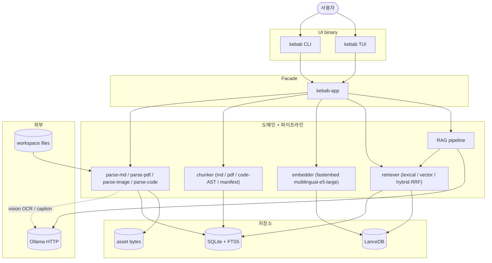

# kebab — Local-first Knowledge Base + RAG

`kebab` 는 개인용 로컬 knowledge base + RAG 도구다. Markdown · PDF · 이미지 · 소스코드를 한 곳에 색인하고, 하이브리드 의미 검색과 근거 인용을 포함한 LLM 답변을 **단일 binary** 로 제공한다. 모든 추론은 로컬 (Ollama + fastembed) 에서 돌아간다.

## Quick start

사전 요구는 두 가지뿐이다.

- **Rust toolchain** ≥ 1.85 (workspace 가 edition 2024 사용). [rustup](https://rustup.rs).
- **Ollama** — `kebab ask` 와 이미지/PDF OCR 가 사용. [공식 설치 안내](https://ollama.com/download) 참고 후 `ollama serve` 실행. 기본 LLM family 는 gemma4 (`ollama pull gemma4:e4b`) — OCR/caption 도 같은 family 라 모델 하나면 된다. CPU-only 환경이면 소형 모델 (예: `gemma3:4b`) 을 권장.

```bash
# 1) 빌드 + 설치 (~/.cargo/bin/kebab)
git clone https://gitea.altair823.xyz/altair823-org/kebab.git
cd kebab
cargo install --path crates/kebab-cli --locked

# 2) 데이터 디렉토리 + config.toml 생성 (XDG 경로)
kebab init

# 3) config 최소 손보기 — workspace.root (색인할 폴더) 와 LLM endpoint
${EDITOR:-vi} ~/.config/kebab/config.toml

# 4) 색인 (Markdown · PDF · 이미지 · 소스코드 한 번에)
kebab ingest

# 5) 검색 (hybrid = lexical + vector RRF, citation 포함)
kebab search "Markdown chunking 규칙"

# 6) 질문 (RAG 답변 + 근거 인용, Ollama 필요)
kebab ask "내 KB 설계에서 저장소 전략은?"
```

clone 없이 git URL 로 바로 설치할 수도 있다: `cargo install --git https://gitea.altair823.xyz/altair823-org/kebab.git --bin kebab --locked`. 업데이트는 동일 명령에 `--force`. 제거는 `cargo uninstall kebab-cli` (데이터는 보존 — 데이터까지 지우려면 `kebab reset --all --yes`).

설치 없이 dev 흐름으로 돌려볼 때는 `cargo run --release -p kebab-cli -- <subcommand>`. 격리된 임시 워크스페이스로 검증하는 절차는 [docs/SMOKE.md](docs/SMOKE.md) (`--config <path>` 로 분리).

## 핵심 기능

### 하이브리드 검색 + citation

lexical (FTS5 BM25) 과 vector (cosine) 두 채널을 **RRF fusion** 으로 합쳐 검색한다. 모든 hit 은 출처 위치를 매체별로 정확히 담는다 — Markdown/코드는 line, 이미지는 region, PDF 는 page. `--tag` · `--media` · `--lang` · `--path-glob` 등 다양한 필터와 `--max-tokens` · `--cursor` 같은 agent budget flag 를 지원한다.

### 파생물 캐시 (자동)

embedding 벡터를 청크 **내용 해시** 로 캐싱한다 (`derivation_cache`). 재색인·갱신 시 내용이 같은 청크는 재계산을 건너뛴다. 캐시 키에 모델·차원 버전이 포함돼 버전 변경 시 자동 무효화된다 (cascade 안전). 별도 설정 없이 투명하게 동작한다. (현재 TTL/LRU 자동 정리는 미구현 — 누적된 캐시는 `kebab reset` 으로만 정리.)

### 외부 계산 + 로컬 검색 워크플로

search/ask 는 원본 파일 없이 KB 산출물만으로 동작한다 (청크 본문이 SQLite 에 저장되고 문서 경로는 상대경로로 기록됨). 비싼 색인(임베딩·OCR)을 성능 좋은 머신에서 수행한 뒤(예: Apple Silicon 맥에서 candle Metal GPU), **두 산출물만** 다른 머신(예: NUMA 서버)으로 복사하면 그대로 검색·질문할 수 있다.

**무엇을 복사하나 — `[storage]` 에서 정의된 두 경로:**

| 복사 대상 | config 키 (`[storage]`) | 기본 경로 | 내용 |
|-----------|------------------------|-----------|------|
| `kebab.sqlite` | `sqlite = "{data_dir}/kebab.sqlite"` | `{data_dir}/kebab.sqlite` | 문서·청크·본문·FTS5·메타 |
| `lancedb/` | `vector_dir = "{data_dir}/lancedb"` | `{data_dir}/lancedb/` | 임베딩 벡터 |

`{data_dir}` 는 `[storage].data_dir` (예: `~/.local/share/kebab`). `models/`(`model_dir`)·`assets/`(`asset_dir`)는 **복사 불필요** — 모델은 각 머신이 자기 캐시를 받고, asset 원본 바이트는 검색·질문에 쓰이지 않는다 (단일파일/`stdin` 색인의 원본 재읽기·재색인까지 보존하려면 `assets/` 도 함께 복사).

```bash
# ingest 가 끝난(쓰기 없는) 상태에서 복사
rsync -a <src-data_dir>/kebab.sqlite  user@server:<dst-data_dir>/
rsync -a <src-data_dir>/lancedb/      user@server:<dst-data_dir>/lancedb/
```

조건: **양쪽 동일 `kebab` 버전 + 동일 임베딩 모델/차원** (`[models.embedding].model`·`dimensions`). provider 는 달라도 됨 (예: 맥 `candle`/Metal ↔ 서버 `candle`/CPU 또는 `fastembed` — 같은 모델이면 벡터 호환). 복사는 반드시 ingest 가 돌지 않을 때.

### 멀티미디어 색인

Markdown · PDF · 이미지(OCR + caption) · 소스코드(Rust/Python/TS/JS/Go/Java/Kotlin/C/C++ AST) · 리소스(YAML/Dockerfile/TOML/JSON/XML 등)를 확장자에 따라 자동으로 적절한 chunker 에 라우팅한다. embedded text 가 없는 scanned PDF 는 `[ingest.pdf.ocr]` 로 page-단위 OCR (opt-in). 전체 확장자→chunker 매핑은 [docs/ARCHITECTURE.md](docs/ARCHITECTURE.md).

### RAG (근거 인용 + 거절)

검색 결과를 근거로 LLM 답변을 생성하고 [#번호] 인용을 단다. 근거가 부족하면 답을 지어내지 않고 거절한다. compound 질문은 `--multi-hop` 으로 분해→synthesize. 답변의 groundedness 는 mDeBERTa XNLI 로 검증할 수 있다 (`[rag] nli_threshold`, default off).

### TUI

`kebab tui` 는 Ratatui 셸 — Library / Search / Ask / Inspect 패널을 vim-style 모드로 다룬다. 키 매핑은 앱 내 `F1` cheatsheet 가 권위 소스다.

## 명령

| 명령 | 동작 |
|------|------|
| `kebab init` | XDG 경로에 데이터 디렉토리 + config.toml 생성 |
| `kebab ingest [<path>]` | 워크스페이스 스캔 후 새/변경 문서 색인 (idempotent · incremental, `--force-reingest` 로 강제 재처리). 미지원 확장자는 자동 skip. 진행바는 현재 **파일명** · 느린 **phase(ocr/caption/embed)+모델명** · **경과초**`(Ns)` · 문서별 청크 수 · phase별 소요시간(parse/chunk/ocr/caption/embed/store)을 표시하고, 종료 시 **최장 소요 파일 top-5** 를 요약한다 (`--json` 은 `asset_phase`/`asset_chunked`/`asset_timings` 이벤트로, 사람용 요약은 미출력) |
| `kebab ingest-file <path>` | 단일 파일 ingest (workspace 외부 가능 — `_external/` 로 deterministic copy) |
| `kebab ingest-stdin --title <T>` | stdin 의 markdown 본문 ingest |
| `kebab search --mode {lexical,vector,hybrid} "<query>" [flags]` | 검색 (default hybrid = RRF fusion, citation 포함). 필터/budget flag 는 `--help` |
| `kebab ask "<query>" [flags]` | RAG 답변 + 근거 인용 (Ollama 필요). `--session` (multi-turn) · `--stream` · `--multi-hop` |
| `kebab list docs` | 색인된 문서 목록 |
| `kebab inspect doc <id>` / `inspect chunk <id>` | raw record 보기 |
| `kebab fetch chunk\|doc\|span <id> [flags]` | indexed corpus 에서 verbatim text fetch |
| `kebab eval run \| aggregate \| compare \| variants` | golden query 회귀 측정 + 변형 일관성 진단 |
| `kebab schema [--json]` | introspection — wire schemas / capabilities / models / stats |
| `kebab doctor` | 설정 / 모델 / DB 헬스 체크 |
| `kebab tui` | Ratatui 셸 (Library / Search / Ask / Inspect) |
| `kebab mcp` | MCP stdio server (`search` / `bulk_search` / `ask` / `fetch` / `schema` / `doctor` / `ingest_file` / `ingest_stdin`) |
| `kebab reset [--all \| --data-only \| --vector-only \| --config-only \| --orphans-only] [--yes]` | XDG 데이터 wipe (**irreversible**) |

모든 명령에 `--json` 플래그가 있고, 출력은 frozen **wire schema v1** 을 따른다 (`schema_version` 항상 포함). `--json` 모드에서 fatal error 는 stderr 에 `error.v1` ndjson 으로 emit (exit code 0/1/2/3 불변). 글로벌 flag: `--readonly` (write-path 비활성화), `--quiet` (human stderr 억제), env `KEBAB_PROGRESS=plain`. 전체 flag·wire 의미는 `kebab <cmd> --help` 와 [docs/wire-schema/v1/](docs/wire-schema/v1/). 외부 agent 통합(Claude Code skill / MCP)은 [docs/mcp-usage.md](docs/mcp-usage.md) 와 [integrations/](integrations/).

## Configuration

`~/.config/kebab/config.toml` 은 `kebab init` 가 XDG 경로에 생성한다. 핵심 노브만 정리한다 (전체 절은 생성된 파일 주석 참고, 예시는 [docs/SMOKE.md](docs/SMOKE.md)).

```toml
[workspace]
root = "~/KnowledgeBase"   # 색인할 폴더. 절대 / tilde / env / 상대 경로 가능.
                          # 상대 경로의 base 는 config.toml 위치 (cwd 무관).

[models.embedding]
provider = "fastembed"            # "fastembed"(기본, onnxruntime) / "candle"(순수 Rust)
                                  # / "ollama"(원격 HTTP) / "none"(lexical-only).
                                  # candle 는 같은 모델·같은 벡터를 순수 Rust 로 돌려
                                  # NUMA 서버의 onnxruntime 48-스레드 double-free 를 피하는
                                  # opt-in 백엔드 (e5 는 재색인 불필요).
model = "multilingual-e5-large"   # 다국어 sentence embedding (1024-dim).
                                  # 첫 ingest 시 ONNX (~1.3GB) 자동 다운로드.
                                  # candle provider 는 safetensors (~2GB) 다운로드.
                                  # candle/ollama 는 "snowflake-arctic-embed-l-v2.0"
                                  # (설명형 query 의 recall 보강) 도 지원 — 아래 참고.
dimensions = 1024                 # config 와 LanceDB stored dim 불일치 시 검색 0건.
num_threads = 0                   # candle 전용 CPU 스레드 캡 (0=auto=#cores).
                                  # env KEBAB_EMBED_THREADS 가 우선. NUMA 노드 바인딩은
                                  # numactl 과 조합. fastembed provider 는 무시.
# endpoint = "http://127.0.0.1:11434"  # provider="ollama" 전용 HTTP endpoint.
                                  # 생략 시 [models.llm].endpoint 로 폴백.
                                  # fastembed/candle provider 는 무시.
```

**arctic-embed-l-v2.0 (설명형 query recall 보강)**: 기본 e5-large 대신
Snowflake `arctic-embed-l-v2.0` 임베더를 쓸 수 있다 (1024-dim, opt-in). 측정에서
설명형/약어/영문 용어 query 의 recall@10 이 e5 대비 향상됐다. 두 경로:

```toml
# (A) candle 백엔드 — 순수 Rust, in-process (NUMA 안전, Metal GPU 가능):
[models.embedding]
provider = "candle"
model    = "snowflake-arctic-embed-l-v2.0"   # CLS pooling, query 에 "query: " 접두어
                                             # (문서는 무접두어). safetensors ~2GB 다운로드.

# (B) ollama 백엔드 — 원격/로컬 Ollama 데몬에 위임 (POST /api/embed):
[models.embedding]
provider = "ollama"
model    = "snowflake-arctic-embed2"          # Ollama 모델 태그 (ollama pull 필요)
endpoint = "http://127.0.0.1:11434"           # 생략 시 [models.llm].endpoint
```

> ⚠️ e5 → arctic 전환은 `embedding_version` cascade 를 트리거한다 (모델이 다르면
> 벡터도 다름). 기존 e5 KB 와 혼용 불가 — 전환 시 **재색인** 필요 (`kebab reset`
> 후 재 ingest). 기본값은 e5 라 기존 사용자는 영향 없음.

**Apple Silicon GPU 가속 (candle / macOS)**: M-시리즈 맥에서 candle 임베딩을
GPU(Metal)로 돌리면 CPU 대비 대용량 ingest 가 크게 빨라진다. 빌드 또는 설치 시
`embed_metal` feature 를 켠다:

```bash
# 빌드만:
cargo build --release --features embed_metal
# 전역 설치 (~/.cargo/bin/kebab):
cargo install --path crates/kebab-cli --features embed_metal --locked
```

벡터는 CPU candle 과 동일 모델이라 호환되므로, 맥에서 GPU 로 색인한
`kebab.sqlite` + `lancedb/` 를 그대로 Linux 서버(CPU candle)로 복사해 질의할 수
있다. 색인 로그에 `candle device = Metal (GPU)` 가 보이면 GPU 사용 중. metal
feature 는 macOS 전용 (Linux/서버는 기본 CPU 빌드).

```toml

[models.llm]
endpoint = "http://localhost:11434"   # Ollama host:port
model = "gemma4:e4b"
# request_timeout_secs = 300          # 큰 모델은 늘림. 0 은 disable 이 아니라 "즉시 timeout".

[search]
stale_threshold_days = 30   # search hit / citation 의 stale 플래그 기준 (0 = off).

[rag]
prompt_template_version = "rag-v3"   # 답변 언어 = 질문 언어. rag-v1/v2 는 legacy.
nli_threshold = 0.0                  # >0 (예: 0.5) 면 mDeBERTa XNLI groundedness 검증.
```

- **`[ingest]`** (v0.28.0) — 모든 형식 ingest 설정의 우산. 병렬도(`max_parallel_extractors`/`max_parallel_embeddings`/`watch_filesystem`, ← 옛 `[indexing]`)와 형식별 하위 절(`[ingest.chunking]` ← 옛 `[chunking]`, `[ingest.code]`, `[ingest.image.ocr]` ← 옛 `[image.ocr]`, `[ingest.pdf.ocr]` ← 옛 `[pdf.ocr]`)이 전부 이 아래로 모인다. 기존 v2 `config.toml` 은 그대로 둬도 로드 시 메모리에서 자동 변환되며, 파일을 새 레이아웃으로 갱신하려면 `kebab config migrate` (값·주석 보존).
- **파생물 캐시** — embedding 결과를 내용 해시로 자동 캐싱한다 (위 「핵심 기능」 참고). 설정 항목 없음.
- **`[ingest.code]`** — code ingest 의 skip 정책 (`skip_generated_header`, `max_file_bytes`, `extra_skip_globs`). `.gitignore` 자동 honor, `.kebabignore` 는 추가 layer.
- **`[ingest.image.ocr]`** — 이미지 OCR (default off / opt-in). `engine` 으로 백엔드 선택: `"ollama-vision"` (default, 원격 vision LM) 또는 `"paddle-onnx"` (PP-OCRv5 ONNX 를 in-process 로 실행, Python 런타임 불필요, 큰 페이지 CPU <4초, 오프라인). `paddle-onnx` 는 워크스페이스에 번들된 모델을 쓰며 `det_model`/`rec_model`/`dict` 로 경로 override, `score_thresh`(0.3)/`unclip_ratio`(1.5)/`max_boxes`(1000) 로 검출 튜닝 가능 (`KEBAB_IMAGE_OCR_*` env 동일 지원 — env 이름은 v3 에서도 불변). engine 또는 모델을 바꾸면 영향 이미지가 자동 재색인된다.
- **`[ingest.pdf.ocr]`** — scanned PDF 의 page-단위 OCR (default off / opt-in, page 당 ~수십 초 cost). `engine` 은 `[ingest.image.ocr]` 과 동일하게 `"ollama-vision"`/`"paddle-onnx"` 선택. v3 에서 paddle 모델 경로 키(`det_model`/`rec_model`/`dict`/`score_thresh`/`unclip_ratio`/`max_boxes`)를 PDF 자체적으로 가질 수 있다(`KEBAB_PDF_OCR_*` env 동일). 활성화 후 옛 색인분은 `kebab ingest --force-reingest` 로 재처리.
- **`--config <path>`** — 임시 워크스페이스 / 격리 테스트용 (CLI · TUI 모두 honor).
- **`kebab config migrate`** — 새 버전에서 추가된 config 섹션을 기존 `config.toml` 에 설명 주석과 함께 채워 넣는다 (사용자가 손본 값·주석·순서는 보존, 멱등, 변경 시 자동 `.bak` 백업). `--dry-run` 으로 변경 미리보기. `kebab doctor` 가 갱신 필요 시 안내한다. `kebab init` 으로 새로 생성되는 config.toml 도 섹션별 주석을 포함한다.
- **`KEBAB_*` env** — 일부 키 override (`KEBAB_RAG_SCORE_GATE`, `KEBAB_EVAL_GOLDEN` 등).
- **XDG layout**: `~/.config/kebab/`, `~/.local/share/kebab/`, `~/.cache/kebab/`, `~/.local/state/kebab/`.

## 아키텍처



v0.21.0 기준 핵심 설계:

- **crate facade** — `kebab-app` 가 유일한 facade다. UI binary (`kebab-cli` / `kebab-tui`) 는 store / parse / search / llm / rag 를 직접 참조하지 않는다 (frozen 설계 §8). 각 user-facing 엔트리는 `*_with_config(cfg, …)` 동반 함수로 explicit config 를 thread 한다.
- **chunk_id 는 위치 기반** — chunk 의 정체성은 문서 내 위치(ordinal + span)다. 반면 파생물 캐시 키는 **내용 해시**라, 내용이 같으면 위치·문서가 달라도 동일 캐시를 재사용한다.
- **wire schema v1** — 모든 `--json` 출력은 `schema_version` 을 담는 frozen contract다. 깨는 변경은 `*.v2` major bump을 요구한다.
- **versioning cascade** — `parser_version` / `chunker_version` / `embedding_version` / `prompt_template_version` / `index_version` 변경은 downstream record(청크·임베딩·캐시·eval)를 무효화한다.

crate-level 의존성 그래프 · 디렉토리 트리 · 확장자→chunker 전체 매핑 · 핵심 기술 결정은 [docs/ARCHITECTURE.md](docs/ARCHITECTURE.md), 진척도는 [HANDOFF.md](HANDOFF.md).

## 비-목표

다중 사용자 SaaS / K8s / 원격 vector DB / enterprise RBAC / 실시간 협업 / agent 임의 파일 수정 / multi-workspace / LLM-as-judge eval / CLIP 시각 embedding — frozen 설계 §0 / §11 참조.

## 버전 / 라이선스 / 참고

- **버전**: v0.21.0 (`kebab --version` 으로 확인).
- **라이선스**: `MIT OR Apache-2.0`.
- 진척도: [HANDOFF.md](HANDOFF.md) · 아키텍처: [docs/ARCHITECTURE.md](docs/ARCHITECTURE.md) · Frozen 설계: [docs/superpowers/specs/2026-04-27-kebab-final-form-design.md](docs/superpowers/specs/2026-04-27-kebab-final-form-design.md)
- Task 인덱스: [tasks/INDEX.md](tasks/INDEX.md) · Hotfix 로그: [tasks/HOTFIXES.md](tasks/HOTFIXES.md) · Smoke 절차: [docs/SMOKE.md](docs/SMOKE.md) · MCP 사용: [docs/mcp-usage.md](docs/mcp-usage.md)
