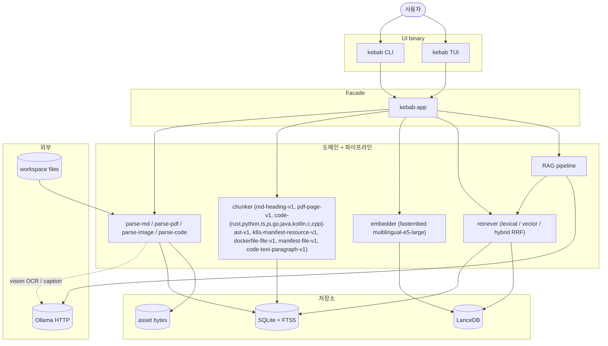

# kebab — Local-first Knowledge Base

`kebab` 는 개인용 로컬 knowledge base + RAG 도구다. Markdown / PDF / 이미지를 한 곳에 색인하고, 의미 검색 + page-단위 citation 포함 LLM 답변을 단일 binary 로 제공한다. 모든 추론은 로컬 (Ollama / fastembed) 에서 돌아간다. 대상 하드웨어: M4 48GB MacBook 1대, 사용자 1명.

## 사전 요구

- **Rust toolchain** ≥ 1.85 (workspace 가 edition 2024 + resolver 3 사용). [rustup](https://rustup.rs) 권장.
- **Ollama** — `kebab ask` 와 이미지 OCR/caption 가 사용. `https://ollama.com/download` 에서 설치 후 `ollama serve` 실행. 기본 LLM 은 gemma4 계열 (`ollama pull gemma4:e4b`) — OCR / caption 도 같은 family 라 모델 하나만 pull 하면 됨. 더 큰 variant 원하면 `gemma4:26b` 등으로 config override. config 의 `[models.llm].endpoint` 에 host:port 명시.
  - **CPU only / RAM ≤ 16 GB 환경 권장 모델**: gemma4:e4b (8B) 는 CPU 추론에 무거워 RAG 한 답변이 5분을 넘기기 쉽다 — `[models.llm] request_timeout_secs` 의 기본 300 s 한도에 걸려 `error: kb-rag: llm.generate_stream` 으로 떨어진다 (HOTFIXES 2026-05-25). `gemma3:4b` / `qwen2.5:3b` / `phi3:mini` 같은 ≤ 4B Q4 모델로 바꾸면 답변 1-3 분에 안정 동작 (확장 도그푸딩에서 검증). 모델 storage 가 부담이면 `OLLAMA_MODELS=/path` env 로 위치 분리 가능.
  - **`request_timeout_secs` 노브 (v0.17.0)**: `[models.llm] request_timeout_secs = 1200` (또는 `KEBAB_MODELS_LLM_REQUEST_TIMEOUT_SECS=1200`) 로 한도를 늘려 큰 모델도 시도 가능. 단 응답 동안 RAM 점유가 길어진다. **`= 0` 은 disable 이 아니라 "즉시 timeout"** (reqwest 의 의미상) — "사실상 무제한" 의도면 `u64::MAX` 또는 `86400` 같이 큰 finite 값 사용.
  - **sudo 없이 설치 (격리 디렉토리 사용)**: `install.sh` 가 `/usr/local/bin/ollama` + `systemd` 유닛까지 건드리는 게 부담이면 binary tarball 만 받아 사용자 디렉토리에 풀고 env 로 모델 위치 분리하면 된다.
    ```bash
    mkdir -p /opt/ollama/{models,logs}
    curl -fL https://ollama.com/download/ollama-linux-amd64.tar.zst -o /tmp/ollama.tar.zst
    zstd -d /tmp/ollama.tar.zst -o /tmp/ollama.tar && tar -xf /tmp/ollama.tar -C /opt/ollama/
    # bin/ollama + lib/ollama/ 가 풀린다. 모델 디렉토리는 OLLAMA_MODELS 로 분리.
    OLLAMA_MODELS=/opt/ollama/models OLLAMA_HOST=127.0.0.1:11434 \
        /opt/ollama/bin/ollama serve > /opt/ollama/logs/serve.log 2>&1 &
    /opt/ollama/bin/ollama pull gemma3:4b
    ```
    루트 디스크 부담을 분리하고 싶을 때 (`~/.ollama/models` 가 기본) 그대로 활용. systemd 가 없는 컨테이너 / WSL2 / 회사 머신 등에서 유용.
  - **`kebab ask --stream` 권장 (fb-33)**: 모델 cold start 가 길 때 (8B+ 또는 첫 호출) `--stream` 으로 토큰을 stderr 에 ndjson 으로 흘려 받으면 5 분 timeout 한도 안에서도 첫 토큰이 빨리 보여 사용자 체감이 개선된다. 동일 inference 시간이라도 wait-and-pray 보다 progressive 가 안정적. CLI: `kebab ask "..." --stream 2> events.ndjson > final.json`. MCP host 도 `streaming_ask` capability flag 가 `true` 면 자동 사용 권장.
- **빌드 디스크** — 첫 빌드 시 `target/` 가 6–10 GB (Lance + DataFusion + fastembed). 여유 확인.
- **fastembed 모델** — 첫 `kebab ingest` 시 `multilingual-e5-large` (~1.3 GB, fb-39b) 자동 다운로드. `config.toml` 에서 `model = "multilingual-e5-small"` 로 명시하면 이전 모델 사용.

## 설치

표준 경로는 `cargo install` — `~/.cargo/bin/kebab` 가 PATH 에 있는지만 확인하면 끝.

```bash
# 1) repo clone
git clone https://gitea.altair823.xyz/altair823-org/kebab.git
cd kebab

# 2) binary 빌드 + 설치 (~/.cargo/bin/kebab)
cargo install --path crates/kebab-cli --locked

# 3) PATH 확인 (아직 추가 안 했으면 ~/.bashrc / ~/.zshrc 에 추가)
which kebab          # → /Users/<you>/.cargo/bin/kebab 같은 경로
kebab --version      # → kebab 0.1.0
```

git URL 직접 install 도 가능 (clone 없이):

```bash
cargo install --git https://gitea.altair823.xyz/altair823-org/kebab.git --bin kebab --locked
```

업데이트는 `git pull && cargo install --path crates/kebab-cli --locked --force` 또는 git URL 형식의 경우 `cargo install --git ... --force`.

제거는 `cargo uninstall kebab-cli`. 이 명령은 binary 만 지우고 워크스페이스 데이터는 그대로 남는다. 데이터까지 정리하려면 `kebab reset --all --yes` (config + data + cache + state 4 개 XDG 경로 모두 wipe — **irreversible**, 재시작 시 `kebab init` 다시 실행). 부분 wipe 는 `kebab reset --data-only` (config 보존), `kebab reset --vector-only` (Lance + `embedding_records` 만, 다음 ingest 가 re-embed), **`kebab reset --orphans-only`** (현재 walker scope 밖에 있는 stored doc 만 정리 — `config.workspace.include` 좁히거나 sub-dir 옮긴 후 explicit reconcile; fs 의 file 은 건드리지 않음) 등.

## Quick start

```bash
# 첫 실행 — XDG 경로에 데이터 디렉토리 + config.toml 생성
kebab init

# config 손보고 — workspace.root, 모델 endpoint 등 설정 (지원 형식: md / png / jpg / pdf / rs / py / ts / js / go)
${EDITOR:-vi} ~/.config/kebab/config.toml

# 색인 (Markdown / 이미지 / PDF 모두 한 번에)
kebab ingest

# 검색 (citation 의 source_span 이 매체별로 line / region / page)
kebab search "Markdown chunking 규칙" --mode hybrid

# 질문 (Ollama 필요, PDF 인용 시 page 번호 surface)
kebab ask "내 KB 설계에서 저장소 전략은?"

# Ratatui 셸 (Library + Search + Ask + Inspect 패널, desktop 진행 중)
kebab tui

# 헬스 체크 (config 경로 / 데이터 디렉토리 쓰기 가능 여부)
kebab doctor
```

격리된 임시 워크스페이스로 돌려보는 절차는 [docs/SMOKE.md](docs/SMOKE.md) — `--config <path>` 로 분리. 이미지 / PDF fixture 가 필요하면 두 example 바이너리 (`cargo run --release --example gen_smoke_pdf -p kebab-parse-pdf` / `gen_smoke_png -p kebab-parse-image`) 로 시스템 dep 없이 in-tree 생성 가능.

설치 없이 dev 흐름으로 돌려볼 때는 `cargo run --release -p kebab-cli -- <subcommand>` 또는 `cargo build --release && ./target/release/kebab <subcommand>`.

## 명령

| 명령 | 동작 |
|------|------|
| `kebab init` | XDG 경로에 데이터 디렉토리 + config.toml 생성 |
| `kebab ingest [<path>]` | Markdown / 이미지 / PDF / Rust 소스코드 색인 (idempotent). TTY 에서는 stderr 진행 바, non-TTY (CI / pipe) 는 stderr 한 줄씩, `--json` 은 stdout 에 `ingest_progress.v1` 라인 streaming 후 마지막에 `ingest_report.v1`. Ctrl-C 한 번이면 현재 asset 마무리 후 abort (부분 commit 보존, idempotent re-run), 두 번째 Ctrl-C 는 hard exit. Markdown title 이 frontmatter 에 없어도 첫 H1 → H2 → 첫 paragraph 80 자 → 파일명 순으로 자동 채움 (parser_version `md-frontmatter-v2`) — 기존 색인된 doc 도 다음 ingest 에서 새 title 로 갱신. **Incremental** (p9-fb-23): 두 번째 이후의 ingest 는 변하지 않은 doc (blake3 + parser/chunker/embedder version 모두 동일) 의 parse/chunk/embed/vector upsert 를 자동 스킵. final summary 에 `N unchanged` 카운트 표시. `--force-reingest` 로 skip 무시 강제 재처리. **지원 형식** (extractor 자동 결정 — config 에 명시 불가): Markdown (`.md`), 이미지 (`.png` / `.jpg` / `.jpeg`, OCR + caption), PDF (`.pdf`), **소스코드** (`.rs` → `code-rust-ast-v1`, `.py` → `code-python-ast-v1`, `.ts`/`.tsx` → `code-ts-ast-v1`, `.js`/`.mjs`/`.cjs`/`.jsx` → `code-js-ast-v1`, `.go` → `code-go-ast-v1`, `.java` → `code-java-ast-v1`, `.kt`/`.kts` → `code-kotlin-ast-v1`, `.c`/`.h` → `code-c-ast-v1`, `.cpp`/`.cc`/`.cxx`/`.hpp`/`.hh`/`.hxx` → `code-cpp-ast-v1` — 모두 tree-sitter AST chunker; **Tier 2 리소스 파일**: `.yaml`/`.yml` → `k8s-manifest-resource-v1` (apiVersion+kind 파싱), `Dockerfile`/`Dockerfile.*`/`*.dockerfile` → `dockerfile-file-v1` (전체 파일), `Cargo.toml`/`pyproject.toml`/`.toml`/`package.json`/`tsconfig.json`/`.json`/`pom.xml`/`.xml`/`build.gradle`/`.gradle`/`go.mod` → `manifest-file-v1` (전체 파일) — yaml (k8s) / dockerfile / toml / json / xml / groovy / go-mod 지원); **Tier 3 paragraph fallback** (`.sh`/`.bash`/`.zsh` → `code-text-paragraph-v1`, blank-line paragraph split + 80-line/20-overlap line-window. Tier 1/2 가 0 chunk 또는 Err 시 자동 fallback — 비-k8s YAML 같은 케이스 picked up. symbol = None, lang 은 원본 보존.). 다른 확장자는 자동 skip — `IngestItem.warnings` 에 사유 (`"unsupported media type: .docx"` 등), `IngestReport.skipped_by_extension` 에 카운트 분류, CLI / TUI summary 에 breakdown 표시. 코드 chunk 는 `citation.kind = "code"` 에 `citation.lang = "<lang>"` + `symbol` + line range 를 담고, SearchHit top-level 에 `code_lang` + `repo` (`.git/` walk-up 의 디렉토리 이름) 가 backfill 됨. `--code-lang rust` / `--code-lang python` / `--code-lang typescript` / `--code-lang javascript` / `--code-lang go` / `--code-lang java` / `--code-lang kotlin` / `--code-lang yaml` / `--code-lang dockerfile` / `--code-lang toml` / `--code-lang json` / `--code-lang xml` / `--code-lang groovy` / `--code-lang go-mod` / `--code-lang shell` / `--code-lang c` / `--code-lang cpp` / `--media code` filter 로 언어별·코드 전용 검색 가능 (p10-1A-1 filter flags). Python symbol 은 workspace 경로 → dotted module path prefix (예: `kebab_eval.metrics.compute_mrr`), TS/JS symbol 은 slash-style module path prefix (예: `src/Foo.Foo.search`), Go symbol 은 `package.Func` / `package.(*Receiver).Method` 형식, Java / Kotlin symbol 은 `com.foo.Foo.bar` 형식 (패키지 + 클래스 + 메서드/필드). |
| `kebab search --mode {lexical,vector,hybrid} "<query>" [--no-cache] [--max-tokens N] [--snippet-chars N] [--cursor <opaque>] [--tag T] [--lang L] [--path-glob G] [--trust-min LEVEL] [--media TYPE] [--ingested-after RFC3339] [--doc-id ID] [--trace] [--bulk] [--repo NAME ...] [--code-lang LIST]` | 검색. hybrid는 RRF fusion, citation 포함. 같은 process 안에서 동일 query (NFKC + trim + lowercase 정규화) 반복 시 in-process LRU 캐시 hit (capacity = `[search] cache_capacity`, default 256). `--no-cache` 로 강제 bypass — 디버깅용. ingest commit 발생 시 `kv['corpus_revision']` bump 으로 모든 entry 자동 stale. **`--max-tokens` / `--snippet-chars` / `--cursor` (p9-fb-34)** — agent budget controls. `--json` 출력은 `search_response.v1` wrapper (`{hits, next_cursor, truncated}`) — pre-fb-34 의 bare array 와 호환 안 됨. mismatched cursor → `error.v1.code = stale_cursor`. **filter flags (p9-fb-36):** `--tag` 는 반복 가능 flag (`--tag rust --tag async`) 로 OR 매칭, `--media` 는 `,` 구분 다중 값 OR 매칭, 나머지 flags 간은 AND 조합. `--trust-min` 은 `primary\|secondary\|generated` 중 하나 (해당 level 이상 포함). `--ingested-after` 는 RFC3339 UTC — 파싱 실패 시 `error.v1.code = config_invalid` (exit 2). `--media md` 는 `markdown` alias 로 정규화. 알 수 없는 `--media` 값은 무조건 empty hits (오류 아님). **`--trace` (p9-fb-37)** — `search_response.v1.trace` 에 lexical / vector pre-fusion 후보 + RRF union + per-stage timing (`lexical_ms` / `vector_ms` / `fusion_ms` / `total_ms`) 노출. trace 요청은 캐시 우회 (`--no-cache` 없이도 항상 cold). **`--bulk` (p9-fb-42)** — stdin ndjson 으로 N query 한 번에 실행. `--json` 면 stdout per-query ndjson (`bulk_search_item.v1`) + stderr summary (`bulk_summary: total=N succeeded=S failed=F`). Cap 100. agent 가 query decomposition 후 sub-query 일괄 실행 시 single round-trip — App instance 재사용으로 캐시 / embedder cold-start 비용 한 번만. Per-query failure 는 item 의 `error` (error.v1) 에 격리, 다른 query 계속 진행. 입력은 stdin ndjson — 줄당 한 query object, `{"query":"<text>"}` 만 필수 (string; nested object 아님), `mode`/`k`/`trust_min`/`ingested_after`/`media`/`tag`/`lang` optional (`docs/wire-schema/v1/bulk_search_input.schema.json`). 예: `echo '{"query":"한국","mode":"lexical","k":3}' | kebab search --bulk --json`. **code corpus filters (p10-1A-1):** `--repo` 는 반복 가능 (`--repo kebab --repo other`) OR 매칭. `--code-lang` 는 반복 또는 comma 다중 값 (`--code-lang rust,python`), 알 수 없는 값은 빈 hits. `--media code` 는 Tier 1/2/3 모든 code chunk 포함. 1A-1 시점에서는 indexed 된 code chunk 가 없어 filter 가 항상 빈 결과 — 1A-2 (Rust AST chunker) 머지 이후 실효. **v0.20.1 V009 morphological tokenizer (한국어 + 영어 동작 변경):** `chunks_fts` 가 FTS5 `unicode61` + 한국어 lindera ko-dic 형태소 분석 결과를 별 column 으로 prepend. **한국어 2자 query 지원** — '한국', '서울', '지하철' 같은 2자/3자 단어가 형태소 분해 후 hit. **영어는 whole-token 매칭** — V002 동작으로 회귀 (`tokenizer` query 는 `tokenizer` 토큰만 hit, `token` 같은 substring 은 hit X). substring recall 이 필요하면 vector/hybrid mode 권장. `kebab.sqlite` 파일 크기는 lindera ko-dic embedded dict 와 tokenized_korean_text column 의존성으로 다소 증가. V009 자동 backfill (`App::open_with_config` 의 first-boot hook) — re-ingest 불필요. |
| `kebab list docs` | 색인된 문서 목록. human-readable 출력은 `doc_id \t title \t doc_path` (title 은 heading 기반이라 중복 가능 — doc_path 로 구분). `--json` 은 `doc_summary.v1` array (title / doc_path 모두 포함, wire schema 불변). |
| `kebab inspect doc <id>` / `kebab inspect chunk <id>` | raw record 보기 |
| `kebab fetch chunk <id> [--context N]` / `kebab fetch doc <id> [--max-tokens N]` / `kebab fetch span <doc_id> <ls> <le> [--max-tokens N]` | (p9-fb-35) verbatim text fetch from indexed corpus. wire = `fetch_result.v1` (kind discriminator). chunk: target + ±N ordinal-context chunks. doc: full normalized markdown. span: 1-based line range (PDF/audio rejected as `error.v1.code = span_not_supported`). chars/4 budget on doc/span. |
| `kebab ask "<query>" [--show-citations / --hide-citations] [--session <id>] [--stream] [--multi-hop]` | RAG 답변 + 근거 인용. 답변 후 `근거:` block 으로 full path / line range / score 한 줄씩 (default ON — `--hide-citations` 로 끄기, pipe 시 유용). 근거 부족 시 거절. Ollama 필요. `--session <id>` 로 multi-turn — 첫 호출에서 SQLite `chat_sessions` 에 자동 생성, 이후 호출은 prior turns 를 history 로 받아 follow-up. session id 는 사용자 지정 (e.g. `kb-rust-async-2026-05`) — `kebab reset --data-only` 로 모든 session wipe. **`--stream` (p9-fb-33)** 로 ndjson `answer_event.v1` event (retrieval_done → token* → final) 를 stderr 에 흘리고 stdout 마지막 줄에 기존 `answer.v1` — agent 가 token 즉시 소비 가능. **`--multi-hop` (v0.18.0 fb-41)** — single-pass 대신 decompose → decide → synthesize 의 N-hop loop. compound 질문 (cross-doc / prereq chain) 에 효과적. 최종 답변 후 mDeBERTa-v3 XNLI 가 `(packed_chunks, generated_answer)` entailment 검사 — `[rag] nli_threshold > 0` (default 0.0 = disabled, production 권장 0.5) 일 때 활성. entailment < threshold → `refusal_reason = "nli_verification_failed"` (LLM-self-judge ceiling 극복, S7 caffeine hallucination 같은 케이스 catch). 첫 호출 시 ~280 MB ONNX model 자동 다운로드 + RAM peak ~7-8 GB (gemma3:4b 기준). model unavailable 시 `refusal_reason = "nli_model_unavailable"`, 우회는 `[rag] nli_threshold = 0` 임시 disable. |
| `kebab doctor` | 설정/모델/DB 헬스 체크 |
| `kebab tui` | Ratatui 셸 (Library + Search + Ask + Inspect 패널, desktop 진행 중). Library 에서 `r` 키로 background ingest 시작 — 화면 하단 status bar 가 진행 표시, 완료/abort 시 final 라인 잠시 유지 후 자동 hide. ingest 진행 중 `Esc` / `Ctrl-C` 가 cancel signal (그 외에는 quit). vim-style mode (header 우측 `-- NORMAL --` / `-- INSERT --`) — Library/Inspect 는 자동 NORMAL, Search/Ask 는 자동 INSERT. `i` 로 Normal→Insert (모든 pane — p9-fb-21), `Esc` 로 Insert→Normal 어디서나. mode-authoritative dispatch — Search 의 `j/k/o/g`, Ask 의 `e/j/k` 는 NORMAL 모드에서만 명령으로 동작, INSERT 에서는 입력 문자로 typing. (Search 의 chunk inspect 키는 `i`→`o` 로 rebind — `i` 가 universal Insert toggle.) **`F1` 로 cheatsheet popup** (현재 pane 의 키 매핑 + global 토글 표) — `Esc` / `F1` 로 닫기. Search 패널은 200ms debounce 후 background worker 가 검색 — 키 입력으로 UI freeze 안 됨, 사용자가 계속 타이핑하면 stale 결과 자동 폐기 (generation counter). Ask 패널은 multi-turn — 같은 conversation 안에서 Q1/A1, Q2/A2 transcript 누적, 다음 질문이 이전 턴을 history 로 받아 답변. 답변 본문은 markdown 렌더 (bold/italic/inline code/heading/list/code fence/table/blockquote, raw `**bold**` 가 실제 굵게 표시). `Ctrl-L` 로 새 conversation 시작. Search 의 `g` 키가 `$EDITOR` (기본 `vi`) 로 hit 의 citation 위치 열기 — 종료 후 TUI 화면이 자동으로 깨끗이 redraw. CLI `kebab ask` 는 raw markdown 그대로 (terminal 호환성 위해). Library 의 doc-list 가 한글 / 일본어 / 중국어 (CJK) 제목을 wide-char 정확한 column width 로 truncate — 한글 제목이 한 줄을 넘기지 않음 (CJK 1 자 = 2 col). Search/Ask/Filter 입력의 cursor 가 wide char 위에서 column 단위로 정렬 — 한글 입력 시 caret 이 글자 옆에 정확히 놓임. `← / →` 로 입력 문자열 중간 cursor 이동 (한글 한 글자 = 2 column 이라도 한 번에 이동), `Home / End` 로 양 끝 점프, `Delete` 로 cursor 위치 char 삭제 — 모든 input pane (Ask / Search / Library filter overlay) 동일 (p9-fb-22). Ask 트랜스크립트는 새 답변이 viewport 아래로 누적될 때 자동으로 tail 을 따라감 (auto-scroll); `j` / `k` 로 위로 스크롤하면 freeze, `Shift-G` 로 다시 bottom + auto-tail 재개. 화면 하단 hint line 은 한국어 동사구로 (`"위로"` / `"아래로"` / `"필터"` / `"타이핑 검색어"` / `"Esc 로 NORMAL 모드"` / `"i 입력모드"` 등) + 현재 (pane, mode) 조합에 맞춰 자동 분기, **첫 fragment 가 항상 `F1 도움말`** (cheatsheet 발견성 보장). 모든 모드에서 항상 떠 있는 상태바 — `kebab v<version> │ <pane> │ <docs> docs │ <state>` (state: streaming/searching/indexing/idle, ingest 진행 중에는 progress 가 같은 자리에 흡수됨). Ask 진입 시 conversation id 8 자 prefix 도 함께 표시. Ask 트랜스크립트와 Inspect 양쪽에서 `PgUp / PgDn` 으로 10 줄씩 페이지 스크롤. Library 의 doc list 위에는 `TITLE / TAGS / UPDATED / CHUNKS` 컬럼 헤더 행 표시 (display-width 정렬, Hangul / CJK 안전). |
| `kebab reset [--all / --data-only / --vector-only / --config-only] [--yes]` | XDG 데이터 wipe. **Irreversible.** TTY 면 confirm prompt, 아니면 `--yes` 필수. `--vector-only` 는 SQLite `embedding_records` 도 함께 truncate (orphan 방지) |
| `kebab eval run / aggregate / compare / variants` | golden query 회귀 측정 (`run` 실행 → `aggregate` 집계 → `compare` run 비교) + `variants <run_id>` 는 같은 의미의 여러 표현(동의어·풀어쓴 문장·한/영) 간 검색 일관성 진단 — `recall@10` vs `recall@50` 대비로 순위출렁(A)/어휘격차(B) 분류, `--json` 지원 |
| `kebab schema [--json]` | introspection — wire schemas / capabilities / models / stats 한 번에. `--json` 은 `schema.v1` wire; 사람 모드는 서식 출력. **stats 에 (p9-fb-37) `media_breakdown` (5 keys: markdown / pdf / image / audio / other) + `lang_breakdown` (BCP-47 코드, NULL 은 literal `"null"`) + `index_bytes` (sqlite + lancedb on-disk 합계) + `stale_doc_count` (`config.search.stale_threshold_days` 초과 doc 수) 추가.** **`index_version` 두 곳 주의 (v0.20.2):** `schema.v1.models.index_version` = vector store (LanceDB) version, `search_hit.v1.index_version` = lexical (FTS5) version — 서로 다른 축, cascade 에서 별도 추적. |
| `kebab ingest-file <path>` | 단일 파일 ingest (workspace 외부 가능). 바이트는 `<workspace.root>/_external/<hash12>.<ext>` 로 copy. `.kebabignore` 매치 시 stderr warn 후 진행 (explicit ingest 가 bypass intent). |
| `kebab ingest-stdin --title <T> [--source-uri <URI>]` | stdin 의 markdown 본문 ingest. frontmatter (title + source_uri) 자동 prepend. v1 markdown only. |
| `kebab mcp` | MCP (Model Context Protocol) stdio server. agent host (Claude Code / Cursor / OpenAI Agents) 가 spawn 하여 tool 호출 (`search` / `bulk_search` / `ask` / `fetch` / `schema` / `doctor` / `ingest_file` / `ingest_stdin`). `--config` honor. |

모든 명령에 `--json` 플래그. 출력은 frozen wire schema v1 (`schema_version` 항상 포함, 예: `ingest_report.v1`, `ingest_progress.v1`, `search_hit.v1`, `answer.v1`, `doctor.v1`, `reset_report.v1`, `schema.v1`). `--json` 모드에서 fatal error 는 stderr 에 `error.v1` ndjson 으로 emit (exit code 0/1/2/3 unchanged).

글로벌 플래그: `--readonly` (또는 `KEBAB_READONLY=1`) — 모든 write-path 명령 (`ingest` / `ingest-file` / `ingest-stdin` / `reset`) 을 비활성화, exit 1. `--quiet` — 진행 바 / hint 등 human-readable stderr 억제 (exit code / stdout 출력은 그대로). `KEBAB_PROGRESS=plain` — TTY 가 없는 환경에서도 진행 상황을 plain-text 한 줄씩 stderr 로 출력 (spinner 대신).

### `lang` vs `code_lang` (v0.20.2)

- `doc.lang` / search hit 의 `lang` 은 **자연어 prose** 의 언어 (lingua 감지 — Markdown / PDF 본문). 감지 불가 / 자연어 아님 → `"und"`.
- 소스코드 문서는 자연어 감지를 하지 않으므로 `lang = "und"` 가 정상이다. 소스 언어는 별도 `code_lang` (`rust` / `python` / ...) 에 담긴다.
- `schema --json` 의 `lang_breakdown` 에서 `und` 비중이 높은 것은 보통 code 문서 비중 때문 — `code_lang_breakdown` / `code_lang_chunk_breakdown` 로 소스 언어 분포를 확인한다.

### Score 해석 (fb-38)

`search_hit.v1.score` 는 **ranking signal** 이지 confidence 가 아니다. `score_kind` 필드로 의미 선언:

| `score_kind` | 의미 | 범위 |
|--------------|------|------|
| `rrf` (hybrid) | RRF normalized | `[0, 1]`, ceiling = 1.0 (양 채널 rank=1) |
| `bm25` (lexical) | raw BM25 | unbounded (≥ 0) |
| `cosine` (vector) | cosine sim | `[-1, 1]` |

#### RRF 수식 (hybrid mode)

```
chunk c 의 raw RRF = Σ_m  1 / (k_rrf + rank_m(c))

여기서 m ∈ {lexical, vector}, k_rrf = config.search.rrf_k (default 60).
양 채널 모두 rank=1 일 때 raw RRF = 2 / (k_rrf + 1) ≈ 0.0328.

normalize: rrf_score = raw_rrf / (2 / (k_rrf + 1))
       → rrf_score ∈ [0, 1]. 양쪽 rank=1 → 1.0, 한 쪽만 등장 → ≈ 0.5 천장.
```

`rrf_score = 0.5` 의 의미: chunk 가 한 채널 (lexical 또는 vector) 에서만 rank 1 로 등장. confidence 50% 가 아님 — RRF 수식의 산술적 천장.

agent 가 trust threshold 가 필요하면 top-level `score` 가 아닌 nested `retrieval.lexical_score` (BM25 raw) / `retrieval.vector_score` (cosine raw) 사용.

#### `score` ↔ `retrieval.*` 구조 (v0.20.2 정정)

`fusion_score` / `lexical_score` / `vector_score` / `lexical_rank` / `vector_rank` 는 모두 **`retrieval` object 내부**에 있다 (top-level 아님). top-level `score` 는 canonical ranking score 이며 그 의미는 `score_kind` 가 선언한다.

- **hybrid**: `score == retrieval.fusion_score` (RRF normalized `[0,1]`), `score_kind = "rrf"`.
- **lexical-only**: fusion 미실행 → `score == retrieval.fusion_score == retrieval.lexical_score` (raw BM25), `score_kind = "bm25"`.
- **vector-only**: `score == retrieval.fusion_score == retrieval.vector_score` (raw cosine), `score_kind = "cosine"`.

즉 single-mode 에서 `score`/`fusion_score`/(lexical|vector)_score 가 같은 값인 것은 fusion 단계가 없기 때문이며 정상이다 (Finding X).

## 논리 아키텍처



`kebab-app` 가 facade — UI binary 가 store / parse / search / llm / rag 를 직접 참조하지 않는다 (frozen 설계 §8). 자세한 crate-level 의존성 + 디렉토리 + 핵심 기술 결정은 [docs/ARCHITECTURE.md](docs/ARCHITECTURE.md).

## Configuration

- `~/.config/kebab/config.toml` — `kebab init` 가 XDG 경로에 생성. `[workspace]` (root, exclude — include 필드는 제거됨, 지원 형식은 자동 결정), `[storage]`, `[chunking]`, `[models.embedding]`, `[models.llm]`, `[image.ocr]`, `[image.caption]`, `[pdf.ocr]`, `[search]`, `[rag]`, `[ui]` 절. 
  - `[models.embedding]` — 
    - `model` (default `"multilingual-e5-large"`, fb-39b) — 다국어 sentence embedding 모델. 1024-dim. ONNX (~1.3 GB) 첫 실행 시 fastembed cache (`config.storage.model_dir/fastembed/`) 에 자동 다운로드. `"multilingual-e5-small"` (384 dim) 는 backwards-compat 으로 사용 가능 — TOML 에 명시.
    - `dimensions` (default `1024`) — 모델의 embedding 차원. config 와 LanceDB stored dim 불일치 시 검색 결과 0 건 (orphan table). 모델 변경 시 `kebab reset --vector-only && kebab ingest` 로 vector index 재구축 권장.
  - `[ui] theme = "dark" | "light"` 로 TUI 팔레트 선택 (default `"dark"`, 알 수 없는 값은 dark fallback). 
  - `[search] stale_threshold_days = 30` (p9-fb-32) — search hit / RAG citation 의 `stale` 플래그 기준 (default 30 일, `0` 으로 비활성화). 옛 config 의 `workspace.include = [...]` 은 silently 무시 + 단발 deprecation warning (p9-fb-25).
- `[ingest.code]` (p10-1A-1) — code ingest 의 skip 정책 + chunker 기본값.
  - `skip_generated_header = true` — 첫 ~512 byte 의 generated marker (`@generated` / `DO NOT EDIT` 등) 감지 시 skip.
  - `max_file_bytes = 262144` (256 KiB) / `max_file_lines = 5000` — 파일당 cap, 초과 시 skip.
  - `extra_skip_globs = []` — 사용자 추가 skip 패턴 (`.gitignore` 문법).
  - `.gitignore` honor: 자동 적용. `.kebabignore` 는 추가 layer. 우선순위: built-in safety net (`node_modules/` / `target/` / `__pycache__/` / `.venv/` / `venv/` / `env/`) > `.gitignore` > `.kebabignore`.
- `[rag] prompt_template_version` (default `"rag-v3"`) — RAG system prompt version. `"rag-v1"` / `"rag-v2"` 은 legacy backwards-compat (명시 시 유지). v2 강화 규칙: (1) fact 인용 시 [#번호] 앞에 chunk 속 원문 큰따옴표 표기, (2) 학습 지식 동원 금지, (3) 근거 모호 시 "확실하지 않다" 명시. **v3 추가 규칙 (v0.20.2)**: 답변 언어 = 질문 언어 (query 가 영어면 영어로, 한국어면 한국어로). 근거 부족 refusal 문구도 언어중립화. **Known limitation**: gemma4:e4b 같은 소형 모델은 refusal 메시지의 언어가 query 언어와 불일치할 수 있음 — refusal 판정(marker 기반)은 정상, 표시 문구만 해당. v2 고정: `[rag] prompt_template_version = "rag-v2"`.
- `--config <path>` flag — 임시 워크스페이스 / 격리 테스트 시 사용. CLI / TUI 모두 honor.
- `KEBAB_*` env — 일부 키 override (`KEBAB_RAG_SCORE_GATE`, `KEBAB_EVAL_GOLDEN`, `KEBAB_COMMIT_HASH` 등).
- XDG layout: `~/.config/kebab/`, `~/.local/share/kebab/`, `~/.cache/kebab/`, `~/.local/state/kebab/`.
- `workspace.root` 경로 형식: 절대 (`/foo/bar`) / tilde (`~/KnowledgeBase`, default) / env (`${XDG_DATA_HOME}/kebab`) / 상대 (`./notes`, `notes`, `../shared/x`) 모두 가능. **상대 경로의 base 는 config.toml 자체가 위치한 디렉토리** — 사용자의 `cwd` 와 무관 (`--config /tmp/cfg.toml` + `root = "kb"` → `/tmp/kb`). p9-fb-05 정책.

config 예시는 [docs/SMOKE.md](docs/SMOKE.md) 의 `/tmp/kebab-smoke/config.toml` 블록 참조.

### `[pdf.ocr]` — scanned PDF OCR (v0.20.0+)

embedded text 가 없는 scanned PDF (책 스캔, 영수증, 카메라 page 등) 의 OCR 활성화. **default off (opt-in)** — OCR 한 page 당 ~45-100s (qwen2.5vl:3b on CPU) 의 cost 때문에 책 / 논문 archive 등 명시적 KB 에만 활성화.

```toml
[pdf.ocr]
enabled = false              # opt-in: 책 / 논문 archive KB 에서 true
always_on = false            # true 시 vector PDF page 도 dual-block OCR (confidence boost)
engine = "ollama-vision"
model = "qwen2.5vl:3b"       # PoC alnum 94.79% page1 / 81.56% 받침 (vs gemma4:e4b 의 27%)
# endpoint = "http://localhost:11434"   # 미명시 시 models.llm.endpoint fallback
languages = ["eng", "kor"]
max_pixels = 2048
request_timeout_secs = 600
valid_ratio_threshold = 0.5  # text-detect threshold — mojibake / scanned 판정 boundary
min_char_count = 20
lang_hint = "kor"
```

env override: `KEBAB_PDF_OCR_*` 11 변수 (예: `KEBAB_PDF_OCR_ENABLED=true kebab ingest`).

**v0.20 upgrade after**: scanned PDF 가 v0.19 에 빈 block + warning 으로 indexed 된 경우 자동으로 OCR 재실행 안 됨 (parser_version `"pdf-text-v1"` 보존). 명시적 재처리: `kebab ingest --force-reingest`.

## 외부 AI 통합

`--json` 출력 + frozen wire schema v1 가 stable contract. 통합 옵션:

- **Claude Code skill** — repo 의 [`integrations/claude-code/`](integrations/claude-code/) 가 ship-ready skill. `cp -r integrations/claude-code/kebab ~/.claude/skills/` 한 번이면 새 Claude Code 세션부터 자동 trigger (내부 시스템 / 위키 lookup / 사내 runbook 질문). multi-turn 은 `kebab ask --session <id> --json` 으로 영속 — skill 이 conversation id 관리하면 외부 agent 도 `--repl` 없이 stateful 대화 가능 (p9-fb-18).
- **Codex / 기타 agent host** — `--json` + frozen wire schema v1 가 stable contract. 동일 패턴으로 ~50줄 wrapper 작성 가능. `integrations/<host>/` 에 추가 PR 환영.
- **MCP server** — stdio JSON-RPC 로 `kebab-app` facade 1:1 노출. `kebab mcp` 참조.
- **HTTP wrapper** — `kebab serve --bind 127.0.0.1:7711` (P+, local-only 가치 신중).

## MCP 사용

`kebab mcp` 가 stdio MCP server. 8 tool: `search` / `bulk_search` (p9-fb-42 — N query 한 번에) / `ask` / `fetch` (p9-fb-35) / `schema` / `doctor` / `ingest_file` / `ingest_stdin`.

Claude Code 빠른 등록 (`~/.claude/mcp.json` 또는 host 동등 위치):

```json
{
  "mcpServers": {
    "kebab": {
      "command": "kebab",
      "args": ["mcp"]
    }
  }
}
```

자세한 사용법 (Cursor / OpenAI Agents / Copilot CLI config, per-tool 입출력 예시, troubleshooting, multi-turn ask + session 관리, performance / security) — **[docs/mcp-usage.md](docs/mcp-usage.md)** 참조.

## 비-목표

다중 사용자 SaaS / K8s / 원격 vector DB / enterprise RBAC / 실시간 협업 / 모든 파일 포맷의 완벽한 parsing / agent 임의 파일 수정 / multi-workspace / LLM-as-judge eval / CLIP 시각 embedding / `kebab://` protocol handler — frozen 설계 §11 / §0 참조.

## 라이선스

`MIT OR Apache-2.0` (workspace `Cargo.toml` 의 `license` 필드).

## 참고

- 진척도: [HANDOFF.md](HANDOFF.md)
- 아키텍처: [docs/ARCHITECTURE.md](docs/ARCHITECTURE.md)
- Frozen 설계: [docs/superpowers/specs/2026-04-27-kebab-final-form-design.md](docs/superpowers/specs/2026-04-27-kebab-final-form-design.md)
- Task 인덱스: [tasks/INDEX.md](tasks/INDEX.md)
- 머지 후 hotfix 로그: [tasks/HOTFIXES.md](tasks/HOTFIXES.md)
- Smoke 절차: [docs/SMOKE.md](docs/SMOKE.md)
