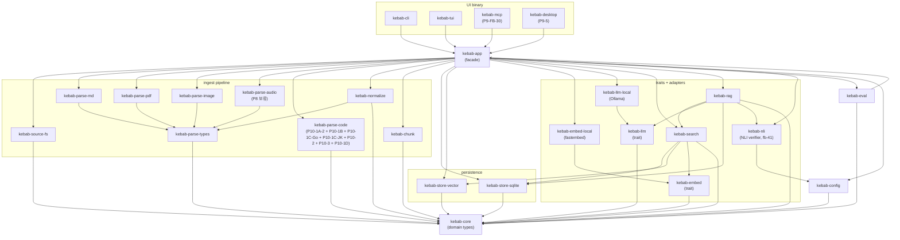

# Architecture

> kebab 의 내부 구조 — crate 의존성, 디렉토리, 핵심 기술 결정. 사용자 사용법은 [README.md](../README.md), 진척도는 [HANDOFF.md](../HANDOFF.md), frozen 설계 계약은 [docs/superpowers/specs/2026-04-27-kebab-final-form-design.md](superpowers/specs/2026-04-27-kebab-final-form-design.md), 머지 후 발견된 deviation 은 [tasks/HOTFIXES.md](../tasks/HOTFIXES.md).

## 한 줄

Cargo workspace, 함수 호출 기반 모듈러 모놀리스. UI binary (`kebab-cli`, `kebab-tui`, 미래 `kebab-desktop`) 가 facade crate (`kebab-app`) 만 참조. 도메인 / 파이프라인 / 저장소 / 외부 어댑터가 명확한 boundary 로 분리.

## 핵심 기술 결정 (lock 됨)

| 결정 | 값 |
|------|-----|
| 언어 | Rust 2024 (resolver=3, edition 2024) |
| repo | Cargo workspace (single repo, 함수 호출 기반 모듈러 모놀리스) |
| 원본 저장 | filesystem + blake3 content-addressable copy (대용량은 reference + checksum) |
| metadata | SQLite + FTS5 (lexical search) |
| vector | LanceDB (embedded, model 별 분리 table) |
| Markdown parser | `pulldown-cmark` |
| embedding | `fastembed-rs` (`multilingual-e5-small`, 384d) |
| LLM | Ollama HTTP (default `gemma4:e4b` ─ OCR / caption 와 family 통일. 사용자가 더 큰 variant `gemma4:26b` 등으로 override 가능) |
| 음성 ASR | `whisper.cpp` (via `whisper-rs`) — P8 보류, 시스템 dep brainstorm 후 |
| OCR | Ollama vision LM (default `gemma4:e4b`) — `OcrEngine` trait 으로 Tesseract / Apple Vision 등 future swap (HOTFIXES P6-2) |
| Image caption | Ollama vision LM, runtime gate `image.caption.enabled` (default OFF) |
| PDF parser | `lopdf` per-page 텍스트, `chunker_version = "pdf-page-v1"` 가 PDF 자산에 하드코딩 (HOTFIXES P7-3) |
| code parser | `tree-sitter` + `tree-sitter-rust` / `tree-sitter-python` / `tree-sitter-typescript` / `tree-sitter-javascript` / `tree-sitter-go` / `tree-sitter-java` / `tree-sitter-kotlin-ng` — **parser-side** (`kebab-parse-code`), chunker-side 아님 (design §6.3). chunker versions: Rust = `code-rust-ast-v1`, Python = `code-python-ast-v1`, TypeScript = `code-ts-ast-v1`, JavaScript = `code-js-ast-v1`, Go = `code-go-ast-v1`, Java = `code-java-ast-v1`, Kotlin = `code-kotlin-ast-v1`. `ast_chunk_max_lines = 200` 상수 고정 (HOTFIXES 2026-05-19 — Chunker trait 이 per-medium config 미노출). Kotlin grammar 은 `tree-sitter-kotlin-ng` 사용 — bare `tree-sitter-kotlin` 은 tree-sitter 0.21–0.23 에 고착되어 있어 사용 불가. **Tier 2 (p10-2)**: YAML/k8s → `serde_yaml` + `k8s-manifest-resource-v1` (apiVersion+kind per resource), Dockerfile → `dockerfile-file-v1` (whole-file), Cargo.toml/go.mod/.json/.xml/.groovy → `manifest-file-v1` (whole-file). Tier 2 chunkers live in `kebab-chunk`; no tree-sitter grammar needed (structure from file type, not AST). **Tier 3 (p10-3)**: shell scripts (`.sh`/`.bash`/`.zsh`) direct → `code-text-paragraph-v1` (blank-line paragraph segmentation + 80-line / 20-overlap line-window for oversize). Same chunker also serves as fallback when Tier 1/2 emit 0 chunks or Err — non-k8s YAML / invalid YAML / AST extractor failures all picked up. symbol = None; lang preserved from input doc. **Tier 1 family complete (p10-1D)**: C (`tree-sitter-c`, `code-c-ast-v1`, `.c`/`.h`) + C++ (`tree-sitter-cpp`, `code-cpp-ast-v1`, `.cpp`/`.cc`/`.cxx`/`.hpp`/`.hh`/`.hxx`). C symbol = function name only; C++ symbol = `namespace::Class::method` (recursive nesting). `.h` 가 C++ syntax 만나면 tree-sitter-c parse 실패 → Tier 3 fallback. |
| 1B symbol path | workspace path → module path: Python = dotted prefix (`kebab_eval.metrics.compute_mrr`), TypeScript/JavaScript = slash-style prefix (`src/Foo.Foo.search`). Rust 1A-2 는 file-scope nesting 만 (workspace prefix 없음, 비일관 수용 — HOTFIXES 2026-05-20). |
| TUI | Ratatui + crossterm — P9-1 Library 패널, P9-2/3/4 진행 예정 |
| Desktop | Tauri 2 + `pdfjs-dist` (native PDF render backend 금지) — P9-5 |
| citation 형식 | URI fragment (`path#L12-L34` / `path#p=12` / `path#xywh=0,0,100,50`, W3C Media Fragments) |
| ID 생성 | `blake3(canonical_json(tuple))[..32]` hex |
| RRF fusion_score | `[0, 1]` 정규화 — `2 / (k_rrf + 1)` 로 나눠 mode 간 비교 가능 (post-merge hotfix) |
| layout | XDG (`~/.local/share/kebab/`, `~/.config/kebab/`, …) |

전체 frozen 설계는 [docs/superpowers/specs/2026-04-27-kebab-final-form-design.md](superpowers/specs/2026-04-27-kebab-final-form-design.md) 12 sections 참조.

## crate 의존성 그래프

> 그룹 단위 view + 컴포넌트별 상세는 [docs/components/](components/).



UI → store/llm/parse 직접 의존 금지. 모든 user-facing 진입은 `kebab-app` facade 만 통한다 (frozen 설계 §8). `kebab-cli` 가 `--config <path>` flag 를 honor 하려면 `kebab_app::*_with_config(cfg, …)` companion 을 통해 Config 을 명시적으로 thread 하는 패턴 — 자세한 이유는 [tasks/HOTFIXES.md](../tasks/HOTFIXES.md) 의 `--config` 항목.

`kebab-parse-code` 의 외부 tree-sitter grammar crate 의존: P10-1A-2 에서 `tree-sitter-rust` 추가, P10-1B 에서 `tree-sitter-python` / `tree-sitter-typescript` / `tree-sitter-javascript` 추가, P10-1C-Go 에서 `tree-sitter-go` 추가, P10-1C-JK 에서 `tree-sitter-java` / `tree-sitter-kotlin-ng` 추가, P10-1D 에서 `tree-sitter-c` / `tree-sitter-cpp` 추가. 모두 `kebab-parse-code` 에만 격리 (facade 룰 — UI crate / chunker 가 직접 import 금지). Kotlin 은 `tree-sitter-kotlin-ng` 사용 (bare `tree-sitter-kotlin` 은 tree-sitter 0.21–0.23 에 고착 — 사용 불가). v0.18.0+ 부터 `kebab-source-fs` 는 자체 `code_meta` 모듈 (lang detect + skip helpers + BUILTIN_BLACKLIST) 을 보유, kebab-parse-code 와 분리 (refactor 2026-05-26).

## 디렉토리 구조

```text
kebab/
├── README.md                                       # 사용자 첫 stop (사용법 / Quick start / Mermaid)
├── HANDOFF.md                                      # 진척도 (phase status / 다음 task)
├── kebab_local_rust_report.md                      # 최초 설계 보고서 (방향성 + 근거)
├── docs/
│   ├── ARCHITECTURE.md                             # 이 파일
│   ├── SMOKE.md                                    # 로컬 워크스페이스 직접 돌려보는 절차
│   ├── superpowers/
│   │   ├── specs/
│   │   │   └── 2026-04-27-kebab-final-form-design.md  # frozen design (12 sections)
│   │   └── plans/
│   │       └── 2026-04-27-task-decomposition.md    # task 분해 implementation plan
│   └── wire-schema/v1/                             # JSON Schema 7 (citation, search_hit, answer, …)
├── tasks/
│   ├── INDEX.md                                    # phase 인덱스 + component task 트리
│   ├── HOTFIXES.md                                 # post-merge dated fix 로그
│   ├── _template.md                                # task spec 작성 템플릿
│   ├── phase-0-skeleton.md … phase-9-ui.md         # phase epic (high-level)
│   ├── p0/p0-1-skeleton.md                         # component task (1)
│   ├── p1/p1-1 … p1-6                              # (6)
│   ├── p2/p2-1, p2-2                               # (2)
│   ├── p3/p3-1 … p3-5                              # (5 — p3-5 = app-wiring, post-spec 추가)
│   ├── p4/p4-1 … p4-3                              # (3)
│   ├── p5/p5-1, p5-2                               # (2)
│   ├── p6/p6-1 … p6-4                              # (4 — p6-4 = image-ingest-wiring 후속 추가)
│   ├── p7/p7-1 … p7-3                              # (3 — p7-3 = pdf-ingest-wiring 후속 추가)
│   ├── p8/p8-1, p8-2                               # (2 — 보류)
│   └── p9/p9-1 … p9-5                              # (5)
├── crates/
│   ├── kebab-core/  kebab-parse-types/  kebab-config/       # 도메인 + 설정 (P0)
│   ├── kebab-source-fs/                               # 워크스페이스 walk + checksum (P1-1)
│   ├── kebab-parse-md/                                # Markdown frontmatter + blocks (P1-2/3)
│   ├── kebab-normalize/                               # ParsedBlock → CanonicalDocument (P1-4)
│   ├── kebab-chunk/                                   # heading-aware + pdf-page-v1 + code-*-ast-v1 (Tier 1) + k8s-manifest-resource-v1 + dockerfile-file-v1 + manifest-file-v1 + tier2_shared (P10-2) + code-text-paragraph-v1 (P10-3) chunker (P1-5, P7-2, P10-1A-2, P10-1B, P10-1C-Go, P10-1C-JK, P10-2, P10-3, P10-1D)
│   │   └── src/
│   │       ├── code_*_ast_v1.rs              # Tier 1 AST chunkers (rust/python/ts/js/go/java/kotlin/c/cpp)
│   │       ├── code_c_ast_v1.rs              # Tier 1 (p10-1D): C top-level fn / struct / enum / union
│   │       ├── code_cpp_ast_v1.rs            # Tier 1 (p10-1D): C++ namespace::Class::method (recursive nesting)
│   │       ├── k8s_manifest_resource_v1.rs   # Tier 2 (p10-2): YAML multi-doc, apiVersion+kind per resource
│   │       ├── dockerfile_file_v1.rs         # Tier 2 (p10-2): whole-file Dockerfile
│   │       ├── manifest_file_v1.rs           # Tier 2 (p10-2): whole-file Cargo.toml / go.mod / .json / .xml / .groovy
│   │       ├── code_text_paragraph_v1.rs     # Tier 3 (p10-3): blank-line paragraph + 80/20 line-window fallback
│   │       └── tier2_shared.rs               # Tier 2 (p10-2): shared oversize fallback + Chunk builder helpers
│   ├── kebab-store-sqlite/                            # SQLite + FTS5 (V001/V002/V003) (P1-6, P2-1, P3-3)
│   ├── kebab-search/                                  # Lexical + Vector + Hybrid retriever (P2-2, P3-4)
│   ├── kebab-embed/  kebab-embed-local/                  # Embedder trait + fastembed adapter (P3-1, P3-2)
│   ├── kebab-store-vector/                            # LanceDB VectorStore (P3-3, P7-3 follow-up)
│   ├── kebab-llm/  kebab-llm-local/                      # LanguageModel trait + Ollama adapter (P4-1, P4-2)
│   ├── kebab-rag/                                     # RAG pipeline (P4-3)
│   ├── kebab-nli/                                     # NLI verifier (mDeBERTa-v3 XNLI, fb-41 PR-9a/9b/9c-1)
│   ├── kebab-eval/                                    # golden query runner + metrics (P5-1, P5-2)
│   ├── kebab-parse-image/                             # ImageExtractor + Ollama OCR + caption (P6)
│   ├── kebab-parse-pdf/                               # lopdf per-page text extractor (P7-1)
│   ├── kebab-parse-code/                              # tree-sitter AST extractors: Rust (P10-1A-2), Python + TypeScript + JavaScript (P10-1B), Go (P10-1C-Go), Java + Kotlin (P10-1C-JK — java.rs + kotlin.rs), C + C++ (P10-1D — c.rs + cpp.rs); chunker lives in kebab-chunk
│   ├── kebab-app/                                     # facade (P0 시그니처 + P3-5/P6-4/P7-3 본체)
│   ├── kebab-tui/                                     # Ratatui shell + Library 패널 (P9-1)
│   ├── kebab-mcp/                                     # stdio MCP server — tools: schema, doctor, search, ask (P9-FB-30)
│   └── kebab-cli/                                     # binary (P0 → 핫픽스로 --config flag wiring 강화)
├── migrations/                                     # SQLite refinery V001/V002/V003
└── fixtures/                                       # 테스트 fixture 트리
```

## 외부 AI 통합

`--json` 플래그 가 모든 명령에 붙어 frozen wire schema v1 (`schema_version` 항상 포함) 을 출력. 외부 도구는 wire 만 의존하면 됨:

1. **Claude Code / Codex skill** — 얇은 wrapper (`kebab search --json` / `kebab ask --json` 호출). ~50 lines.
2. **MCP server** — `kebab` 를 stdio MCP server 로 wrap. 모든 LLM client 가 자동으로 사용.
3. **HTTP wrapper** — `kebab serve --bind 127.0.0.1:7711` (P+, local-only 가치 깨므로 신중).

wire schema 자체는 [docs/wire-schema/v1/](wire-schema/v1/).

## 비-목표 (frozen design §11 / §0)

- 다중 사용자 SaaS, K8s 배포, 원격 vector DB
- enterprise RBAC/ABAC, 실시간 협업
- 모든 파일 포맷의 완벽한 parsing
- agent 가 임의로 파일을 수정하는 자동화
- multi-workspace (P+ 후순위)
- LLM-as-judge eval (rule-based `must_contain` 만)
- visual embedding (CLIP) — P+
- desktop app `kebab://` protocol handler — P+
