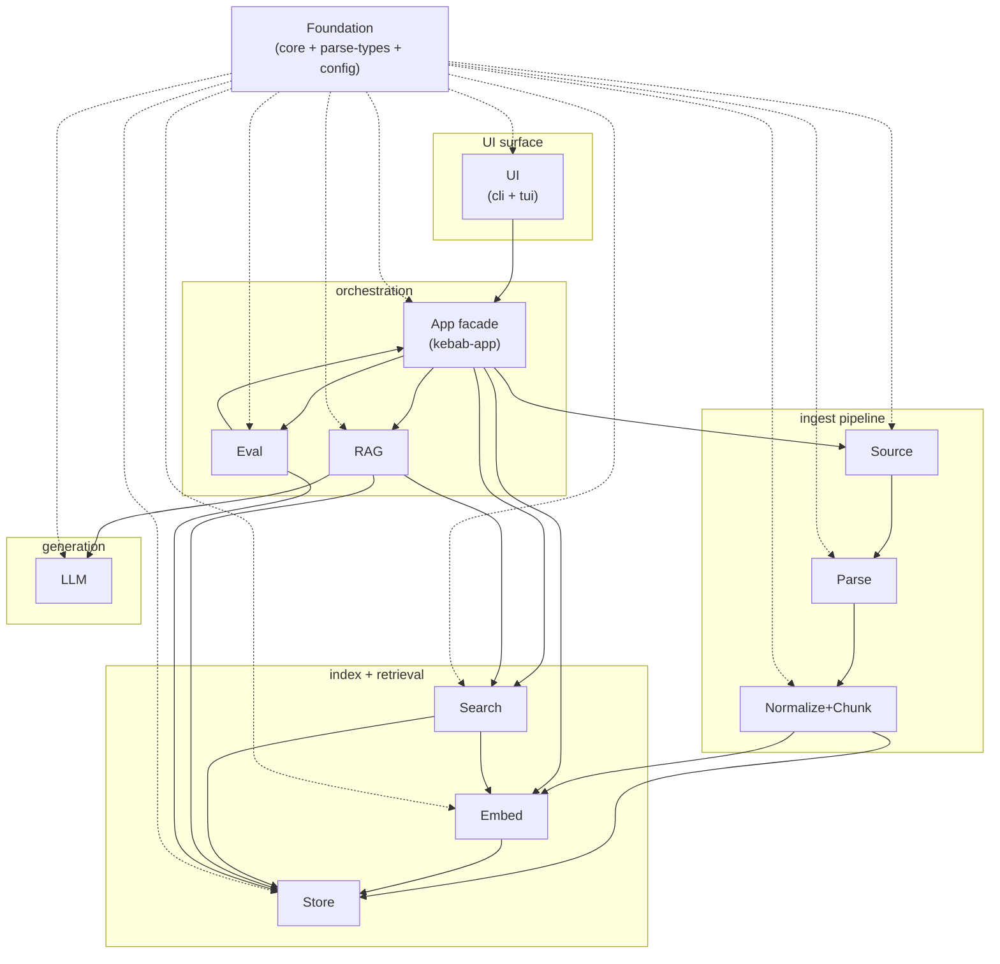

# Components

> 책임 단위 그룹별 contributor 향 상세. 사용자 향 grand picture 는 [README.md](../../README.md), 상위 crate 의존 그래프 + 디렉토리 구조 + locked-in 결정은 [docs/ARCHITECTURE.md](../ARCHITECTURE.md), 진척도는 [HANDOFF.md](../../HANDOFF.md), per-task spec 은 [tasks/INDEX.md](../../tasks/INDEX.md).

각 그룹 페이지는 동일 템플릿: 구성 crate / 구조 다이어그램 / data flow 다이어그램 / 주요 type / 외부 의존 / 핵심 결정 (HOTFIXES + spec 의 "왜") / 관련 spec / HOTFIXES.

## 그룹 wiring

12 그룹 간 호출/의존 흐름. 점선 = `Foundation` 이 모두에 의존. UI 는 `App facade` 만 통해 다른 그룹 도달.

## 그룹 목록

| 그룹 | 역할 | 페이지 |
|------|------|--------|
| **Foundation** | 도메인 type + 설정 + parser IR. 모든 crate 의 zero-dep 토대. | [foundation/](foundation/) |
| **Source** | 워크스페이스 walk + .kebabignore + BLAKE3 checksum → `RawAsset`. | [source/](source/) |
| **Parse** | bytes → `ParsedBlock` (md) 또는 `CanonicalDocument` (pdf/image). OCR + caption 어댑터. | [parse/](parse/) |
| **Normalize+Chunk** | `ParsedBlock` → `CanonicalDocument` lift (markdown only) + 모든 미디어 → `Vec<Chunk>` (md/pdf 변종 chunker). | [normalize-chunk/](normalize-chunk/) |
| **Store** | SQLite (V001-V005, FTS5, jobs, chat sessions) + LanceDB (per-model vector 테이블) two-phase write. | [store/](store/) |
| **Embed** | `Embedder` trait + fastembed-rs 어댑터 (multilingual-e5-small 384d). | [embed/](embed/) |
| **Search** | lexical (FTS5 BM25) + vector (ANN) + hybrid (RRF) — `Retriever` trait 3 변종. | [search/](search/) |
| **LLM** | `LanguageModel` trait + Ollama HTTP 어댑터 (`gemma4:e4b` default). streaming + cancel-safe. | [llm/](llm/) |
| **RAG** | retrieve → gate → pack → generate → cite-validate → persist 9 stage pipeline. multi-turn 지원. | [rag/](rag/) |
| **App facade** | `kebab-app` — 모든 UI binary 의 유일한 진입점. `*_with_config` companion 패턴. | [app-facade/](app-facade/) |
| **UI** | `kebab-cli` (`--json` wire envelope) + `kebab-tui` (4 패널 + Mode machine + cheatsheet). | [ui/](ui/) |
| **Eval** | golden query 회귀 평가 + run-vs-run compare. `must_contain` rule-based. | [eval/](eval/) |

## 진입 가이드

처음 읽는다면 (의존성 따라 bottom-up):

1. **Foundation** — 다른 모든 페이지가 참조하는 type 정의. `AssetId` / `DocumentId` / `Chunk` / `Citation` / 5 version 등.
2. **Source → Parse → Normalize+Chunk → Store** — ingest pipeline 흐름.
3. **Embed → Search** — retrieval.
4. **LLM → RAG** — generation.
5. **App facade** — 위 전부 wiring.
6. **UI** — facade 위.
7. **Eval** — 독립.

특정 작업 별 진입:

- **새 미디어 타입 추가** (예: epub) — Parse → Normalize+Chunk → Store (chunker_version) → App facade (라우팅).
- **새 retrieval 모드** — Search → App facade (mode dispatch) → UI (--mode flag).
- **새 LLM 어댑터** — LLM (trait crate, 새 type 금지) + 새 `kebab-llm-<provider>` crate → App facade (config provider switch).
- **TUI 신규 pane** — UI 만. Mode + Theme + InputBuffer 재사용.

## 다이어그램 제약

각 그룹 페이지의 다이어그램은 `mermaid` (Gitea / GitHub 자동 렌더). 페이지 별 최소 2개 — **구조** (type/trait/struct 관계) + **data flow** (입출력 흐름). 실제 코드와 시그니처 일치 — 작성 시 `crates/kebab-<name>/src/lib.rs` 직접 읽음 (추측 금지).
