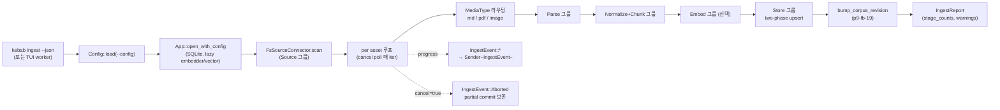
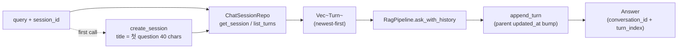

# App facade

> `kebab-app` 은 모든 UI binary (cli/tui/desktop) 가 의존하는 **유일한** 진입점. 도메인 type 만 반환 (wire envelope 은 UI 측 책임). `*_with_config` companion 패턴으로 explicit Config threading 보장.

## 구성 crate

| Crate | 역할 |
|-------|------|
| `kebab-app` | high-level facade. 모든 pipeline crate 를 wire 해서 ingest / search / ask / list / inspect / doctor / reset / init 8개 op 노출. `App` lifecycle struct + `*_with_config` companion + `IngestEvent` streaming + cooperative cancel. |

## 구조

```mermaid
classDiagram
    class App {
        +open_with_config(cfg) Self
        +embedder() Option~Arc~dyn Embedder~~
        +vector() Option~Arc~LanceVectorStore~~
        +llm() Arc~dyn LanguageModel~
        +search(query) Vec~SearchHit~
        +ask_with_session(session_id, query, opts) Answer
        -config: Config
        -sqlite: Arc~SqliteStore~
        -embedder: OnceLock
        -vector: OnceLock
        -llm: OnceLock
        -search_cache: Option~Mutex~LruCache~~
    }
    class FreeFns {
        <<top-level pub fn>>
        init_workspace(force)
        ingest(scope, summary_only)
        list_docs(filter)
        inspect_doc(id) / inspect_chunk(id)
        search(query)
        ask(query, opts)
        doctor()
    }
    class WithConfig {
        <<#[doc(hidden)] pub fn>>
        ingest_with_config
        ingest_with_config_progress
        ingest_with_config_cancellable
        list_docs_with_config / inspect_*_with_config
        search_with_config / search_uncached_with_config
        ask_with_config / ask_with_session_with_config
        doctor_with_config_path
    }
    class IngestEvent {
        <<enum>>
        Started{total}
        AssetStarted{path}
        AssetCompleted{counts}
        Completed{counts}
        Aborted{partial_counts}
    }
    class ResetReport {
        scope: ResetScope
        wiped: Vec~PathBuf~
    }
    class DoctorReport {
        schema_version: u32
        checks: Vec~DoctorCheck~
    }
    FreeFns ..> WithConfig : load_config + delegate
    App ..> WithConfig : long-lived path
    WithConfig ..> IngestEvent : stream channel
```

## Data flow — `kebab ingest` (cancellable + progress)



## Data flow — `kebab ask --session <id>` (multi-turn)



## 주요 type / trait / 함수

**Top-level free fn** (사용자 향, XDG Config 자동 로드):
- `init_workspace(force: bool)` — `~/.config/kebab/config.toml` + `~/.local/share/kebab/` 생성. path policy comment 자동 prepend (p9-fb-05).
- `ingest(scope, summary_only) -> IngestReport` — workspace 전체 ingest.
- `list_docs(filter) / inspect_doc(id) / inspect_chunk(id) / search(query) / ask(query, opts) / doctor()` — 그대로.

**`*_with_config` companion** (`#[doc(hidden)] pub fn`, but **공식** API):
- `ingest_with_config(cfg, scope, summary_only)` — 가장 단순.
- `ingest_with_config_progress(cfg, scope, progress: Option<Sender<IngestEvent>>)` — TTY 진행 표시 / `--json` line-delimited 용.
- `ingest_with_config_cancellable(cfg, scope, progress, cancel: Option<Arc<AtomicBool>>)` — 위 + cooperative cancel. asset loop iter 시작에서 poll → true 면 break + `Aborted{partial_counts}` + `Ok(IngestReport)` 반환 (Err 아님). 부분 commit 보존.
- `search_with_config / search_uncached_with_config` — 후자는 LRU cache bypass (debug).
- `ask_with_session_with_config(cfg, session_id, query, opts)` — multi-turn (p9-fb-18).
- `doctor_with_config_path(Option<&Path>)` — config 경로 explicit.

**`App` lifecycle** (long-lived caller 향 — kebab-eval, future TUI session):
- `App::open_with_config(cfg) -> Result<Self>` — SQLite open + migration. embedder/vector/llm 은 lazy `OnceLock` 으로 첫 호출에서 build.
- `App::embedder() -> Option<...>` — `provider == "none"` 또는 `dimensions == 0` 이면 `None` (lexical-only fallback).
- `App::ask_with_session(session_id, query, opts)` — repo + RAG ask + 새 turn append 한 묶음 (p9-fb-18).
- `App::search(query)` — LRU cache lookup → miss 시 `search_uncached` → put. cache key = `(query_norm, mode, k, snippet_chars, embedding_version, chunker_version, corpus_revision)`.

**`IngestEvent`** (`kebab-app::ingest_progress`):
- `Started { total }` / `AssetStarted { workspace_path }` / `AssetCompleted { counts }` / `Completed { counts }` / `Aborted { partial_counts }`. terminal frame 후 sender drop.

**`ResetReport` / `ResetScope`** (`kebab-app::reset`):
- `--all` / `--data-only` / `--vector-only` / `--config-only` (p9-fb-06).
- TTY 가 아니면 `--yes` 필수 (silent destruction 방어).
- `--vector-only` 가 SQLite `embedding_records` 도 truncate (off-disk Lance dir wipe 시 orphan 방지).

## 외부 의존

- crate dep: 거의 모든 kebab-* (source-fs, parse-md/pdf/image, normalize, chunk, store-sqlite, store-vector, embed-local, llm-local, search, rag, config, core).
- 외부 lib: `lru` (search cache), `serde`, `anyhow`, `tracing`, `time`, `ctrlc` (CLI signal).
- 외부 서비스: 없음 (down-stream adapter 가 가져옴).

## 핵심 결정

- **Facade rule: UI binary 는 `kebab-app` 만 import**.
  **왜**: store / llm / parse / search 직접 import 가 boundary 깨짐 → UI 가 SQLite 를 알면 swap 안 됨, ONNX 를 알면 cold start 비대화. `kebab-app` 만 알게 하면 future MCP server / HTTP wrapper 도 같은 contract 위에 build.

- **`*_with_config` companion = 공식 API (test seam 아님)**.
  **왜**: top-level `ingest()` 는 `Config::load(None)` 으로 XDG default 만 읽음 → `kebab-cli --config /tmp/foo.toml` 가 silently bypass 되는 회귀 두 번 (HOTFIXES P3-5, P4-3). `kebab-cli` 는 항상 `*_with_config` 호출 — 이 패턴이 spec literal 을 후행 강화. `#[doc(hidden)]` 는 rustdoc 깨끗함만, public 그대로.

- **`App.{embedder, vector, llm}` 가 `OnceLock` lazy + memoized**.
  **왜**: `kebab list` / `kebab inspect` / `--mode lexical` 가 ONNX (~470 MB) + Lance reopen 비용 0 이어야 함. 매 CLI invocation 가 cold start 부담 = sub-second 가 다 망가짐. 첫 사용 시 build, 같은 `App` 재사용 시 재 build 안 함 (kebab-eval 50 query suite, TUI session).

- **embedding 비활성 모드 (`provider = "none"` 또는 `dimensions = 0`)**.
  **왜**: 사용자 환경 (헤드리스 / OS 미지원) 에서 embedding 끄고 lexical-only 쓰는 escape hatch. `App::embedder()` 가 `None` 반환 → search 가 mode=lexical 에 falls back. config-only switch.

- **`ingest_with_config*` 3개 함수 (vanilla / progress / cancellable)**.
  **왜**: 호출 사이트 별 capability 다름. CLI 가 progress 만 필요 / TUI worker 가 progress + cancel 둘 다. 단일 함수에 `Option<Sender>` + `Option<AtomicBool>` 다 받게 하면 caller 시그니처 noisy. 3 layered: vanilla → progress wraps it (cancel=None) → cancellable wraps progress.

- **`Aborted` = `Ok(IngestReport)`, `Err` 아님**.
  **왜**: cancel 은 사용자 의도. partial commit 보존 (다음 ingest idempotent 재개). `Err` 로 처리하면 caller 가 cleanup 강요, partial 도 sweep 됨. wire 측에서 `IngestEvent::Aborted` frame 으로 cancel signal 분명, `IngestReport.partial_counts` 가 진행 상황 보유.

- **`App.search_cache` LRU + `corpus_revision` snapshot**.
  **왜**: TUI 의 매 keystroke debounced search 가 같은 query 반복. capacity 256 (~1.3 MB) cap. cache key 의 `corpus_revision` snapshot 이 ingest commit 후 자동 invalidation — 사용자가 문서 추가하면 다음 search 가 새로 쿼리 (p9-fb-19).

- **wire-schema envelope = UI 측 (`kebab-cli/wire.rs`) 책임**.
  **왜**: `kebab-app` 의 함수가 pure 도메인 type 만 반환 → kebab-tui 가 wire envelope 안 거치고 in-memory 직접 사용. `--json` 출력은 cli 가 `*.v1` envelope 으로 wrap. `DoctorReport` 만 예외 — 자체 `schema_version` 보유 (도메인 측 동등 type 없음).

- **multi-turn 세션 진입 = `App` 메서드 (`ask_with_session`)**.
  **왜**: 세션 복구 + history 빌드 + ChatSessionRepo append 가 한 transaction. caller (CLI / TUI) 가 매번 free fn 으로 호출하면 매번 `App::open` → ONNX cold start. `App` 위 메서드 = 한 번 open 후 N 번 ask.

## 관련 spec / HOTFIXES

- frozen 설계 §2.4a (ingest progress wire), §3.8 (Answer / Turn), §5.7a (chat sessions), §6.4 (defaults), §7 (facade), §8 (boundary), §10 (long-running ops), §11 (errors): [`docs/superpowers/specs/2026-04-27-kebab-final-form-design.md`](../../superpowers/specs/2026-04-27-kebab-final-form-design.md)
- task spec:
  - app skeleton + ingest wiring: [`tasks/p3/p3-5-app-wiring.md`](../../../tasks/p3/p3-5-app-wiring.md), [`tasks/p6/p6-4-image-ingest-wiring.md`](../../../tasks/p6/p6-4-image-ingest-wiring.md), [`tasks/p7/p7-3-pdf-ingest-wiring.md`](../../../tasks/p7/p7-3-pdf-ingest-wiring.md)
  - reset: [`tasks/p9/p9-fb-06-data-reset-command.md`](../../../tasks/p9/p9-fb-06-data-reset-command.md)
  - ingest progress / cancel: [`tasks/p9/p9-fb-03-tui-ingest-background.md`](../../../tasks/p9/p9-fb-03-tui-ingest-background.md), [`tasks/p9/p9-fb-04-ingest-cancellation.md`](../../../tasks/p9/p9-fb-04-ingest-cancellation.md)
  - search cache: [`tasks/p9/p9-fb-19-search-cache.md`](../../../tasks/p9/p9-fb-19-search-cache.md)
  - chat session CLI: [`tasks/p9/p9-fb-18-cli-ask-session-repl.md`](../../../tasks/p9/p9-fb-18-cli-ask-session-repl.md)
- HOTFIXES (P3-5/P4-3 `--config` 누락 + `*_with_config` 패턴, P7-3 storage UNIQUE bug, p9-fb-* 도그푸딩 후속): [`tasks/HOTFIXES.md`](../../../tasks/HOTFIXES.md)
