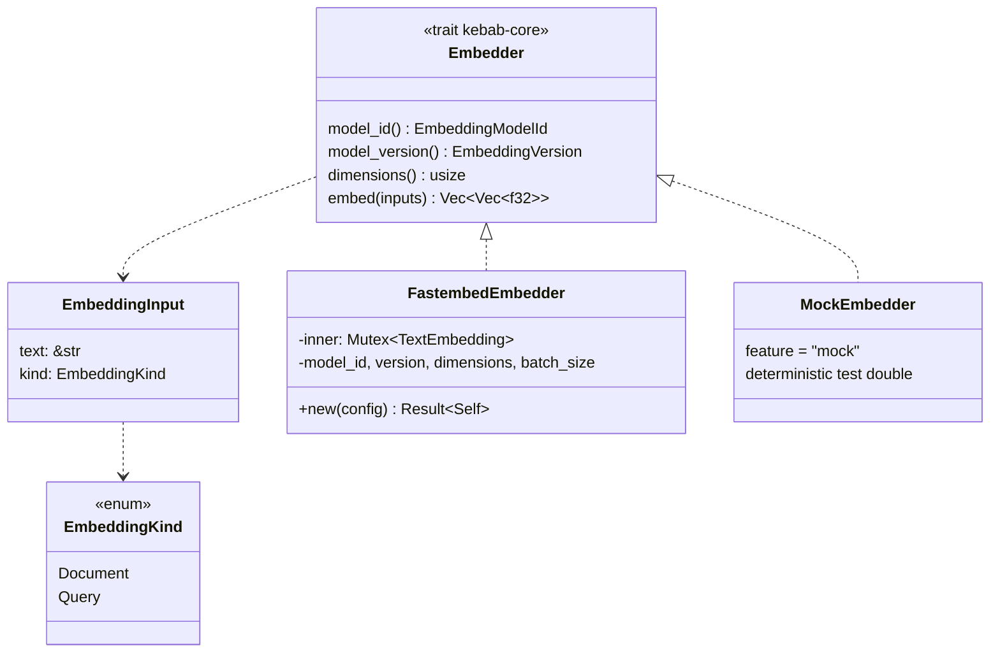
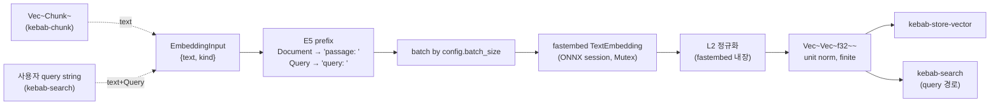

# Embed

> Chunk text → 단위 정규화된 벡터. trait + impl 패턴으로 future swap (candle / ollama-embed) 가능.

## 구성 crate

| Crate | 역할 |
|-------|------|
| `kebab-embed` | `Embedder` trait re-export + 테스트 도구 (`assert_vector_shape`, `assert_unit_norm`) + optional `MockEmbedder` (feature gated). 새 type 추가 **금지** — 순수 facade. |
| `kebab-embed-local` | `FastembedEmbedder` — fastembed-rs 위 ONNX-backed local 임베더. default `multilingual-e5-small` 384d. |

## 구조

## Data flow

## 주요 type / trait / 함수

**Trait** (`kebab-core`, re-export `kebab-embed`):
- `Embedder::embed(&self, inputs: &[EmbeddingInput<'_>]) -> Result<Vec<Vec<f32>>>` — 출력 shape `inputs.len()` × `dimensions()`. 결과 벡터 모두 L2 = 1 + finite.
- `EmbeddingInput { text: &str, kind: EmbeddingKind }` — kind = `Document` / `Query` (E5 prefix 분기).
- `EmbeddingModelId(String)`, `EmbeddingVersion(String)` — `model_id × version × dim` 으로 vector store 테이블 분리.

**FastembedEmbedder** (`kebab-embed-local`):
- `FastembedEmbedder::new(config: &kebab_config::Config) -> Result<Self>` — 모델 파일 캐시 위치 = `{model_dir}/fastembed/`. 첫 호출 시 ONNX + tokenizer 다운로드. `config.models.embedding.dimensions` 가 실제 모델 차원과 다르면 즉시 `Err` (런타임 silent mismatch 회피).
- `Mutex<TextEmbedding>` 으로 inner 세션 직렬화 — fastembed 4.9 가 `&self` 지만 보수적 lock. kebab-app 의 indexer 가 어차피 순차 batch 라 contention 없음.
- E5 prefix 자동 적용: `Document` → `"passage: "`, `Query` → `"query: "` (§11.3).
- L2 정규화 = fastembed 내장 (`transformer_with_precedence`). 별도 정규화 안 함, 단 `assert_unit_norm` 테스트로 invariant pin.

**테스트 도구** (`kebab-embed`):
- `assert_vector_shape(&[Vec<f32>], expected_dims)` — 길이 + finite 검증.
- `assert_unit_norm(&[Vec<f32>], tolerance)` — L2 norm 이 `1.0 ± tolerance`. f32 384d 권장 tol = `5e-4`.
- `MockEmbedder` (feature `mock`, default OFF) — 테스트용 deterministic double. 실 어댑터는 `kebab-embed-local` 또는 future P+ adapter 가 담당.

## 외부 의존

- `kebab-embed` → `kebab-core` 만 (re-export crate).
- `kebab-embed-local` → `kebab-embed` + `kebab-config`, `fastembed`, `anyhow`.
- 외부 lib: `fastembed-rs` (ONNX wrapper, Hugging Face 모델 다운로드 포함). 로컬 ORT runtime.
- 외부 서비스: 첫 호출 시 모델 다운로드 (Hugging Face). 그 후 오프라인.

## 핵심 결정

- **`kebab-embed` = trait re-export only, **새 type 금지****.
  **왜**: `kebab-store-vector`, `kebab-search` 등 downstream 이 `use kebab_embed::Embedder` 안정 surface 의존. `kebab-core` 재구성 시 trait 이동해도 downstream 안 깨짐. spec 가 명시 — 어댑터 코드는 `kebab-embed-local` 또는 future `kebab-embed-<provider>` 로.

- **`multilingual-e5-small` 384d default**.
  **왜**: 한국어 + 영어 동시 강함, ONNX 작음 (~120MB), 384d 가 retrieval 정확도/저장 비용 균형 좋음. e5 prefix 컨벤션 (`"passage: "` / `"query: "`) 으로 같은 모델이 doc + query 두 모드 cover.

- **L2 정규화 = fastembed 내장에 위임**.
  **왜**: fastembed 4.x 가 `transformer_with_precedence` 에서 이미 L2. 두 번 정규화 = 비용 + numerical drift. invariant 가 깨지면 `assert_unit_norm` 테스트가 즉시 실패 — fastembed 가 default 바꾸면 회귀 잡힘.

- **`Mutex<TextEmbedding>` 보수적 직렬화**.
  **왜**: fastembed `&self` API 라 in principle 병렬 가능, 그러나 ORT Session 의 thread-safety 가 backend 별로 다름. indexer 가 어차피 순차 batch 라 contention 없음. profiling 에서 병목 보이면 그때 풀음.

- **dim mismatch = 생성자에서 즉시 fail**.
  **왜**: `config.models.embedding.dimensions = 384` 가 실제 모델 차원과 다르면 첫 `embed` 호출에서야 발견 → 운영 시 ingest 절반 진행 후 죽음. 생성자에서 검증 = early exit, 사용자가 즉시 config 수정.

- **모델 캐시 = `{model_dir}/fastembed/` 고정 서브디렉토리**.
  **왜**: spec literal. `model_dir` 가 `{data_dir}/models` default → 사용자가 한 곳에 모든 모델 캐시. fastembed 외 어댑터 (candle / ggml / ...) 는 자기 서브디렉토리 사용해서 충돌 회피.

- **`MockEmbedder` feature gate (default OFF)**.
  **왜**: production binary 가 mock 코드를 포함 안 함. test crate 가 `features = ["mock"]` 로 명시 opt-in.

## 관련 spec / HOTFIXES

- frozen 설계 §7.1 (helper input types `EmbeddingInput`/`EmbeddingKind`), §7.2 (`Embedder` trait), §11.3 (E5 prefix), §6.4 (`models.embedding`), §9 (versioning): [`docs/superpowers/specs/2026-04-27-kebab-final-form-design.md`](../../superpowers/specs/2026-04-27-kebab-final-form-design.md)
- task spec:
  - trait crate: [`tasks/p3/p3-1-embed-trait.md`](../../../tasks/p3/p3-1-embed-trait.md)
  - fastembed adapter: [`tasks/p3/p3-2-embed-local.md`](../../../tasks/p3/p3-2-embed-local.md)
- HOTFIXES: 이 그룹은 머지 후 deviation 없음.
