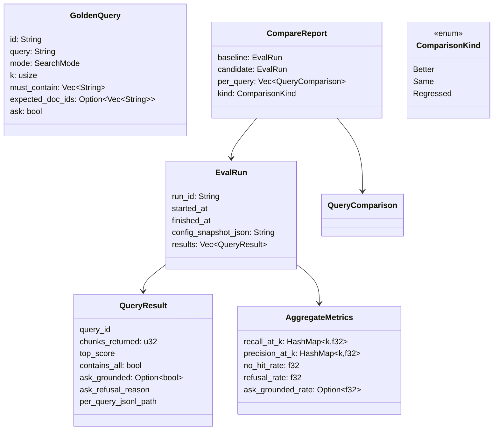
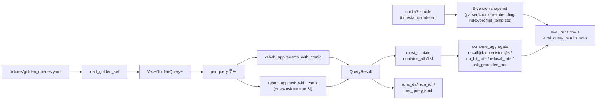
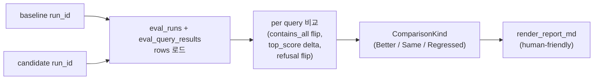

# Eval

> Golden query 회귀 평가. fixture YAML 로드 → kebab-app facade 통해 실행 → 결과 + 메트릭을 SQLite + per_query.jsonl 로 저장. 두 run 간 비교 (compare). LLM-as-judge 안 함 — rule-based `must_contain`.

## 구성 crate

| Crate | 역할 |
|-------|------|
| `kebab-eval` | golden fixture loader + run executor + 메트릭 computer + run-vs-run comparison + markdown 리포트. retrieval/embedding/LLM crate 직접 의존 **금지** — 모두 `kebab-app` facade 통해서만 (P5-1 inheritance). |

## 구조

## Data flow — eval run

## Data flow — compare two runs

## 주요 type / trait / 함수

**Loader** (`kebab-eval::loader`):
- `load_golden_set(path: &Path) -> Result<Vec<GoldenQuery>>` — `serde_yaml_ng` 위 YAML 파싱.
- `GoldenQuery { id, query, mode, k, must_contain, expected_doc_ids, ask }` — fixture 한 entry. `must_contain` 가 case-sensitive substring 검사.

**Runner** (`kebab-eval::runner`):
- `run_eval(opts: EvalRunOpts) -> Result<EvalRun>` / `run_eval_with_config(cfg, opts) -> Result<EvalRun>`.
- `EvalRunOpts { golden_path, ask_enabled, k_override, ... }`.
- 각 query → `kebab_app::search_with_config` 호출 (모든 retrieval 은 facade 통해). `ask=true` 시 추가로 `ask_with_config`.
- `run_id` = UUID v7 simple (timestamp-ordered, lowercase hex).
- `config_snapshot_json` = 5 version 모두 (`parser_version` / `chunker_version` / `embedding_version` / `index_version` / `prompt_template_version`) 한 번에 capture → 후일 compare 가 정확히 같은 environment 인지 검증.
- `runs_dir/<run_id>/per_query.jsonl` 로 raw search hit + answer 저장 — SQLite 의 `eval_query_results` 는 메트릭 + 요약만, full payload 는 JSONL.

**Metrics** (`kebab-eval::metrics`):
- `AggregateMetrics { recall_at_k, precision_at_k, no_hit_rate, refusal_rate, ask_grounded_rate }`.
- `TOP_K_VARIANTS` — 표준 k 값 set (1, 3, 5, 10, ...). 한 run 에서 multiple k 측정.
- `compute_aggregate(run: &EvalRun) -> AggregateMetrics` / `_with_config` companion.
- `store_aggregate(...)` — SQLite `eval_runs.aggregate_json` 컬럼에 저장.
- LLM-as-judge 안 함. `ask_grounded_rate` 는 `Answer.refusal_reason.is_none() && answer.citations.len() > 0` rule.

**Compare** (`kebab-eval::compare`):
- `compare_runs(baseline_id, candidate_id) -> Result<CompareReport>` / `_with_config`.
- `CompareOpts { include_unchanged, k_focus }`.
- `QueryComparison { query_id, baseline_result, candidate_result, deltas: ContainsFlipped/TopScoreDelta/RefusalFlipped }`.
- `ComparisonKind { Better, Same, Regressed }` — overall verdict.
- `render_report_md(&CompareReport) -> String` — markdown 본문 (PR 리뷰 첨부 용도).

## 외부 의존

- crate dep: `kebab-core` + `kebab-config` + `kebab-app` (facade only) + `kebab-store-sqlite` (SQLite 직접 read/write — `eval_runs` / `eval_query_results` 측). retrieval / embedding / LLM crate 직접 import **금지**.
- 외부 lib: `serde_yaml_ng` (golden YAML), `serde_json`, `uuid` (v7), `time`, `tracing`, `anyhow`.
- 외부 서비스: 없음 (facade 가 가져옴).

## 핵심 결정

- **runner 가 `kebab-app` facade 통해서만 실행 (직접 retrieval 금지)**.
  **왜**: facade rule (P5-1 inheritance). retrieval/embedding/LLM 의 swap 가 eval 의 contract 깨면 안 됨. 같은 facade 호출이 production 에서도 → eval 결과가 production 동작과 등가.

- **rule-based `must_contain`, LLM-as-judge 거부**.
  **왜**: LLM judge 가 stochastic + 비용 발생 + 모델 swap 시 baseline 회귀. `must_contain` substring 검사가 deterministic + 무료 + 사용자가 fixture 작성 시 이미 의도 명시. spec §11 의 비-목표 명시.

- **5-version `config_snapshot_json`**.
  **왜**: 두 eval run 비교 시 environment drift 잡음. parser_version / chunker_version 한 단계라도 다르면 비교 무의미 (다른 chunk_id, 다른 retrieval 결과). compare 가 mismatch 시 경고.

- **per_query.jsonl off-disk + SQLite metrics-only**.
  **왜**: SQLite row 가 raw search hit + answer 본문 다 보관하면 row 가 거대해짐 + FTS5 인덱스 노이즈. JSONL 은 개별 파일 → 디스크 저렴, append-only 안전, jq / fzf 로 ad-hoc 분석 가능. SQLite 는 메트릭 + 요약만.

- **UUID v7 run_id**.
  **왜**: timestamp 순 정렬 (v4 random 은 정렬 안 됨) + collision-free + lowercase hex. `runs_dir/<run_id>/` 가 자연 정렬 시 시간 순.

- **`ask_grounded_rate` = `refusal == None && citations > 0`**.
  **왜**: "grounded" 정의가 spec §3.8 — refusal 아니고 citation 보유. LLM 의 답변 품질 (hallucination 여부) 평가 LLM-judge 없이는 불가능, 가까운 proxy 가 grounded rate.

- **compare 의 `ComparisonKind` overall verdict**.
  **왜**: PR review 가 "regressed 인가?" 한 줄 답이 핵심. per-query delta 모두 봐야 verdict 가 나오면 leverage 안 남. `Better` / `Same` / `Regressed` 단일 verdict + 세부 delta 가 backing.

- **eval 자체 cancellable 안 함**.
  **왜**: 50-query suite 가 ~5 분. 중도 cancel 시 partial run 가 baseline 으로 쓰이면 회귀 검출 부정. CLI Ctrl-C 면 hard exit (소실 OK), partial state 저장 안 함.

## 관련 spec / HOTFIXES

- frozen 설계 §5.7 (eval_runs / eval_query_results), §6.3 (runs_dir), §11 (비-목표 = LLM-as-judge 금지), §9 (5-version cascade): [`docs/superpowers/specs/2026-04-27-kebab-final-form-design.md`](../../superpowers/specs/2026-04-27-kebab-final-form-design.md)
- task specs: 삭제됨(2026-06-27 doc-reorg) — 설계는 frozen 계약, 동작은 tasks/HOTFIXES.md, 상세 git history.
- HOTFIXES (P5-1 facade-inheritance 결정, P5-2 metric definition tweaks): [`tasks/HOTFIXES.md`](../../../tasks/HOTFIXES.md)
