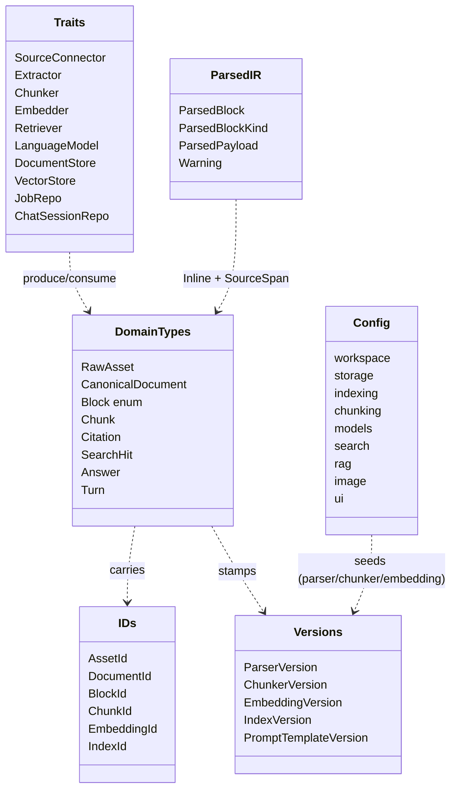
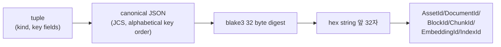

# Foundation

> 도메인 type, 설정, parser 공통 IR — workspace 의 모든 crate 가 의존하는 zero-dependency 토대.

## 구성 crate

| Crate | 역할 |
|-------|------|
| `kebab-core` | 도메인 type + ID recipe + trait. 다른 `kebab-*` crate 에 **의존 금지** (frozen 설계 §3, §4, §7). |
| `kebab-parse-md::types` (모듈; 구 `kebab-parse-types`, v0.19.0 에 `kebab-parse-md` 로 흡수) | parser intermediate (`ParsedBlock`) — `kebab-core` 만 의존. parser library (`pulldown-cmark`, `lopdf` 등) 의존 금지 (§3.7b). |
| `kebab-config` | `Config` 스키마 + XDG path resolver. `defaults → file → env (KEBAB_*)` 3 layer (§6). |

## 구조

## Data flow — ID recipe

모든 ID 는 동일한 recipe (§4.2). tuple 의 (kind, key fields) → 정렬된 canonical JSON → `blake3` → hex 앞 32자.

핵심 invariant: 같은 tuple → 같은 ID, 무한 idempotent. `id_for_*` helper 가 tuple 조립까지 캡슐화 — caller 는 입력만 넘김.

## 주요 type / trait / 함수

**IDs / 버전** (`ids.rs`, `versions.rs`):
- `AssetId(String)` — 32 hex, `blake3` content addressed.
- `id_for_doc(&WorkspacePath, &AssetId, &ParserVersion) -> DocumentId` — `parser_version` 갈리면 doc 도 갈림 (cascade).
- `id_for_chunk(&DocumentId, &ChunkerVersion, &[BlockId], policy_hash: &str) -> ChunkId` — `policy_hash` 가 chunk-policy 변화 capture.
- `id_for_embedding(&ChunkId, &EmbeddingModelId, &EmbeddingVersion, dims: usize) -> EmbeddingId`.

**도메인 type** (`document.rs`, `chunk.rs`, `citation.rs`, `answer.rs`):
- `Block` (enum) — `Heading`, `Paragraph`, `Code`, `List`, `Table`, `ImageRef`, `AudioRef`, `Quote`. `CanonicalDocument` 가 보유.
- `Citation` — URI fragment (`path#L12-L34` / `path#p=12` / `path#xywh=…`).
- `Answer { text, citations, refusal_reason: Option<RefusalReason>, conversation_id, turn_index, ... }` — multi-turn 메타 (p9-fb-15).
- `Turn { question, answer, ... }` — chat history.

**Trait** (`traits.rs`) — pipeline contract. 자세한 내용은 각 그룹 페이지:
- `Extractor` (→ Parse), `Chunker` (→ Normalize+Chunk), `Embedder` (→ Embed), `Retriever` (→ Search), `LanguageModel` (→ LLM), `DocumentStore` / `VectorStore` (→ Store), `ChatSessionRepo` (→ Store, p9-fb-17).

**ParsedBlock IR** (`kebab-parse-md::types`):
- `ParsedBlock { kind, heading_path, source_span, payload: ParsedPayload }` — 모든 parser 의 공통 출력.
- `Warning { kind: WarningKind, note }` — `MalformedFrontmatter` / `MalformedTable` / `EncodingFallback` / `ExtractFailed`.

**Config** (`kebab-config`):
- `Config::load(Option<&Path>) -> anyhow::Result<Self>` — 3 layer merge.
- `Config::resolve_workspace_root(&self) -> PathBuf` — relative `workspace.root` 을 config 파일 디렉토리 기준으로 해석 (p9-fb-05).
- `Config::xdg_config_path() / xdg_data_dir() / xdg_cache_dir() / xdg_state_dir()` — XDG 표준 디렉토리.
- env override 키 패턴: `KEBAB_<SECTION>_<KEY>` (예: `KEBAB_RAG_SCORE_GATE`, `KEBAB_SEARCH_DEFAULT_K`). 알려지지 않은 키는 silently ignore.

## 외부 의존

- `kebab-core`: `serde` + `serde_json` + `serde_json_canonicalizer` (JCS) + `blake3` + `time` + `uuid`. parser/store/llm crate 의존 **금지**.
- `kebab-parse-md::types` (구 `kebab-parse-types` crate, 이제 `kebab-parse-md` 모듈): `kebab-core` + `serde` 만.
- `kebab-config`: `kebab-core` + `serde` + `toml` + `dirs` + `tracing`.

## 핵심 결정

- **ID recipe = tuple → JCS → blake3[..32]**.
  **왜**: 동일 tuple → 항상 동일 ID. JCS (RFC 8785) 가 key 정렬을 강제해서 struct field 순서가 hash 에 영향 안 미침. 32 hex (128 bit) 가 충돌 무시할 만큼 작고 SQLite TEXT PK 로 다루기 좋음.
  **검증**: `tests::id_for_*_pinned` 가 외부 도구 (`b3sum`) 로 hand-computed 한 hex 와 매칭 — JCS / hash pipeline 의 회귀를 즉시 잡음.

- **`parser_version` / `chunker_version` / `embedding_version` / `index_version` / `prompt_template_version` 5 cascade**.
  **왜**: 각 단계 산출물의 ID 가 상위 version 을 tuple 에 포함 → version bump 시 downstream record 가 자동으로 무효화 (frozen 설계 §9). eval runner 가 5 개 모두 `eval_runs.config_snapshot_json` 으로 snapshot.

- **`Config.source_dir` (`#[serde(skip)]` + `pub(crate)`)**.
  **왜**: `--config /tmp/cfg.toml` + `workspace.root = "kb"` 가 `cwd` 무관하게 `/tmp/kb` 로 해석되어야 함. p9-fb-05 의 path policy. `from_file` / `load` 만 stamp 하므로 외부 호출자가 망가뜨릴 수 없음.

- **`#[serde(default)]` 의 점진적 신설**.
  **왜**: pre-P6 config 파일 (`[image]` 섹션 없음) + pre-p9-fb-14 config (`[ui]` 섹션 없음) 가 그대로 load 가능. 사용자가 `kebab init` 매번 재실행 안 해도 됨.

- **env override 미지의 키 silent ignore**.
  **왜**: `KEBAB_NOPE_FOO=garbage` 같은 환경변수가 startup 을 죽이면 안 됨. whitelist 기반 명시 매칭 — grep 으로 모든 매핑 한 눈에 확인 가능.

## 관련 spec / HOTFIXES

- frozen 설계 §3 (도메인 type) / §4 (ID) / §6 (Config) / §7 (trait) / §9 (cascade): [`docs/superpowers/specs/2026-04-27-kebab-final-form-design.md`](../../superpowers/specs/2026-04-27-kebab-final-form-design.md)
- p9-fb-05 (`workspace.root` path policy) — task spec 삭제됨(2026-06-27 doc-reorg), 상세 git history.
- p9-fb-15 (RAG multi-turn — `Turn`, `Answer.conversation_id`/`turn_index`) — task spec 삭제됨, 상세 git history.
- p9-fb-17 (chat session storage — `ChatSessionRow`, `ChatTurnRow`, `ChatSessionRepo`) — task spec 삭제됨, 상세 git history.
- HOTFIXES dated 로그 (P3-5/P4-3 `--config` 누락, P6-3 `GenerateRequest.images` 신설 등): [`tasks/HOTFIXES.md`](../../../tasks/HOTFIXES.md)
