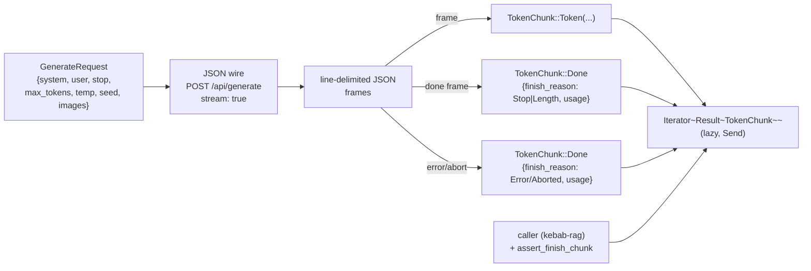

# LLM

> 텍스트 + vision 생성 모델 인터페이스. `LanguageModel` trait + Ollama HTTP 어댑터. streaming 결과 + 항상 `Done` 종료 보장.

## 구성 crate

| Crate | 역할 |
|-------|------|
| `kebab-llm` | `LanguageModel` trait re-export + `MockLanguageModel` (feature `mock`, default OFF). 새 type 추가 **금지** — 순수 facade. |
| `kebab-llm-local` | `OllamaLanguageModel` — `reqwest::blocking` 기반 Ollama `POST /api/generate` 어댑터. line-delimited JSON streaming 디코드. |

## 구조

```mermaid
classDiagram
    class LanguageModel {
        <<trait kebab-core>>
        model_ref() ModelRef
        context_tokens() usize
        generate_stream(req) Iterator~Result~TokenChunk~~
    }
    class GenerateRequest {
        system: String
        user: String
        stop: Vec~String~
        max_tokens: usize
        temperature: f32
        seed: Option~u64~
        images: Vec~String~ [base64]
    }
    class TokenChunk {
        <<enum>>
        Token(String)
        Done {finish_reason, usage}
    }
    class FinishReason {
        <<enum>>
        Stop
        Length
        Aborted
        Error(String)
    }
    class OllamaLanguageModel {
        +new(cfg) Result~Self~
        -client: reqwest::blocking::Client
        -endpoint: String
        -model: String
        -context_tokens: usize
    }
    class MockLanguageModel {
        feature = "mock"
        deterministic test double
    }
    class LlmError {
        <<error>>
        ConnectionRefused
        HttpStatus
        Decode
        ...
    }
    LanguageModel <|.. OllamaLanguageModel
    LanguageModel <|.. MockLanguageModel
    LanguageModel ..> GenerateRequest
    LanguageModel ..> TokenChunk
    TokenChunk ..> FinishReason
    OllamaLanguageModel ..> LlmError
```

## Data flow



## 주요 type / trait / 함수

**Trait** (`kebab-core`, re-export `kebab-llm`):
- `LanguageModel::model_ref() -> ModelRef` — provider/model/version 식별. `Answer.model_ref` 으로 흘려서 wire payload 가 자가 식별.
- `LanguageModel::context_tokens() -> usize` — 모델 별 max prompt+completion 합. RAG 가 budget 계산에 사용.
- `LanguageModel::generate_stream(req: GenerateRequest) -> Result<Box<dyn Iterator<Item = Result<TokenChunk>> + Send>>` — async 안 됨, 매 next() 가 blocking. 모든 stream 이 마지막에 `TokenChunk::Done` 으로 끝남 (error 케이스 포함, §0 Q5).

**`GenerateRequest`** (`kebab-core::traits`):
- `images: Vec<String>` (base64) — 빈 vec = text-only path. 비어있지 않으면 vision-capable adapter 가 `images: [...]` 로 wire 에 포함 (Ollama). 다른 backend 는 다르게 라우팅. `#[serde(default)]` — older snapshot 호환.

**`TokenChunk`**:
- `Token(String)` — partial text. 누적은 caller 책임.
- `Done { finish_reason: FinishReason, usage: TokenUsage }` — 항상 마지막. `finish_reason::Aborted` 가 cancel signal, `Error(s)` 가 mid-stream 실패.

**OllamaLanguageModel** (`kebab-llm-local::ollama`):
- `OllamaLanguageModel::new(&kebab_config::Config) -> anyhow::Result<Self>` — `config.models.llm.endpoint` + `model` + `context_tokens` + `temperature` + `seed` 읽음. **lazy connect** — network 안 침, 첫 generate_stream 에서 실패 surface.
- 내부: `reqwest::blocking::Client` — top-level async 표면 없음. (참고: reqwest 0.12 의 blocking 이 private current-thread tokio runtime wrap 해서 `cargo tree` 에 tokio 보임. invariant = "top-level tokio dep 없음 + async surface 노출 안 함".)
- streaming decode: `BufReader::lines()` 위에서 `serde_json::from_str` 로 frame 별 lazy parse → `TokenChunk::Token` yield.

**`LlmError`** (`kebab-llm-local::error`):
- ConnectionRefused / HttpStatus(code) / Decode(json error) / Timeout / Aborted / 그 외 — `Err` 로 first chunk 전 surface 가능.

**테스트 도구** (`kebab-llm`):
- `assert_finish_chunk(chunks: &[TokenChunk])` — 마지막이 `Done` 이어야 — 모든 stream contract pin.
- `MockLanguageModel` (feature `mock`, default OFF) — deterministic test double. 실 adapter 만 `Err` 가능, mock 은 항상 stream 시작 후 yield.

## 외부 의존

- `kebab-llm` → `kebab-core` 만 (re-export crate).
- `kebab-llm-local` → `kebab-llm` + `kebab-config`, `reqwest` (`blocking` feature, JSON), `serde` + `serde_json`, `thiserror`, `anyhow`.
- 외부 서비스: **Ollama HTTP** (default `http://127.0.0.1:11434`). default 모델 `gemma4:e4b` (OCR / caption / RAG 모두 같은 family — 단일 모델 다운로드면 전 시스템 동작).

## 핵심 결정

- **`kebab-llm` = trait re-export only, **새 type 금지****.
  **왜**: `kebab-rag` 등 downstream 이 `use kebab_llm::LanguageModel` 안정 surface 의존. 어댑터 (Ollama/llama.cpp/candle) 는 별 crate. swap config-only.

- **synchronous + blocking + stream iterator**.
  **왜**: §0 Q5 가 streaming 명시. `async` 가 trait object 와 잘 안 맞음 (Rust async-in-trait 안정성 + Send bound 복잡). `reqwest::blocking` + line-delimited frame 의 `Iterator` 가 caller 코드 단순. RAG 가 동기 소비 + UI thread 가 별도 worker 로 spawn.

- **모든 stream 이 `Done` 으로 끝남 (error 포함)**.
  **왜**: caller 가 partial accumulation 한 텍스트 + finish reason 함께 받음. `Done(Error)` vs `Iterator::next() = None` 차이가 contract 명확. `assert_finish_chunk` 가 invariant pin.

- **lazy connect (생성자에서 network 안 침)**.
  **왜**: `kebab init` / `kebab doctor` 가 Ollama 안 떠도 동작해야 함. 첫 `generate_stream` 에서 `Err` 가 나는 게 사용자 기대 — startup 이 죽으면 진단 어려움.

- **Ollama 가 default backend**.
  **왜**: macOS / Linux 모두 single-binary install, GGUF 모델 다운로드 한 줄. local-first 의 핵심. llama.cpp / candle 어댑터는 future P+ — `LanguageModel` trait 그대로라 swap 가능.

- **default 모델 `gemma4:e4b` (OCR / caption / RAG 통일)**.
  **왜**: OCR (P6-2) + caption (P6-3) + RAG 가 같은 family 사용 → 사용자가 모델 1개만 ollama pull. variant (gemma4:26b 등) 으로 override 가능. (HOTFIXES P6-2.)

- **`GenerateRequest.images: Vec<String>` 추가 (P6-3)**.
  **왜**: 기존 trait 가 text-only 였는데 caption 이 vision 필요. base64 image vec 으로 wire 형식 통일 — Ollama 의 `images` 필드와 1:1. text-only caller 모두 `images: Vec::new()` 마이그레이션 + `#[serde(default)]` 로 snapshot 호환. (HOTFIXES P6-3.)

- **`MockLanguageModel` 가 `Err` 안 던짐**.
  **왜**: mock 은 deterministic — first chunk 전 connection-refused 같은 케이스 시뮬레이션 안 함. 실 adapter (`OllamaLanguageModel`) 가 그 분기 책임. RAG 의 RefusalReason::LlmStreamAborted 분기 (p9-fb-15) 는 실 adapter 만 trigger.

## 관련 spec / HOTFIXES

- frozen 설계 §7.1 (`GenerateRequest`/`TokenChunk`/`FinishReason`), §7.2 (`LanguageModel` trait), §0 Q5 (streaming), §3.8 (`ModelRef`/`TokenUsage`), §6.4 (`models.llm`), §10 (errors), §11.2 (Ollama protocol notes): [`docs/superpowers/specs/2026-04-27-kebab-final-form-design.md`](../../superpowers/specs/2026-04-27-kebab-final-form-design.md)
- task spec:
  - trait crate: [`tasks/p4/p4-1-llm-trait.md`](../../../tasks/p4/p4-1-llm-trait.md)
  - Ollama adapter: [`tasks/p4/p4-2-llm-ollama.md`](../../../tasks/p4/p4-2-llm-ollama.md)
- HOTFIXES (P6-3 `GenerateRequest.images` 추가, P6-2 OCR 기본을 Ollama vision 으로 통일): [`tasks/HOTFIXES.md`](../../../tasks/HOTFIXES.md)
