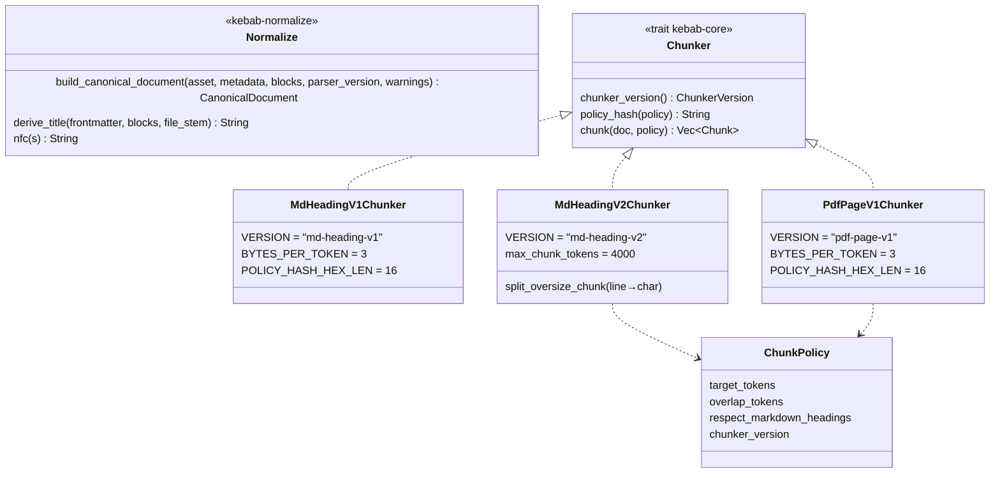
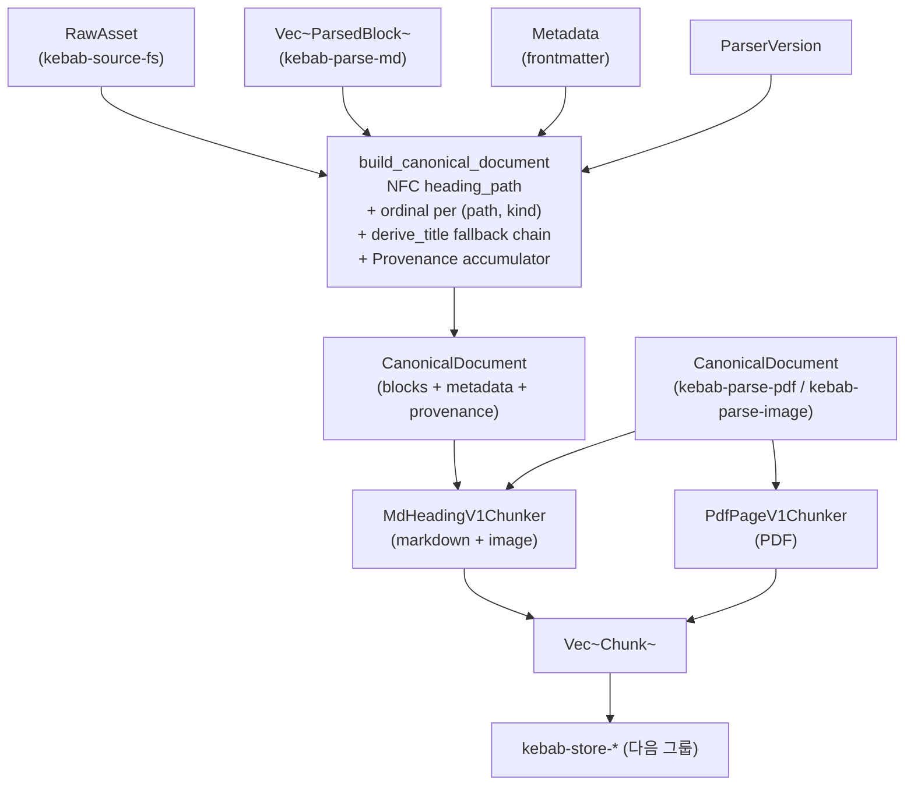

# Normalize + Chunk

> Markdown 의 `ParsedBlock` 을 도메인 `CanonicalDocument` 로 lift 하고, 모든 미디어의 `CanonicalDocument` 를 검색 단위 `Chunk` 로 자른다.

## 구성 crate

| Crate | 역할 |
|-------|------|
| `kebab-normalize` | `ParsedBlock` (markdown only) → `CanonicalDocument` lift. NFC + heading-path ordinal + provenance 합성 + title fallback chain (p9-fb-07). |
| `kebab-chunk` | `CanonicalDocument` → `Vec<Chunk>`. markdown 기본 `md-heading-v2` (v1 + 예산 초과 청크 일반 분할; v0.30.0), `pdf-page-v1` (PDF). `md-heading-v1` 은 historical 변종으로 잔존. |

## 구조

`md-heading-v2` (기본, v0.30.0) 는 v1 과 모든 출력이 동일하되, 마지막에
`token_estimate > max_chunk_tokens` 인 청크만 줄(`\n`) 경계로 — 단일 거대 줄은
UTF-8 char 경계로 — 잘라 각 조각이 예산 이하가 되도록 한다. 분할 조각은 동일
`block_ids` 를 공유하므로 chunk_id 충돌을 막기 위해 id-input 해시에 `#seg{i}`
접미사를 붙이고(저장 `policy_hash` 는 bare), `max_chunk_tokens` 는 v2 의
`policy_hash` 에 fold 된다(공유 `ChunkPolicy` 미변경). 분할 조각의
`source_spans` 는 원 블록 범위를 그대로 보존(블록 단위 citation).

## Data flow

## 주요 type / trait / 함수

**Normalize** (`kebab-normalize`):
- `build_canonical_document(asset: &RawAsset, metadata: Metadata, blocks: Vec<ParsedBlock>, parser_version: &ParserVersion, warnings: Vec<Warning>) -> Result<CanonicalDocument>`.
  - `doc_id = id_for_doc(workspace_path, asset_id, parser_version)`.
  - 모든 `heading_path` 에 NFC 정규화 적용 (NFD `\u{1100}\u{1161}` 와 NFC `\u{AC00}` = "가" 가 같은 `block_id` 로 hash 되도록).
  - ordinal = `(heading_path, block_kind)` 별 0-based, document order (§4.3).
  - title 은 `metadata.user["title"]` lift 후, 비어 있으면 `derive_title(frontmatter_title, blocks, file_stem)` chain.
  - `lang` 은 `metadata.user["lang"]` lift; non-string 이면 빈 `Lang`.
  - `Provenance::events` = `Discovered` (`asset.discovered_at`) + `Parsed` + `Normalized` + 각 warning 1개 + lift-stage warning (e.g. AudioRef pre-P8 drop).
- `derive_title(frontmatter, &[Block], file_stem) -> String` — fallback chain (p9-fb-07): frontmatter title → 첫 H1 → 첫 H2 → 첫 paragraph 80 chars → file stem → `"untitled"` sentinel.
- `nfc(s: &str) -> String`, `to_posix(p: &Path) -> Result<WorkspacePath>` — 재export from `kebab-core`.

**Chunker trait** (`kebab-core`):
- `Chunker::chunker_version() -> ChunkerVersion`.
- `Chunker::policy_hash(&ChunkPolicy) -> String` — `blake3(canonical_json(policy))[..16]`. v1 두 chunker 가 같은 recipe.
- `Chunker::chunk(&CanonicalDocument, &ChunkPolicy) -> Result<Vec<Chunk>>`.

**MdHeadingV1Chunker** (`kebab-chunk`):
- 우선순위 (§0/§14): heading 경계 → code/table 한 chunk → paragraph greedy + overlap → `heading_path` propagation.
- `BYTES_PER_TOKEN = 3` (한국어 ≈ 3 b/tok 커버, 영어 ≈ 4 b/tok 는 over-estimate). 실제 tokenizer 도입 (P+) 까지 proxy.
- `ImageRef` / `AudioRef` 는 자체 chunk (text = alt/caption preview, `token_estimate = 0`).

**PdfPageV1Chunker** (`kebab-chunk`):
- 모든 chunk 가 single `SourceSpan::Page { page, char_start, char_end }` — 페이지 cross 금지 (citation locality).
- 페이지가 budget 초과 시 paragraph break (`\n\n`) → sentence end (`.`/`?`/`!` + ws) → 강제 over-size 순서로 split.
- `chunk_id` 충돌 회피: §4.2 가 한 `block_id` 페어 → 한 `chunk_id` 가정인데 PDF 의 한 페이지 (= 한 block) 가 여러 chunk 로 split 됨. policy_hash slot 에 `format!("{base}#c{char_start}")` 변형 주입, `Chunk.policy_hash` 자체는 unmodified base 보존.

## 외부 의존

- crate dep:
  - `kebab-normalize` → `kebab-core`, `kebab-parse-types` (`ParsedBlock`/`ParsedPayload`/`Warning`), `unicode-normalization`, `time`.
  - `kebab-chunk` → `kebab-core`, `serde_json_canonicalizer`, `blake3`. parser/store/embed 의존 **금지**.
- 외부 lib: `unicode-normalization` (NFC), `blake3` (policy_hash), `serde_json_canonicalizer` (JCS), `time` (provenance timestamps).
- 외부 서비스: 없음.

## 핵심 결정

- **Markdown 만 normalize 거침; PDF / Image 는 우회**.
  **왜**: Markdown 의 frontmatter / heading path 추적 + ordinal 부여가 normalize 의 본업. PDF 는 "페이지 = block", Image 는 "single block" 이라 IR 거치는 가치 없음. 결과: 두 path 가 chunker 단계에서 합류.

- **`heading_path` NFC 정규화 (parsedBlock → canonical 시점)**.
  **왜**: `pulldown-cmark` 가 NFC 안 함, `serde_json_canonicalizer` 도 NFC 안 함. 한국어 자모 분리/조합 두 표현이 다른 `block_id` hash 로 가면 idempotent re-ingest 가 깨짐. lift 시 NFC → on-disk `CommonBlock.heading_path` + ID input 동일 보장.

- **ordinal rule = `(heading_path, block_kind)` 별 0-based, document order**.
  **왜**: 한 heading 아래 같은 종류의 블록 (paragraph 0/1/2, code 0/1) 만 ordinal 공유. 다른 heading 으로 가면 ordinal 리셋. 같은 heading 내 paragraph 추가/삭제가 다른 종류 ordinal 안 망가뜨림.

- **`derive_title` fallback chain (5단계 + sentinel)**.
  **왜**: spec literal 의 frontmatter-only title 정책이 실제 사용자 노트 (frontmatter 없이 H1 으로 시작) 와 충돌. 5단계: frontmatter → H1 → H2 → 첫 paragraph 80자 → file stem → `"untitled"`. 각 단계 NFC, 빈 문자열 절대 반환 안 함. `parser_version` 을 `pulldown-cmark-0.x` → `md-frontmatter-v2` bump 해서 기존 doc 자동 재처리.

- **`BYTES_PER_TOKEN = 3` (spec literal 의 `4` 거부)**.
  **왜**: 한국어가 E5/M-BERT 에서 ≈ 3 bytes/token. 영어는 4 b/tok 라 3 으로 잡으면 over-estimate → 실제 tokenizer 가 봤을 때 budget 초과 안 함. 두 chunker (md/pdf) 가 같은 상수 써서 cross-chunker comparable. (HOTFIXES P7-2.)

- **PDF chunk_id 충돌 회피 = policy_hash slot 에 `#c{char_start}` 변형**.
  **왜**: 한 페이지 (= 한 block) 가 여러 chunk 로 split 되면 §4.2 의 (`doc_id`, `chunker_version`, `block_ids`, `policy_hash`) tuple 가 동일 → 같은 `chunk_id` 충돌. chunker `policy_hash` 슬롯에만 변형 주입, `Chunk.policy_hash` 필드는 base 보존 ("어떤 policy 가 active 였는지" 답변 정확). §4.2 recipe 자체는 안 바꿈. (HOTFIXES P7-2.)

- **chunker 가 store/embed 의존 금지**.
  **왜**: 순수 변환 함수. test 에서 `CanonicalDocument` 만 만들어서 chunker 호출 가능. Storage / embedding 부재가 chunker 단위 테스트 막지 않음.

## 관련 spec / HOTFIXES

- frozen 설계 §3.4 (`Block` / `CanonicalDocument`), §3.5 (`Chunk`), §3.6 (`Provenance`), §3.7b (`ParsedBlock`), §4.2 (ID recipe), §4.3 (ordinal), §0/§14 (chunking priority): [`docs/superpowers/specs/2026-04-27-kebab-final-form-design.md`](../../superpowers/specs/2026-04-27-kebab-final-form-design.md)
- task spec:
  - normalize: [`tasks/p1/p1-4-normalize.md`](../../../tasks/p1/p1-4-normalize.md)
  - chunk md: [`tasks/p1/p1-5-chunk-md.md`](../../../tasks/p1/p1-5-chunk-md.md)
  - chunk pdf: [`tasks/p7/p7-2-chunk-pdf.md`](../../../tasks/p7/p7-2-chunk-pdf.md)
  - title fallback: [`tasks/p9/p9-fb-07-md-title-fallback.md`](../../../tasks/p9/p9-fb-07-md-title-fallback.md)
- HOTFIXES (P7-2 BYTES_PER_TOKEN/=3, chunk_id 충돌 회피, p9-fb-07 title chain): [`tasks/HOTFIXES.md`](../../../tasks/HOTFIXES.md)
