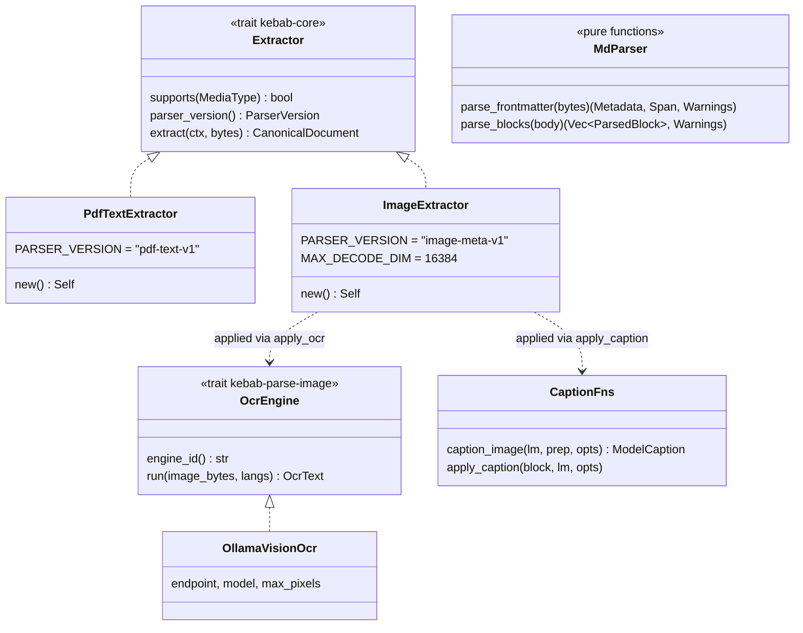
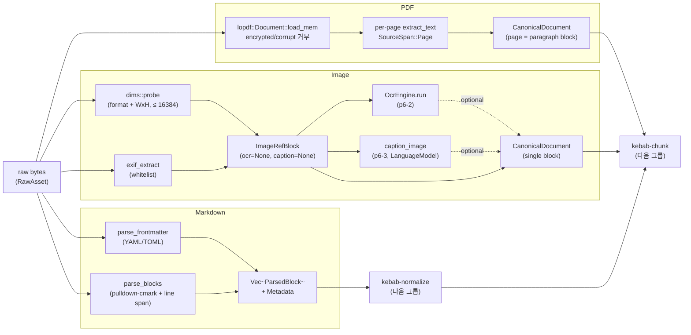

# Parse

> 미디어 타입별 추출기 — markdown / PDF / image 의 raw bytes 를 다음 단계로 흘려보낼 형태로 변환한다. 세 crate 가 같은 도메인 (`Extractor` 또는 `ParsedBlock` 출력) 에 속하지만 출력 단계가 일관되지 않다는 점이 핵심.

## 구성 crate

| Crate | 역할 | 출력 형태 |
|-------|------|-----------|
| `kebab-parse-md` | Markdown frontmatter + body parsing (P1-2/3) | `Vec<ParsedBlock>` + `Metadata` (pure 함수) |
| `kebab-parse-pdf` | text-based PDF per-page 추출 (P7-1) | `CanonicalDocument` 직접 (`Extractor` impl) |
| `kebab-parse-image` | 이미지 메타 + EXIF + 차원 + OCR + caption (P6-1/2/3) | `CanonicalDocument` 직접 (`Extractor` impl) |

## 구조

## Data flow

세 parser 의 출력 stage 가 다른 점이 가장 중요. Markdown 만 `ParsedBlock` IR 을 거쳐 `kebab-normalize` 가 lift; PDF / Image 는 추출기 안에서 `CanonicalDocument` 까지 한 번에.

## 주요 type / trait / 함수

**Markdown** (`kebab-parse-md`):
- `parse_frontmatter(bytes) -> (Metadata, Option<FrontmatterSpan>, Vec<Warning>)` — YAML/TOML 둘 다 인식. 파싱 실패 → `WarningKind::MalformedFrontmatter`.
- `parse_blocks(body) -> (Vec<ParsedBlock>, Vec<Warning>)` — `pulldown-cmark` 위에서 heading path 추적 + 1-indexed `SourceSpan::Line`.
- `BodyHints { title, lang }` — frontmatter 누락 시 caller 가 fallback 제공 (p9-fb-07 title fallback chain 의 entry).

**PDF** (`kebab-parse-pdf`):
- `PdfTextExtractor` — `Extractor` 구현체. `lopdf::Document::load_mem` 로 한 번 파싱, encrypted 면 즉시 bail.
- `PARSER_VERSION = "pdf-text-v1"` — version cascade entry. (HOTFIXES P7-2 의 chunker_version `pdf-page-v1` 와 별개.)
- 빈 페이지 / extract 실패 → `Block::Paragraph` 빈 inlines + `ProvenanceKind::Warning("scanned candidate")`. OCR fallback 미구현.

**Image** (`kebab-parse-image`):
- `ImageExtractor` — `Extractor` 구현체. `MAX_DECODE_DIM = 16384` 초과 거부 (decode bomb 방어).
- `OcrEngine` (trait) — `engine_id() / run(...) -> OcrText`. `OcrText.engine` 필드로 trust level 분기.
- `OllamaVisionOcr { endpoint, model, max_pixels }` — v1 유일 구현. `apply_ocr(block, engine, langs)` 가 `ImageRefBlock.ocr` 슬롯 채움.
- `caption_image(lm: &dyn LanguageModel, prep, opts) -> Result<ModelCaption>` — `LanguageModel.generate_stream` 의 vision 입력 (`GenerateRequest.images`) 사용. `apply_caption` 이 block 에 in-place 주입.

## 외부 의존

- crate dep:
  - 모든 parser → `kebab-core` (`Extractor` trait, `Block`, `Metadata`, `id_for_*`).
  - `kebab-parse-md` → `pulldown-cmark`, `serde_yaml_ng`. (`ParsedBlock`/`ParsedPayload`/`Warning` 등 옛 `kebab-parse-types` 는 v0.19.0 에 `kebab-parse-md::types` 모듈로 흡수.)
  - `kebab-parse-pdf` → `lopdf`.
  - `kebab-parse-image` → `image` (decode), `kamadak-exif` (EXIF), `kebab-core::LanguageModel` (caption).
- 외부 서비스:
  - PDF: 없음 (in-process).
  - Image OCR / caption: Ollama HTTP (default `gemma4:e4b`).

## 핵심 결정

- **Markdown 만 `ParsedBlock` IR 사용**.
  **왜**: §3.7b 가 "parser intermediate" 추상을 markdown 의 frontmatter / heading path 추적용으로 도입. PDF / image 는 source 자체가 단순 (PDF=페이지 평면, image=단일 블록) 이라 IR 거치지 않고 `CanonicalDocument` 바로 만드는 게 자연스러움. 결과: ingest pipeline 의 분기가 비대칭 — `kebab-app` 의 라우팅이 두 path 를 같이 처리 (HOTFIXES P7-3 가 둘의 storage 처리 통일 작업).

- **PDF encrypted → hard fail (auto-decrypt 안 함)**.
  **왜**: 자동 decryption 은 사용자의 키/뷰어 환경 가정. `kebab-parse-pdf` 는 "사용자가 외부에서 `qpdf --decrypt` 후 ingest" 명시. encrypted PDF 가 silently 빈 doc 으로 들어가는 게 더 위험.

- **PDF 빈 페이지 = `Block::Paragraph` 빈 inlines + Warning provenance**.
  **왜**: scanned PDF 식별. 빈 문자열로 chunk 만드는 비용 무시 가능 + OCR fallback (P+) 가 같은 doc 위에 in-place 추가 가능. 페이지 ordinal 보존.

- **Image OCR 기본 = Ollama vision LM (Tesseract 거부)**.
  **왜**: spec literal 의 Tesseract 가 시스템 dep (libtesseract + 언어 모델 다운로드) 를 요구해서 single-binary 약속을 깸. Ollama 가 이미 LLM 으로 깔려 있으면 추가 install 0. `OcrEngine` trait 으로 Tesseract / Apple Vision adapter 가 future swap 가능. (HOTFIXES P6-2 의 결정.)

- **Caption 기본 OFF (`image.caption.enabled = false`)**.
  **왜**: caption 은 model-generated → low trust. 매 이미지마다 모델 호출 비용 (= ingest 시간) 도 큼. opt-in. `ModelCaption.model_version` + `caption.prompt_template_version` 필드가 wire payload 로 흘러서 eval 단계에서 prompt 변화 감지 가능.

- **`GenerateRequest.images: Vec<String>` 필드 신설**.
  **왜**: 기존 `LanguageModel` trait 가 text-only. P6-3 caption 이 vision 입력 필요해서 `images` (base64) 필드 추가. 기존 caller 모두 `images: Vec::new()` 로 마이그레이션 + `#[serde(default)]` 로 snapshot 호환. (HOTFIXES P6-3 의 결정.)

- **Image decode size 캡 (`MAX_DECODE_DIM = 16384`)**.
  **왜**: decode bomb (e.g. 100k×100k PNG) 가 메모리 즉시 OOM. 16384 = 16k px, 사진/문서 스캔 정상 케이스 충분. 초과 시 `dims::DimOutcome::Failed` + warning provenance.

## 관련 spec / HOTFIXES

- frozen 설계 §3.4 (`Block` enum), §3.7a (`OcrText` / `ModelCaption`), §3.7b (`ParsedBlock` IR), §9 (parser_version cascade), §9.1 (image policy), §9.2 (PDF text extraction): [`docs/superpowers/specs/2026-04-27-kebab-final-form-design.md`](../../superpowers/specs/2026-04-27-kebab-final-form-design.md)
- task specs: 삭제됨(2026-06-27 doc-reorg) — 설계는 frozen 계약, 동작은 tasks/HOTFIXES.md, 상세 git history.
- HOTFIXES (P6-2 OCR 기본, P6-3 caption + `GenerateRequest.images`, P7-2 chunk_id 충돌, P7-3 storage UNIQUE bug, p9-fb-07 title fallback): [`tasks/HOTFIXES.md`](../../../tasks/HOTFIXES.md)
