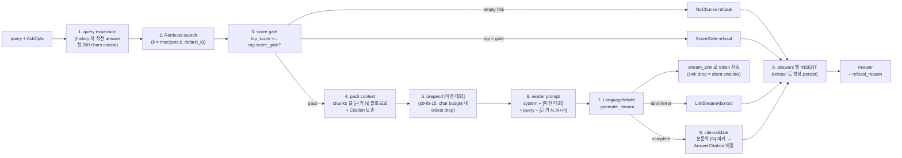

# RAG

> Retrieval-Augmented Generation pipeline. retrieve → gate → pack → generate → cite-validate → persist 단일 orchestrator. multi-turn 지원 (p9-fb-15) + cancel-safe streaming.

## 구성 crate

| Crate | 역할 |
|-------|------|
| `kebab-rag` | `RagPipeline` + `AskOpts`. retriever / LLM / docs store 를 trait object 로 inject 받아 single-threaded 실행. concrete adapter 의존 **금지** (`kebab-llm-local` / `kebab-embed-local` / `kebab-store-vector` 직접 사용 금지 — 모두 trait 너머). |

## 구조

```mermaid
classDiagram
    class RagPipeline {
        +new(cfg, retriever, llm, docs) Self
        +ask(query, opts) Answer
        +ask_with_history(query, history, conv_id, turn, opts) Answer
        -config: Config
        -retriever: Arc~dyn Retriever~
        -llm: Arc~dyn LanguageModel~
        -docs: Arc~SqliteStore~
    }
    class AskOpts {
        k: usize
        explain: bool
        mode: SearchMode
        temperature: Option~f32~
        seed: Option~u64~
        stream_sink: Option~Sender~String~~
        history: Vec~Turn~
        conversation_id: Option~String~
        turn_index: Option~u32~
    }
    class Answer {
        text
        citations: Vec~AnswerCitation~
        refusal_reason: Option~RefusalReason~
        retrieval_summary
        conversation_id
        turn_index
        model_ref
        usage
        trace_id
    }
    class RefusalReason {
        <<enum>>
        NoChunks
        ScoreGate{top_score, threshold}
        LlmStreamAborted
        Other(String)
    }
    RagPipeline ..> AskOpts
    RagPipeline ..> Answer
    Answer ..> RefusalReason
```

## Data flow — pipeline stages



## 주요 type / trait / 함수

**`RagPipeline`** (`kebab-rag::pipeline`):
- `RagPipeline::new(config: Config, retriever: Arc<dyn Retriever>, llm: Arc<dyn LanguageModel>, docs: Arc<SqliteStore>) -> Self` — caller (kebab-app) 가 wire.
- `RagPipeline::ask(&self, query: &str, opts: AskOpts) -> Result<Answer>` — single-shot 또는 history 가 빈 multi-turn 첫 호출.
- `RagPipeline::ask_with_history(&self, query, history, conversation_id, turn_index, opts) -> Result<Answer>` — convenience: opts 에 3개 필드 stuff 후 `ask` 호출.

**`AskOpts`** (Clone, Debug, **PartialEq 안 함** — `Sender` 가 PartialEq 구현 안 함):
- `k: usize` — retrieval top-k. 실효는 `max(opts.k, config.search.default_k)` (config default = floor).
- `explain: bool` — true 시 `answers.packed_chunks_json` 에 packed-context JSON 저장. refusal 은 항상 persist.
- `mode: SearchMode` — pipeline 내부에서 mode 안 정함, caller 가 inject (lexical/vector/hybrid).
- `temperature` / `seed: Option<...>` — config 기본값 override per call.
- `stream_sink: Option<mpsc::Sender<String>>` — 매 `TokenChunk::Token` 동기 forward. receiver drop 시 `SendError` silent swallow + 생성 계속 (answers 행 보존).
- `history: Vec<Turn>` (p9-fb-15) — newest-first prepended `[이전 대화]` 블록. `cfg.rag.max_context_tokens * 4` 문자 budget 초과 시 oldest 부터 drop.
- `conversation_id` / `turn_index` (p9-fb-15) — `Answer.conversation_id` / `turn_index` 로 흘러가서 wire payload 가 same-conversation 식별 가능.

**`Answer`** (`kebab-core::answer`, re-export `kebab-rag`):
- `text` + `citations: Vec<AnswerCitation>` + `refusal_reason: Option<RefusalReason>` + `retrieval_summary: AnswerRetrievalSummary` + `conversation_id` + `turn_index` + `model_ref` + `usage` + `trace_id`.
- `RefusalReason`: `NoChunks` (retrieval 비음), `ScoreGate { top_score, threshold }` (낮은 신뢰), `LlmStreamAborted` (mid-stream 중단, p9-fb-15), `Other(String)`.

**상수 / 헬퍼** (`pipeline.rs`):
- `SYSTEM_PROMPT_RAG_V1` — `prompt_template_version` 가 가리키는 system prompt. 변경 시 cascade per §9.
- `expand_query_with_history(query, &history) -> String` — 직전 answer 첫 200 chars concat. LLM-based standalone-question rewriting 은 out of scope (P+).

## 외부 의존

- crate dep: `kebab-core` + `kebab-config` + `kebab-search` (`Retriever` trait 만) + `kebab-llm` (trait 만) + `kebab-store-sqlite` (`DocumentStore` + `put_answer` helper).
- 외부 lib: `serde`/`serde_json`, `regex` (citation marker `[N]` 매칭), `time` (timestamps), `blake3` (`TraceId` 채굴), `thiserror`, `anyhow`.
- 외부 서비스: 없음 (concrete adapter 가 가져옴).

## 핵심 결정

- **single-threaded synchronous orchestrator**.
  **왜**: pipeline 의 9 stages 가 다 sequential dependency. 동시성 가치 없음. async 도입하면 caller (kebab-app, TUI worker) 가 자체 thread spawn — 단순함이 깨짐. `LanguageModel::generate_stream` 의 blocking iterator 가 자연스럽게 fit.

- **`opts.k = max(opts.k, config.search.default_k)` floor**.
  **왜**: 사용자가 `kebab ask --k 0` 같은 실수 시 retrieval starvation. config default 가 floor → "내가 더 넓히려면 높은 값 pass" 만 의미 있게 동작.

- **`stream_sink` drop = silent swallow (abort 안 함)**.
  **왜**: TUI 가 cancel 누르면 receiver drop. pipeline 이 즉시 abort 하면 `answers` 행 persist 안 됨 → debug 어려움. 끝까지 generate 후 row write, sink 만 무시 = answers 보존 + UX 자연스러움.

- **refusal 도 항상 `answers` 행 INSERT**.
  **왜**: 운영 분석 필수 — score gate 가 너무 높아서 거부 비율 분석, ScoreGate top_score 분포 등. row 부재 = 회고 불가능. row write 실패는 `tracing::warn!` 만 (caller 는 in-memory `Answer` 받음).

- **모든 hit 의 chunk fetch 실패 시 `NoChunks` refusal collapse**.
  **왜**: search → pack 사이 chunks 삭제 (다른 process 의 reset 등) 발생 시 빈 `[근거]` 블록을 LLM 에 보내면 self-refusal — 진단 misleading. 구조 원인을 알면 명시적 NoChunks 가 정확.

- **history query expansion = 직전 answer 첫 200 chars concat**.
  **왜**: full LLM-based standalone-question rewriting 이 정확하지만 한 번 더 LLM call → latency 2배 + 비결정. 200 chars concat 이 cheap deterministic, retrieval 확장 효과 충분 (대부분의 follow-up "그것" / "그게 뭐였지" 가 직전 answer 키워드 caret). spec §3.8 가 LLM-based 를 P+ 로 marking.

- **`conversation_id` / `turn_index` optional**.
  **왜**: single-shot ask 가 절반 이상의 사용. 빈 `Vec::new()` history 와 함께 `None / None` 으로 `ask` 호출 = 기존 behavior 동일. multi-turn caller (`ask_with_history`) 만 채움.

- **prompt budget 초과 시 oldest history drop (newest-first 보존)**.
  **왜**: 최근 turn 가 follow-up 컨텍스트 핵심. budget = `cfg.rag.max_context_tokens * 4` (chars-per-token proxy). spec §3.8.

- **forbidden deps: `kebab-llm-local` / `kebab-embed-local` / `kebab-store-vector` 직접 사용 금지**.
  **왜**: pipeline 가 trait 만 의존하면 test 가 mock 으로 swap 가능. 어댑터 직접 import = 테스트가 ONNX 모델 다운로드 / Ollama 서버 / LanceDB 디렉토리 필요. 단위 테스트 격리 보장.

## 관련 spec / HOTFIXES

- frozen 설계 §0 Q4 (RAG 9 stages), §1 (cite-validate), §2.3 (`[근거]` 블록 형식), §3.8 (Answer / Turn / RefusalReason), §6.4 (`rag.score_gate` / `max_context_tokens` / `prompt_template_version`), §7.2 (`Retriever` / `LanguageModel` traits), §9 (cascade): [`docs/superpowers/specs/2026-04-27-kebab-final-form-design.md`](../../superpowers/specs/2026-04-27-kebab-final-form-design.md)
- task spec:
  - pipeline: [`tasks/p4/p4-3-rag-pipeline.md`](../../../tasks/p4/p4-3-rag-pipeline.md)
  - multi-turn core: [`tasks/p9/p9-fb-15-rag-multi-turn-core.md`](../../../tasks/p9/p9-fb-15-rag-multi-turn-core.md)
- HOTFIXES (P4-3 `--config` 누락, p9-fb-15 multi-turn 위 `Answer`/`Turn` 필드 추가, p9-fb-20 citation 표면): [`tasks/HOTFIXES.md`](../../../tasks/HOTFIXES.md)
