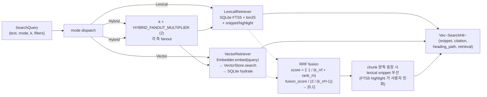

# Search

> 검색 백엔드 — lexical (FTS5 BM25) + vector (LanceDB ANN) + hybrid (RRF fusion). 같은 `Retriever` trait, `SearchMode` 로 dispatch.

## 구성 crate

| Crate | 역할 |
|-------|------|
| `kebab-search` | `LexicalRetriever` (P2-2) + `VectorRetriever` (P3-4) + `HybridRetriever` (P3-4). 모두 `kebab-core::Retriever` 구현. citation hydration 헬퍼 포함. |

## 구조

```mermaid
classDiagram
    class Retriever {
        <<trait kebab-core>>
        search(query) Vec~SearchHit~
        index_version() IndexVersion
    }
    class LexicalRetriever {
        +new(store, index_version) Self
        +with_settings(store, snippet_chars, ...)
        -store: Arc~SqliteStore~
    }
    class VectorRetriever {
        +new(store, vector_store, embedder, ...) Self
        -store: Arc~SqliteStore~
        -vector_store: Arc~dyn VectorStore~
        -embedder: Arc~dyn Embedder~
    }
    class HybridRetriever {
        +new(cfg, lexical, vector) Self
        +with_policy(lex, vec, FusionPolicy, k)
        -lexical: Arc~dyn Retriever~
        -vector: Arc~dyn Retriever~
        -fusion: FusionPolicy
        -default_k: usize
    }
    class FusionPolicy {
        <<enum>>
        Rrf{k_rrf}
    }
    class SearchMode {
        <<enum>>
        Lexical
        Vector
        Hybrid
    }
    Retriever <|.. LexicalRetriever
    Retriever <|.. VectorRetriever
    Retriever <|.. HybridRetriever
    HybridRetriever --> LexicalRetriever
    HybridRetriever --> VectorRetriever
    HybridRetriever ..> FusionPolicy
    HybridRetriever ..> SearchMode : dispatch
```

## Data flow



## 주요 type / trait / 함수

**Trait** (`kebab-core`):
- `Retriever::search(&SearchQuery) -> Result<Vec<SearchHit>>`.
- `Retriever::index_version() -> IndexVersion` — hybrid 가 두 측 version 다르면 stale-index 경고.

**LexicalRetriever** (`kebab-search::lexical`):
- `LexicalRetriever::new(store: Arc<SqliteStore>, index_version: IndexVersion) -> Self`.
- `LexicalRetriever::with_settings(store, snippet_chars, ...)` — `snippet`, `highlight` SQL 함수 호출. FTS5 `MATCH` 쿼리.
- 구현: `SELECT chunk_id, bm25(...), snippet(...), highlight(...) FROM chunks_fts WHERE chunks_fts MATCH ? ...`. citation_helper 가 `Citation::Line { L_start, L_end }` / `Page { p }` 등 분기.

**VectorRetriever** (`kebab-search::vector`):
- `VectorRetriever::new(store: Arc<SqliteStore>, vector_store: Arc<dyn VectorStore>, embedder: Arc<dyn Embedder>, ...)`.
- 구현: query text → `embedder.embed(EmbeddingKind::Query, ...)` → `vector_store.search(vec, k, filters)` → SQLite 로 hydrate (snippet, citation 등은 vector hit 의 `chunk_id` 로 SELECT).
- `Arc<dyn Embedder>` runtime injection — concrete adapter (`kebab-embed-local::FastembedEmbedder`) 는 caller 가 wire.

**HybridRetriever** (`kebab-search::hybrid`):
- `HybridRetriever::new(&Config, Arc<dyn Retriever> lex, Arc<dyn Retriever> vec) -> Self` — `config.search.hybrid_fusion` (`"rrf"`) + `config.search.rrf_k` 읽음. 두 retriever 의 `index_version` 가 다르면 `tracing::warn`.
- `FusionPolicy::Rrf { k_rrf }` — default 60. `with_policy` 헬퍼로 explicit 지정 가능.
- 상수: `DEFAULT_K = 10` (query.k == 0 fallback), `DEFAULT_K_RRF = 60`, `HYBRID_FANOUT_MULTIPLIER = 2`.
- merge rule: 양측 등장 chunk 의 `snippet` / `citation` / `heading_path` 는 lexical 측에서 가져옴 (FTS5 highlight 가 vector 의 truncated text 보다 user-relevant).

## 외부 의존

- crate dep: `kebab-core` + `kebab-config` + `kebab-store-sqlite` + `kebab-store-vector` + `kebab-embed` (trait re-export). `kebab-embed-local` 은 caller 가 inject (forbidden direct dep).
- 외부 lib: `rusqlite` (FTS5 쿼리), `globset` (filter 매칭), `serde_json`, `tracing`.
- 외부 서비스: 없음.

## 핵심 결정

- **세 retriever 모두 같은 `Retriever` trait**.
  **왜**: `HybridRetriever` 가 `Arc<dyn Retriever>` 두 개 받으니 lexical/vector 가 자기들도 trait object 가능. test 가 `CannedRetriever` mock 으로 두 측 inject 가능 — RRF 만 검증할 때 SQLite/Lance 부재해도 됨.

- **`HybridRetriever` 가 `Arc<dyn Embedder>` 직접 안 받음**.
  **왜**: vector retriever 가 이미 embedder 보유. hybrid 는 `mode == Hybrid` 시 양측 fanout, 직접 embedding 안 함 → vector 측이 자기 embedder 사용. concrete adapter (`kebab-embed-local`) 가 hybrid 에 노출 안 됨 → forbidden dep 깨끗.

- **RRF fanout = `k * 2`**.
  **왜**: spec literal 의 floor. lexical 과 vector 의 disjoint set (한쪽만 surface 한 chunk) 이 충분히 넓어야 fused top-k 가 의미 있음. 비용 linear, recall 회복 큼.

- **양측 등장 chunk = lexical snippet 우선**.
  **왜**: vector 의 raw chunk text 는 보통 truncated (snippet_chars 짧음, BM25 highlight 없음). FTS5 의 `snippet()` + `highlight()` 가 user-perceived relevance 강함. citation/heading_path 도 lexical 결과가 정확 (vector 측은 SQLite hydrate 값 같지만 lexical 일관성).

- **`fusion_score` `[0, 1]` 정규화 (post-merge hotfix)**.
  **왜**: raw RRF score 는 `Σ 1/(k_rrf + rank)` 라 max 가 `2/(k_rrf+1)` (양측 모두 rank=1). mode 간 (Lexical 0~1 BM25 normalized, Vector cosine 0~1, Hybrid 0~?) 비교 가능하려면 `[0,1]` 정규화 필요. raw 를 `2/(k_rrf+1)` 로 나눔. (HOTFIXES "RRF fusion_score `[0,1]` 정규화" 항목.)

- **두 측 `index_version` mismatch = warn (not error)**.
  **왜**: lexical 이 v2, vector 가 v1 (re-embed 안 했음) 같은 stale state 가 운영 시 일어남. 즉시 fail = ingest 끝나기 전 search 막힘. warning 만 띄우고 계속 동작 = 사용자가 인지하고 re-index 결정.

- **`kebab-embed` (trait crate) 만 의존, `kebab-embed-local` (concrete) **금지****.
  **왜**: future MVP 의 swap 가능성 (candle, ollama-embed 등). `kebab-search` 가 concrete 어댑터 import 하면 `kebab-embed-local` 의 fastembed dep (큰 ONNX runtime) 이 search 에 강제 → unrelated build 비용. caller 가 runtime inject.

## 관련 spec / HOTFIXES

- frozen 설계 §3.7 (SearchHit), §6.4 (`search.hybrid_fusion`/`rrf_k`/`default_k`/`snippet_chars`), §0 Q3 (citation), §7.2 (`Retriever` trait): [`docs/superpowers/specs/2026-04-27-kebab-final-form-design.md`](../../superpowers/specs/2026-04-27-kebab-final-form-design.md)
- task spec:
  - lexical: [`tasks/p2/p2-2-search-lexical.md`](../../../tasks/p2/p2-2-search-lexical.md)
  - vector + hybrid: [`tasks/p3/p3-4-hybrid-fusion.md`](../../../tasks/p3/p3-4-hybrid-fusion.md)
- HOTFIXES (RRF `fusion_score [0,1]` 정규화): [`tasks/HOTFIXES.md`](../../../tasks/HOTFIXES.md)
