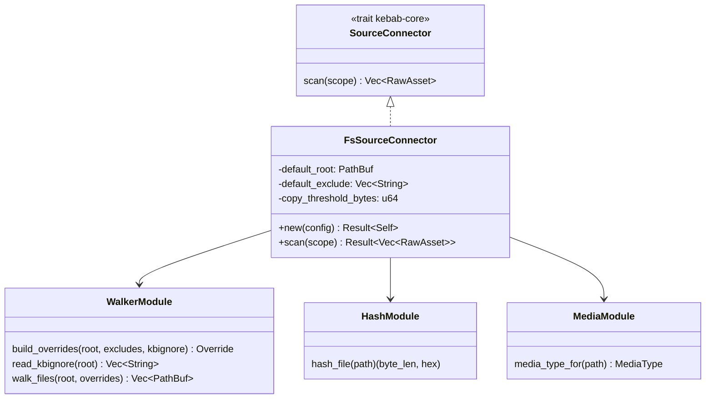
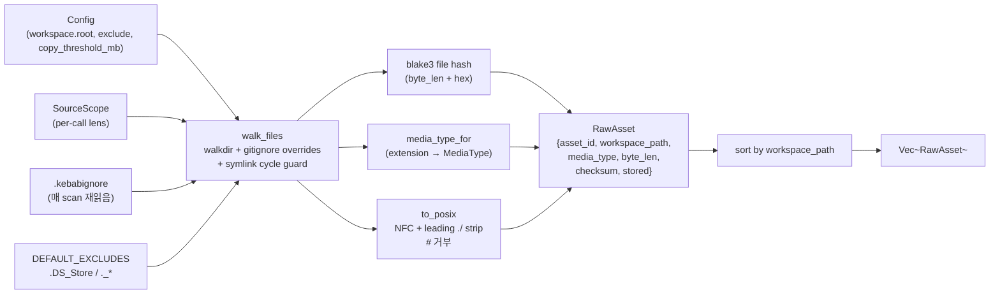

# Source

> 워크스페이스를 walk 하고 gitignore-style 필터로 거른 뒤 BLAKE3 checksum 으로 컨텐츠 어드레스된 `RawAsset` 목록을 만든다. ingest pipeline 의 첫 단계.

## 구성 crate

| Crate | 역할 |
|-------|------|
| `kebab-source-fs` | 로컬 파일시스템 `SourceConnector` 단일 구현. `kebab-config` + `kebab-core` 만 의존. |

## 구조

## Data flow

## 주요 type / trait / 함수

- `FsSourceConnector::new(&Config) -> Result<Self>` — `Config::resolve_workspace_root()` 호출 (p9-fb-05 path policy 통일), `copy_threshold_mb * 1 MiB` 미리 곱해 둠.
- `FsSourceConnector::scan(&SourceScope) -> Result<Vec<RawAsset>>` — kebab-core `SourceConnector` trait 구현. 결정성 보장 sort by `workspace_path`.
- `walker::build_overrides(root, config_exclude, kbignore_patterns) -> Override` — `ignore` crate 의 gitignore engine 위에서 union 빌드. 모든 패턴이 `!` prefix (positive override = include 의미라 negate 필요).
- `walker::read_kbignore(root) -> Vec<String>` — `<root>/.kebabignore` 매 scan 재읽음 (long-running process 가 file edit 즉시 반영).
- `walker::walk_files(root, overrides) -> Vec<PathBuf>` — `walkdir::WalkDir::follow_links(true)` + 별도 `visited: HashSet<canonical PathBuf>` 으로 symlink cycle 방어.
- `hash::hash_file(path) -> Result<(byte_len, hex)>` — streaming BLAKE3, 큰 파일도 메모리 안 쌓음.
- `media::media_type_for(path) -> MediaType` — extension 기반 단순 매핑 (`.md` → `Markdown`, `.pdf` → `Pdf`, `.png/.jpg/...` → `Image(_)` 등).

## 외부 의존

- crate dep: `kebab-core` (`RawAsset`, `Checksum`, `SourceConnector`, `id_for_asset`, `to_posix`), `kebab-config` (`Config`).
- 외부 lib: `walkdir` (디렉토리 walk + symlink follow), `ignore` (gitignore override engine, walker 는 안 씀), `blake3` (file hash), `time` (`OffsetDateTime::now_utc` for `discovered_at`).
- 외부 서비스: 없음.

## 핵심 결정

- **`walkdir` 사용 (not `ignore::WalkBuilder`)**.
  **왜**: `ignore::WalkBuilder` 가 gitignore + cycle detection 을 한 번에 묶지만, sibling-subtree symlink (`a -> ../b`) 의 cycle 을 ancestor-only check 가 놓치는 케이스가 있음. `walkdir` + 자체 `visited` set 으로 canonical-path 비교를 명시 제어.

- **DEFAULT_EXCLUDES = `.DS_Store` + `._*`**.
  **왜**: macOS Finder 메타파일 + AppleDouble resource fork. 모든 사용자 `.kebabignore` 에 들어갈 noise — 한 번에 baked-in. 사용자가 끄려면 별 메커니즘 필요 (현재 미제공, 필요 시 P+).

- **`AssetStorage::{Copied, Reference}` = intent signal, not actual copy**.
  **왜**: scan 단계는 byte_len 만 보고 의도만 표시. 실제 디스크 copy 는 P1-6 의 asset writer 책임. `copy_threshold_mb = 100` (default) 미만은 `Copied`, 이상은 `Reference + sha`. 큰 파일 중복 저장 회피.

- **`SourceScope::include` 무시 (router 책임)**.
  **왜**: §6.2 의 `WorkspaceCfg.include` 는 extractor router 가 적용. SourceConnector 가 또 필터링하면 markdown/PDF 가 router 에 도달 전 이중 필터. Connector 는 모든 non-excluded 파일 emit.

- **Filename `#` 거부 = warn + skip (not abort)**.
  **왜**: `to_posix` 가 `#` 포함 path 를 Err 반환 (Citation URI fragment separator 와 충돌). 단일 파일이 10000 파일 ingest 를 죽이면 안 됨 — `tracing::warn` 로 알리고 다음 파일.

- **scan 결과 sort by `workspace_path`**.
  **왜**: 결정성. 두 번 scan 의 `Vec<RawAsset>` 가 `discovered_at` 빼고 동일해야 idempotent ingest 가능. test `scan_idempotent_modulo_timestamp` 가 회귀 핀.

## 관련 spec / HOTFIXES

- frozen 설계 §3.3 (`RawAsset`), §6.2 (workspace + .kebabignore), §6.6 (POSIX 정규화), §7.1 (`SourceScope`), §7.2 (`SourceConnector`): [`docs/superpowers/specs/2026-04-27-kebab-final-form-design.md`](../../superpowers/specs/2026-04-27-kebab-final-form-design.md)
- task spec: [`tasks/p1/p1-1-source-fs.md`](../../../tasks/p1/p1-1-source-fs.md)
- p9-fb-05 (`expand_tilde` shim 제거 + `Config::resolve_workspace_root` 일원화): [`tasks/p9/p9-fb-05-config-path-policy.md`](../../../tasks/p9/p9-fb-05-config-path-policy.md)
