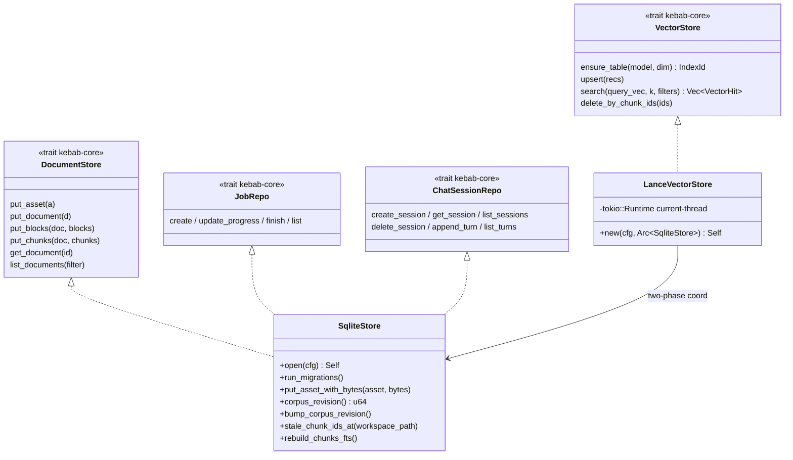
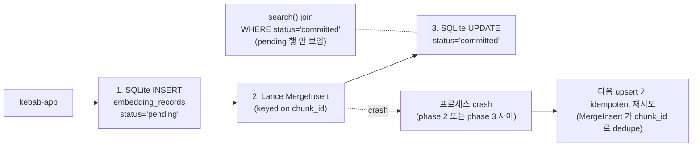
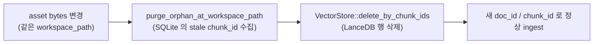

# Store

> persistence layer 두 백엔드 — SQLite (메타 + lexical FTS + jobs + chat) + LanceDB (per-model vector 테이블). 둘이 협조해 partial-write Lance 행이 caller 에 노출되지 않게 two-phase 보장.

## 구성 crate

| Crate | 역할 |
|-------|------|
| `kebab-store-sqlite` | `DocumentStore` + `JobRepo` + `ChatSessionRepo` + asset writer + FTS5 lexical 쿼리 + eval 저장. refinery migration runner. |
| `kebab-store-vector` | `VectorStore` LanceDB 어댑터. per-model `chunk_embeddings_<model>_<dim>.lance/` 테이블. SQLite 와 two-phase write 협조. |

## 구조

## Data flow — two-phase upsert (write 경로)

## Data flow — re-ingest orphan cleanup (delete 경로)

## 주요 type / trait / 함수

**`SqliteStore`** (`kebab-store-sqlite::store`):
- `SqliteStore::open(&kebab_config::Config) -> Result<Self>` — `data_dir/sqlite` 파일 열고 `Mutex<Connection>` 으로 wrap.
- `SqliteStore::run_migrations()` — `refinery` 가 `migrations/V001..V005` 적용.
- `put_asset_with_bytes(asset, bytes)` — content-addressable 저장 (`{asset_dir}/<aa>/<bb>/<full_hex>` blob), `assets.workspace_path` UNIQUE 충돌 시 `purge_orphan_at_workspace_path` 후 재삽입 (HOTFIXES P7-3).
- `corpus_revision() -> u64` / `bump_corpus_revision() -> Result<u64>` — `kv` 테이블의 monotonic counter (p9-fb-19, search cache invalidation key).
- `stale_chunk_ids_at(&WorkspacePath) -> Vec<ChunkId>` — re-ingest 시 LanceDB 에서 지울 행 식별.
- `rebuild_chunks_fts()` — FTS5 virtual table 풀 리빌드 (corruption 또는 스키마 변경 시).

**SQLite migrations** (`migrations/`):
- **V001** — full P1 schema: `assets`, `documents`, `document_tags`, `blocks`, `chunks`, `embedding_records`, `jobs`, `ingest_runs`, `answers`, `eval_runs`, `eval_query_results`.
- **V002** — `chunks_fts` (FTS5 virtual, `unicode61 remove_diacritics 2`) + `chunks_ai`/`ad`/`au` sync triggers. 본문은 frozen 설계 §5.5 verbatim.
- **V003** — `embedding_records.status` lifecycle marker (`pending`/`committed`) + `idx_embed_status`. P3-3 two-phase write 의 SQLite 측.
- **V004** — `kv (key TEXT PK, value TEXT)` + `corpus_revision = '0'` seed (p9-fb-19).
- **V005** — `chat_sessions` + `chat_turns` (FK ON DELETE CASCADE) + `idx_chat_turns_session` (p9-fb-17). spec PR 의 V004 가 p9-fb-19 의 kv 와 충돌해서 V005 로 시프트.

**`LanceVectorStore`** (`kebab-store-vector::store`):
- `LanceVectorStore::new(&Config, Arc<SqliteStore>) -> Result<Self>` — `Arc<SqliteStore>` 공유로 two-phase coord.
- `VectorStore` trait 구현. 모든 메서드 안에서 private current-thread `tokio::runtime::Runtime` 위 `block_on` (sync trait → async LanceDB 브리지).
- 테이블 명: `chunk_embeddings_<sanitized_model>_<dim>.lance/` (예: `chunk_embeddings_multilingual-e5-small_384.lance/`). 모델/차원 변경 시 자동 새 테이블 = embeddings 분리.
- `delete_by_chunk_ids(&[ChunkId])` — default impl 빈 no-op (P7-3 follow-up 으로 LanceVectorStore 만 override).

## 외부 의존

- `kebab-store-sqlite` → `kebab-core` + `kebab-config`, `rusqlite` (`bundled` feature, libsqlite3 시스템 dep 회피), `refinery`, `serde_json`, `time`, `blake3`, `globset`.
- `kebab-store-vector` → `kebab-core` + `kebab-config` + `kebab-store-sqlite`, `lancedb`, `arrow` (Lance schema), `tokio` (current-thread runtime).
- 외부 서비스: 없음. 모든 저장 on-disk.

## 핵심 결정

- **`rusqlite` `bundled` feature**.
  **왜**: 시스템 `libsqlite3` 의존을 single-binary 약속이 거부. `bundled` 가 SQLite source 를 같이 빌드 → `kebab` 깔면 추가 install 0.

- **per-model Lance 테이블**.
  **왜**: 임베딩 모델 swap 시 이전 모델의 vector 가 그대로 남아 있어야 (re-embed 유예) + 같은 chunk 가 두 모델로 동시에 indexed 가능. 테이블 명에 `<model>_<dim>` 인코딩 → `EmbeddingModelId` 변경 = 새 테이블, 기존은 read-only 유지.

- **two-phase write (SQLite first, Lance second, status flip)**.
  **왜**: LanceDB 는 transactional commit 없음 (MergeInsert 도 read-after-write 보장 안 함). SQLite 의 `embedding_records.status` 가 truth 역할 — `search` 가 `WHERE status='committed'` 로 join 해서 partial-write Lance 행 보이지 않음. 프로세스 crash 후 재 ingest 가 idempotent (Lance MergeInsert 가 chunk_id dedupe).

- **`delete_by_chunk_ids` 의 default no-op + Lance override**.
  **왜**: `VectorStore` trait 의 default impl 가 빈 no-op 이라 test fake / 미래 다른 backend 가 default 그대로 컴파일됨 (behavioural breaking change 없음). Lance 만 override.

- **byte-edit re-ingest 시 SQLite + Lance 양쪽 stale 청소**.
  **왜**: P7-3 의 hot bug — `assets.workspace_path` UNIQUE 와 `upsert_asset_row` 의 `ON CONFLICT(asset_id)` gap 때문에 byte 가 바뀐 같은 path 의 자산이 ingest 실패. `purge_orphan_at_workspace_path` 가 SQLite 측 stale chunk_id 수집, follow-up PR 이 `VectorStore::delete_by_chunk_ids` 추가해 LanceDB 에서도 같은 chunk_id 삭제. 둘 다 안 청소하면 orphan vector 누적.

- **chat session storage = V005 (V004 와 충돌)**.
  **왜**: spec PR 가 chat_sessions 를 V004 로 잡았는데 같은 시점 p9-fb-19 가 kv 테이블을 V004 로 가져감. refinery 는 numeric 충돌 = hard fail. p9-fb-17 가 V005 로 시프트, HOTFIXES 기록.

- **`SqliteStore` 가 `JobRepo` + `ChatSessionRepo` 도 구현**.
  **왜**: 모두 같은 SQLite 파일 안에 있고 같은 `Mutex<Connection>` 공유. 별 crate 로 분리하면 connection 두 개 필요 → SQLite 가 single-writer 라 contention 만 늘어남. trait 별로는 분리, impl 은 한 store.

- **FTS5 본문 spec verbatim + CI diff-check**.
  **왜**: tokenizer (`unicode61 remove_diacritics 2`) + trigger 본문이 frozen 설계 §5.5 와 byte-for-byte 동일해야 wire 동작 일치. CI 가 diff 검출.

## 관련 spec / HOTFIXES

- frozen 설계 §5.1 (meta), §5.2 (assets), §5.3 (documents), §5.4 (blocks), §5.5 (chunks + FTS5), §5.6 (embedding_records two-phase), §5.7 (jobs/ingest_runs/answers/eval_runs), §5.7a (chat_sessions/turns), §6.3 (lance table naming), §7.2 (DocumentStore/VectorStore/JobRepo/ChatSessionRepo): [`docs/superpowers/specs/2026-04-27-kebab-final-form-design.md`](../../superpowers/specs/2026-04-27-kebab-final-form-design.md)
- task spec:
  - SQLite store: [`tasks/p1/p1-6-store-sqlite.md`](../../../tasks/p1/p1-6-store-sqlite.md)
  - FTS5 + V002: [`tasks/p2/p2-1-fts.md`](../../../tasks/p2/p2-1-fts.md)
  - V003 + LanceDB + two-phase: [`tasks/p3/p3-3-store-vector.md`](../../../tasks/p3/p3-3-store-vector.md)
  - V004 kv: [`tasks/p9/p9-fb-19-search-cache.md`](../../../tasks/p9/p9-fb-19-search-cache.md)
  - V005 chat sessions: [`tasks/p9/p9-fb-17-chat-session-storage.md`](../../../tasks/p9/p9-fb-17-chat-session-storage.md)
- HOTFIXES (P7-3 storage UNIQUE bug + delete_by_chunk_ids follow-up, V004→V005 시프트): [`tasks/HOTFIXES.md`](../../../tasks/HOTFIXES.md)
