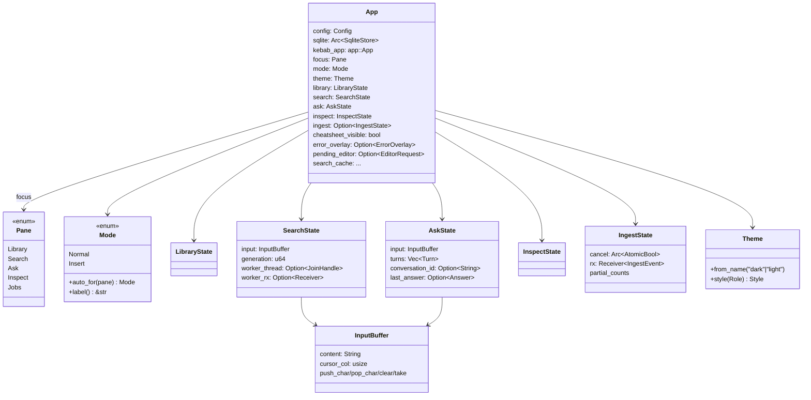

# UI

> 사용자 surface — 두 binary, 둘 다 `kebab-app` facade 만 사용. CLI 가 1:1 subcommand → app fn 매핑, TUI 가 4 패널 (Library / Search / Ask / Inspect) ratatui shell.

## 구성 crate

| Crate | 역할 |
|-------|------|
| `kebab-cli` | binary `kebab`. clap subcommand → `kebab-app` fn 1:1. wire schema v1 envelope (`--json`). progress bar (indicatif). Ctrl-C cancel handler. exit codes. |
| `kebab-tui` | binary `kebab tui` (그리고 라이브러리). ratatui + crossterm. 4 패널 + cheatsheet popup + error overlay + Vim-style mode machine. async search worker + background ingest worker + external editor jump. |

## 구조 (TUI 위주, CLI 는 단순)

## Data flow — 전체 ratatui run loop

```mermaid
flowchart LR
    Start["kebab tui<br/>main"]
    Setup["enable_raw_mode<br/>+ EnterAlternateScreen<br/>+ Hide cursor"]
    Loop["run loop"]
    Tick["매 tick"]
    Drain["drain progress channel<br/>(ingest worker)"]
    Poll["search worker poll<br/>(generation match?)"]
    Render["render pane (focus)<br/>+ overlay (error/cheatsheet)"]
    Event["crossterm event"]
    CIntercept["cheatsheet_intercept<br/>(F1 toggle, Esc close)"]
    MIntercept["mode_intercept<br/>(i/Esc Normal↔Insert)"]
    Dispatch["pane dispatch<br/>(library/search/ask/inspect)"]
    EditorReq["EditorRequest enqueue"]
    EditorSpawn["with_external_program<br/>(suspend → spawn → restore)"]
    Restore["disable_raw_mode + force_redraw"]
    Start --> Setup --> Loop
    Loop --> Tick --> Drain --> Poll --> Render
    Render --> Event
    Event --> CIntercept --> MIntercept --> Dispatch
    Dispatch --> EditorReq --> EditorSpawn -.RAII guard.-> Restore -.-> Render
    Loop -.quit.-> Setup
```

## 주요 type / trait / 함수

**`kebab-cli`** (`main.rs`):
- clap `Cli { config: Option<PathBuf>, verbose, debug, json, command: Cmd }` — `--config` 가 모든 subcommand 에 전역.
- subcommand 별 호출: `init` → `init_workspace`, `ingest` → `ingest_with_config_cancellable`, `search` → `search_with_config`, `ask` → `ask_with_config` 또는 `ask_with_session_with_config`, `list` / `inspect` / `doctor` / `tui` / `reset` → 대응 `*_with_config`.
- `progress.rs` — `indicatif::ProgressBar` (TTY 시) / non-TTY 한 줄씩 / `--json` line-delimited stdout.
- `cancel.rs` — `ctrlc` SIGINT handler. 1회 → cancel signal, 2회 → hard exit 130.
- `wire.rs` — `*.v1` envelope wrap (`ingest_report.v1`, `search_hit.v1`, `answer.v1`, `doctor.v1` 등). `DoctorReport` 만 자체 schema_version, 다른 도메인 type 은 cli 에서 wrap.
- exit code: 0 (ok) / 1 (anyhow chain) / 2 (clap usage) / 3 (no-hit signal) / 4 (refusal signal) / 5 (doctor unhealthy) — design §10.

**`kebab-tui`** (`lib.rs` re-export):
- `App { config, sqlite, kebab_app, focus, mode, theme, library, search, ask, inspect, ingest, cheatsheet_visible, error_overlay, pending_editor, search_cache, ... }` — single-threaded shell state.
- `Pane` enum (Library / Search / Ask / Inspect / Jobs), `Mode` enum (Normal / Insert) + `Mode::auto_for(pane)` (Library/Inspect/Jobs → Normal, Search/Ask → Insert).
- `InputBuffer { content, cursor_col }` — wide-char-aware (한글 = 2 col, ASCII = 1 col, combining = 0). `push_char` / `pop_char` / `clear` / `take`.
- `Theme { from_name, style(Role) }` — 16 Role × 2 palette (dark/light). 모든 pane 의 inline `Style::default().fg(...)` → `theme.style(Role::X)` 격리.
- `render_*(f, area, app, ...)` per pane — `f: &mut Frame<'_>` (ratatui 0.28 backend-agnostic). cursor caret 은 caret-필요 pane (Search / Ask / Filter) 가 `set_cursor_position(...)` 호출.
- `handle_key_*(app, key) -> KeyOutcome` per pane — Mode-authoritative dispatch (p9-fb-12 follow-up): Normal 에서 nav/command 키, Insert 에서 typing.
- `enter_inspect(app, target: InspectTarget, return_to: Pane)` (p9-fb-04) — Library `Enter` (Doc) / Search `o` (Chunk).
- `with_external_program(&mut TuiTerminal, Command)` (p9-fb-09) — RAII guard 가 atomic suspend/restore.
- `cheatsheet_intercept(app, key)` (p9-fb-13) — F1 toggle, mode_intercept 보다 먼저 dispatch.
- `start_ingest / drain_progress / cancel_running_ingest / ready_to_clear / status_line` (p9-fb-03) — Library `r` 가 spawned thread + channel + Esc cancel.
- `markdown::render(text, &Theme) -> Vec<Line<'static>>` (p9-fb-11) — pulldown-cmark 위 inline + block + table + code + heading.
- `footer_hints(focus, mode, filter_open) -> &'static str` (p9-fb-13 follow-up) — 한국어 동사구 + mode-aware. 첫 fragment 항상 `F1 도움말`.

## 외부 의존

- `kebab-cli` → `kebab-app` (only), `clap`, `indicatif`, `ctrlc`, `serde_json`, `anyhow`. **forbidden** 직접 import: `kebab-store-*` / `kebab-llm-*` / `kebab-search` / `kebab-rag`.
- `kebab-tui` → `kebab-app` (only) + `kebab-config` + `kebab-core` + `kebab-store-sqlite` (직접 import — App 의 sqlite handle 공유 위함, ChatSessionRepo 호출), `ratatui` (0.28), `crossterm` (0.28), `pulldown-cmark` (0.13), `unicode-width`, `lru`, `anyhow`, `time`.
- 외부 서비스: 없음 (facade 가 가져옴).

## 핵심 결정

- **UI binary 가 facade 만 → swap 가능**.
  **왜**: future MCP server / HTTP wrapper 가 같은 contract 위에 build. `kebab-cli` 가 `--json` envelope 으로 wire schema v1 표면 = 외부 통합 (Claude Code skill 등) 이 binary 한 줄 spawn 으로 끝.

- **`kebab-app::App` 한 번 open → CLI subcommand 처리 후 drop**.
  **왜**: per-invocation cold start 단순. 장수 caller (kebab-tui session) 만 retain → memoized embedder/vector/llm 이득.

- **TUI = single-threaded run loop + 외부 worker thread**.
  **왜**: ratatui idiomatic. 매 tick render. search / ingest 처럼 50-200ms+ 작업은 별 thread + channel post 로 freeze 회피. main thread 가 매 tick channel drain + apply.

- **search worker = generation counter + stale drop** (p9-fb-08).
  **왜**: 사용자가 빠르게 타이핑 시 매 keystroke 가 worker spawn. 이전 worker 의 결과가 늦게 도착해도 generation mismatch → silent drop. UI 항상 최신 query 의 결과만 보임.

- **Vim-style Mode machine** (p9-fb-12).
  **왜**: 텍스트 입력 (`e`/`j`/`k`/`i`) 와 command 키 (`e`=explain, `j`=down, `k`=up, `i`=inspect) 충돌. 도그푸딩에서 "explain" / "javascript" 같은 단어 입력이 mode 안 가지고 깨짐. Normal/Insert 명시. Search/Ask 는 자동 Insert (입력 위주), Library/Inspect/Jobs 는 자동 Normal (nav 위주). `i` 가 universal Normal→Insert toggle (p9-fb-21), Search 의 chunk inspect 는 `i`→`o` rebind (vim "open").

- **CJK column-aware InputBuffer** (p9-fb-10).
  **왜**: ratatui frame 의 `set_cursor_position(...)` 가 column 단위. byte/char 인덱스 시 한글 1 글자가 1 col 만 차지하는 것처럼 cursor 가 박힘. `unicode-width` 위 wide-char 단위 cursor_col 추적 → caret 정확. backspace 는 모든 pane 이 `String::pop()` 으로 char-aware 이미 안전.

- **Theme module** (p9-fb-14).
  **왜**: dark/light palette swap 가 inline `fg(Color::*)` 흩어져 있으면 한 군데 빼먹음. 16 Role × 2 Palette exhaustive match → unknown role compile-time fail. config typo 시 dark fallback (panic 안 함).

- **External editor jump = RAII guard** (p9-fb-09).
  **왜**: ratatui alt-screen + raw mode 가 spawn 사이 깨지면 화면 손상. suspend (LeaveAlt + Show cursor + disable_raw) → spawn → restore (enable_raw + EnterAlt + Hide + clear) 시퀀스를 RAII 로 묶음. 키 핸들러는 enqueue 만, run loop 가 `TuiTerminal` handle 들고 spawn — handle ownership 분리.

- **Multi-turn Ask UI** (p9-fb-16).
  **왜**: 도그푸딩에서 "이 문서 더 자세히" 같은 follow-up 질문이 standalone single-shot 으로 처리되어 retrieval 부정확. answer area 가 transcript (Q1/A1, Q2/A2, ...). 매 Enter 가 prior turns 를 history 로 worker 에 전달. `Ctrl-L` 로 conversation 초기화.

- **F1 cheatsheet popup** (p9-fb-13).
  **왜**: 도그푸딩에서 keybinding discoverability 문제. 단축키 도움말 없으면 사용자가 매번 README 검색. spec 의 `?` trigger 가 Library 의 quick-Ask 와 충돌해서 `F1` rebind. mode_intercept 보다 먼저 dispatch — popup 이 mode flip 발동 안 시킴.

## 관련 spec / HOTFIXES

- frozen 설계 §1 (UX scenes), §2.4a (ingest progress wire), §3.7 (SearchHit / DocSummary), §3.8 (Answer / Turn), §8 (boundary), §10 (errors / exit codes): [`docs/superpowers/specs/2026-04-27-kebab-final-form-design.md`](../../superpowers/specs/2026-04-27-kebab-final-form-design.md)
- task specs: 삭제됨(2026-06-27 doc-reorg) — 설계는 frozen 계약, 동작은 tasks/HOTFIXES.md, 상세 git history.
- HOTFIXES (P9-1 Backend generic 제거, P9-2 workspace_root 인자, P9-3 e/j/k 텍스트 충돌 → mode machine, p9-fb-* 도그푸딩 후속): [`tasks/HOTFIXES.md`](../../../tasks/HOTFIXES.md)
