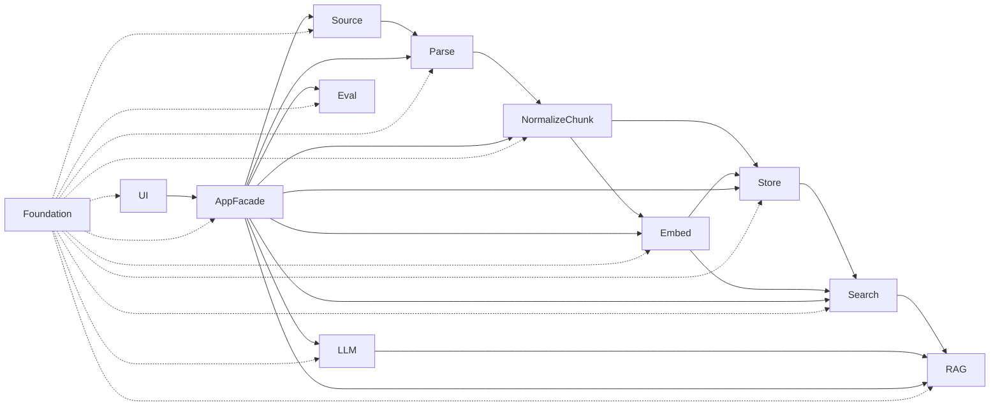

# Component documentation design

**Date**: 2026-05-04
**Status**: planned
**Audience**: contributor / reader who wants per-component depth beyond README + ARCHITECTURE.

## Goal

Add a per-component documentation layer under `docs/components/` so that contributors can read a single page per responsibility group and understand:

- which crate(s) the group contains;
- the internal structure (types / traits / structs);
- the data flow through the group;
- key decisions (and the *why*, often spread across HOTFIXES + spec);
- which spec / HOTFIXES entries the group descends from.

End-user audience stays served by the existing README. ARCHITECTURE keeps its crate-level depth but its ASCII graph is upgraded to mermaid.

## Non-goals

- Re-doing the README user-layer Mermaid (already covers the user grand-picture).
- Editing spec files (frozen) or HOTFIXES content.
- Adding code comments / rustdoc.
- Per-task spec diagrams.
- A separate user-facing tutorial — that stays in README.

## Output tree

```text
docs/components/
├── README.md                       # index + group wiring diagram
├── foundation/README.md            # kebab-core + kebab-parse-types + kebab-config
├── source/README.md                # kebab-source-fs
├── parse/README.md                 # kebab-parse-md + kebab-parse-pdf + kebab-parse-image
├── normalize-chunk/README.md       # kebab-normalize + kebab-chunk
├── store/README.md                 # kebab-store-sqlite + kebab-store-vector
├── embed/README.md                 # kebab-embed + kebab-embed-local
├── search/README.md                # kebab-search
├── llm/README.md                   # kebab-llm + kebab-llm-local
├── rag/README.md                   # kebab-rag
├── app-facade/README.md            # kebab-app
├── ui/README.md                    # kebab-cli + kebab-tui
└── eval/README.md                  # kebab-eval
```

The folder + `README.md` pattern means Gitea / GitHub auto-render each group page when navigated to.

### Why these 12 groups (not 21 crates, not 6 stages)

- **Trait + impl pairs stay together** (`kebab-embed` + `kebab-embed-local`, `kebab-llm` + `kebab-llm-local`) — the swap pattern is the point of the pair.
- **Same-output parsers grouped** (`parse-md` + `parse-pdf` + `parse-image` all emit `ParsedBlock`) — comparison only makes sense side-by-side.
- **Sequential transforms grouped** (`normalize` → `chunk` are both `ParsedBlock → next stage`).
- **Storage backends grouped** (`store-sqlite` + `store-vector` share the persistence-trait pattern).
- `kebab-app` stays alone — the facade rule is load-bearing enough to deserve its own page.
- `kebab-cli` + `kebab-tui` grouped as UI — both consume facade only, contract identical, surface different.
- `kebab-eval` stays alone — independent of pipeline crates.

## Per-group page template

Every `<group>/README.md` follows this skeleton:

```markdown
# <Group name>

> One-line summary — what this group is.

## 구성 crate

| Crate | 역할 |
|-------|------|
| kebab-X | … |

## 구조

\`\`\`mermaid
<flowchart or classDiagram — type / trait / struct relationships>
\`\`\`

## Data flow

\`\`\`mermaid
<flowchart — input → output flow>
\`\`\`

## 주요 type / trait / 함수

- `TypeName` — one-line description
- `fn signature(...) -> Result<...>` — one-line description

## 외부 의존

- crate dep: …
- 외부 서비스: …

## 핵심 결정

- **결정**: …
  **왜**: HOTFIXES or spec link.

## 관련 spec / HOTFIXES

- spec: `tasks/p<N>/p<N>-<M>-<name>.md`
- HOTFIXES: `tasks/HOTFIXES.md` (relevant entries)
```

Diagram count is fixed at minimum 2 (구조 + flow). More are allowed if needed.

The "핵심 결정" section is the heaviest — it consolidates the *why* behind decisions that are currently scattered across HOTFIXES entries and frozen spec sections.

## Index page (`docs/components/README.md`)

Contains a single mermaid `flowchart` showing group-level wiring (one node per group, arrows for "calls / depends on"), plus a table linking each group page. Example wiring (final exact form drawn after all group pages exist):



## ARCHITECTURE.md changes

- The existing ASCII crate-dependency graph (lines 36–54) is replaced with an equivalent mermaid `flowchart` — same nodes, same edges, same information, better rendering on Gitea / GitHub.
- A single new line added near the top: `> 그룹 단위 view + 컴포넌트별 상세는 [docs/components/](components/).`
- Directory tree, locked-in decisions table, "외부 AI 통합", "비-목표" sections all stay unchanged.

## Writing order (bottom-up)

1. **Foundation** — defines types every other page links to (`AssetId`, `DocumentId`, `Chunk`, `Citation`, …).
2. **Source → Parse → Normalize+Chunk → Store** — ingest pipeline order.
3. **Embed → Search** — retrieval.
4. **LLM → RAG** — generation.
5. **App facade** — wires the above.
6. **UI** — sits on facade.
7. **Eval** — independent.
8. **Index `README.md`** — wiring diagram drawn last (so arrows match actual page content).
9. **ARCHITECTURE crate-graph mermaid replacement** — last, since it does not depend on the others.

## Verification

Per page:

- mermaid syntax renders (preview on Gitea or mermaid.live).
- Every type / trait / function signature in the page matches the actual code in `crates/kebab-<name>/src/lib.rs` — author reads source while writing, no guessing.
- HOTFIXES anchor links resolve.

Across pages:

- Group wiring diagram in the index does not contradict the crate graph in ARCHITECTURE.
- Bidirectional links: README ↔ ARCHITECTURE ↔ components index ↔ each group page.

## Risks / notes

- **Drift**: code changes after these pages land will silently invalidate signatures. Mitigation = page text stays minimal (signatures, not bodies); contributors update the page in the same PR that changes the surface (same rule the README/HANDOFF/ARCHITECTURE trio already follow).
- **HOTFIXES dilution**: if "핵심 결정" copies HOTFIXES entries verbatim, the live source-of-truth duplicates. Mitigation = component pages link to HOTFIXES entries by anchor + summarize in one line, not full quote.
- **Group-count debate**: 12 is a judgment call. If a group page grows past ~250 lines, it is a signal to split (e.g. `parse/` could split into per-format pages later — defer until pressure shows up).
